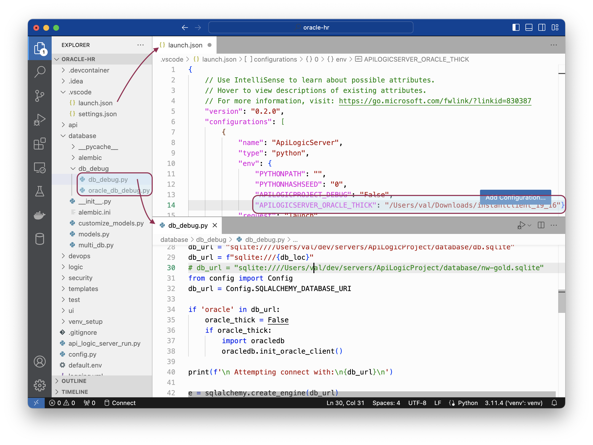

Oracle support depends upon `pip install oracledb`.  You **do not** need to do this, since it's already installed with API Logic Server.

> For more information on oracle-db, [click here](https://python-oracledb.readthedocs.io/en/latest/user_guide/installation.html#){:target="_blank" rel="noopener"}

This driver operates in *thin* mode and *thick* mode.  In some tightly regulated corporate environments, thin mode fails to connect with network errors, for example:

```
OSError: [WinError 10038] An operation was attempted on something that is not a socket
```

or,

```
Service "xxx" is not registered with the listener 
```


In such cases, you need to use *thick* mode.  This page shows how.

&nbsp;

## Install thick client

Install Oracle thick support as [described here](https://python-oracledb.readthedocs.io/en/latest/user_guide/installation.html#){:target="_blank" rel="noopener"}.  Each os-specific section contains information on installing thick mode, [like this for mac](https://python-oracledb.readthedocs.io/en/latest/user_guide/installation.html#installing-python-oracledb-on-macos){:target="_blank" rel="noopener"}.

Make a note of the install location.  For example, this might install to the following on a mac: `/Users/val/Downloads/instantclient_19_16`.

&nbsp;

## Activate thick client for API Logic Server

When required, thick client must be activated for both creating and running applications.  It operates by setting the environment variable to the thick client install location noted above.  

```
APILOGICSERVER_ORACLE_THICK=/Users/val/Downloads/instantclient_19_16
```

> Note: setting environment variables is os-dependent.  Windows, for example, requires you preceed the above with `set`.

To create projects, set the environment variable before you run `ApiLogicServer create`.

You can do the same for running projects.  Or, you can set this in your IDE as shown below.



