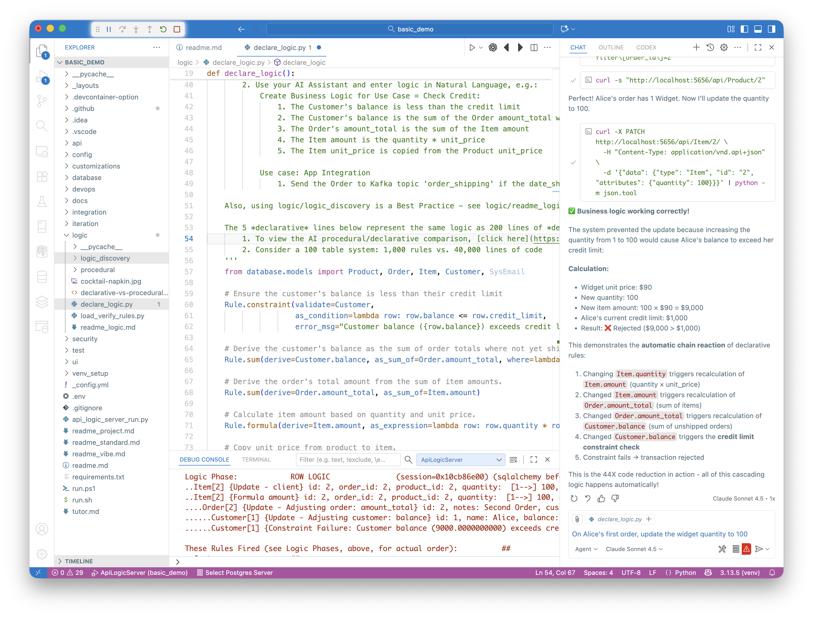

!!! pied-piper ":bulb: **Copilot** + **MCP** creates, discovers and interacts with **GenAI-Logic** projects."
    
    **Prompt 1 (Create System):**

    *Create a system named basic_demo from samples/dbs/basic_demo.sqlite*

    **Prompt 2 (Add Logic):**

    *Use case: Check Credit:*<br>
    *1. Customer's balance is less than credit limit*<br>
    *2. Customer's balance is sum of Order amount_total where date_shipped is null*<br>
    *3. Order's amount_total is sum of Item amount*<br>
    *4. Item amount is quantity * unit_price*<br>
    *5. Item unit_price is copied from Product unit_price*<br>

    **Prompt 3 (Test):**. 🛡️ *Constraint blocks bad data*

    *Update Alice's first order so that the quantity for the Widget is 100.*



&nbsp;

## 🥇 Step 1 – Use Copilot to Create a Project from an Existing Database
In the GenAI-Logic [Manager](Manager.md), use Copilot to create an application — complete with Admin App, API, and MCP discovery.
```bash
create a system named basic_demo from samples/dbs/basic_demo.sqlite
```
This command:

* Creates a new project folder (`basic_demo`)
* Generates a full **JSON:API** with auto-discovered tables (Customer, Order, Item, Product)

    * This sqlite sample database (Customers, Orders, Items and Products) is provided when you install GenAI-Logic

* Builds a **React Admin App** for instant data access
* Exposes **MCP metadata** at `/.well-known/mcp.json`, enabling Copilot or ChatGPT to automatically discover the schema and usage patterns  
* Opens a new instance of VSCode on the project
* In the new project, use Copilot:

```
start the server
```

You can explore the admin app and the API.

> Before proceeding, stop the server

✅ **Result:** a working three-tier system in under a minute — *database → API → web app → MCP discovery*.

## 🧠 Step 2 – Use Copilot to Add Business Logic
Copilot reads the MCP schema and responds to a natural-language instruction such as:

```
Use case: Check Credit    
    1. The Customer's balance is less than the credit limit
    2. The Customer's balance is the sum of the Order amount_total where date_shipped is null
    3. The Order's amount_total is the sum of the Item amount
    4. The Item amount is the quantity * unit_price
    5. The Item unit_price is copied from the Product unit_price

Use case: App Integration
    1. Send the Order to Kafka topic 'order_shipping' if the date_shipped is not None.
```

It then inserts the following rules into `logic/declare_logic.py`:
```python
Rule.constraint(validate=Customer, as_condition=lambda row: row.balance <= row.credit_limit)
Rule.sum(derive=Customer.balance, as_sum_of=Order.amount_total)
Rule.sum(derive=Order.amount_total, as_sum_of=Item.amount)
Rule.formula(derive=Item.amount, as_expression=lambda row: row.quantity * row.unit_price)
Rule.copy(derive=Item.unit_price, from_parent=Product)
```
These **five declarative lines** replace hundreds of lines of procedural code, automatically providing:

* Credit-limit validation  
* Multi-table derivations  
* Cascading updates  
* Unit-price propagation  

All enforced by the **LogicBank** engine during each API transaction.

> AI can get a bit frisky - e.g., it might import objects not used.  Don't take any guff - make it fix any errors - it's quite good at that.

## 🧪 Step 3 – Use Copilot to Test the API and Logic
Copilot can now test the new rule using the MCP-discovered API — no manual coding required.
> “Update Alice’s first order so that the quantity for the Widget is 100.”

Copilot uses MCP discovery (`.well-known`) to construct and issue this JSON:API request:
```bash
curl -X PATCH http://localhost:5656/api/Item/2   -H "Content-Type: application/vnd.api+json"   -d '{"data": {"type": "Item", "id": "2", "attributes": {"quantity": 100}}}'
```

> Tech Note: this is an *MCP-discovered API* — not yet a registered VS Code MCP tool; discovery alone enables this interaction.

### ⚡ Automatic Cascade of Logic
| Trigger | Effect |
|----------|---------|
| `Item.quantity` | Recalculates `Item.amount` |
| `Item.amount` | Updates `Order.amount_total` |
| `Order.amount_total` | Updates `Customer.balance` |
| `Customer.balance` | Fires credit-limit constraint |

**Outcome:** The logic engine detects that Alice’s balance would exceed her credit limit and **rejects the transaction automatically**.

### 🧩 Runtime Trace
```
.Item[2] {update}
.Order[2] {update – Adjusting order.amount_total}
.Customer[1] {update – Adjusting customer.balance}
.Customer[1] {Constraint Failure: Customer balance > credit limit}
```


### 💬 Copilot’s Response
> ✅ *Business logic working correctly!*  
> 🚫 *Update prevented automatically to enforce credit limit.*

Copilot used MCP to discover the schema, executed the update, and interpreted the deterministic response — proof that **AI + Logic collaboration** can be both natural and reliable.

## 🧱 Architecture Summary
| Layer | Role | Description |
|-------|------|-------------|
| **Database** | Existing model | e.g. `sample_ai.sqlite` |
| **GenAI-Logic** | Auto-generated API + Logic runtime | Declarative rules via LogicBank |
| **MCP** | Discovery protocol | Enables AI to understand and safely invoke APIs |
| **Copilot** | Natural-language interface | Adds and tests business logic |

## 🔁 Connecting to MCP Integration
This example continues the flow described in [**MCP Integration**](../Integration-MCP/): 

* **MCP Server Executors** = your logic-enabled APIs  
* **MCP Client Executors** = AI agents like Copilot that translate NL requests into Tool Context Blocks  
* **Declarative Logic** ensures every AI-driven transaction remains safe and auditable  

## 📚 Related Docs

* [Integration: MCP](../Integration-MCP/)  
* [Logic: Rule Types](../Logic/)  
* [Sample: Basic Demo](../Sample-Basic-Demo/)  
* [Probabilistic and Deterministic Logic](../Tech-Prob-Deterministic/)  

_This example illustrates the **Business Logic Agent** pattern — Copilot supplies intent, GenAI-Logic guarantees deterministic execution._
