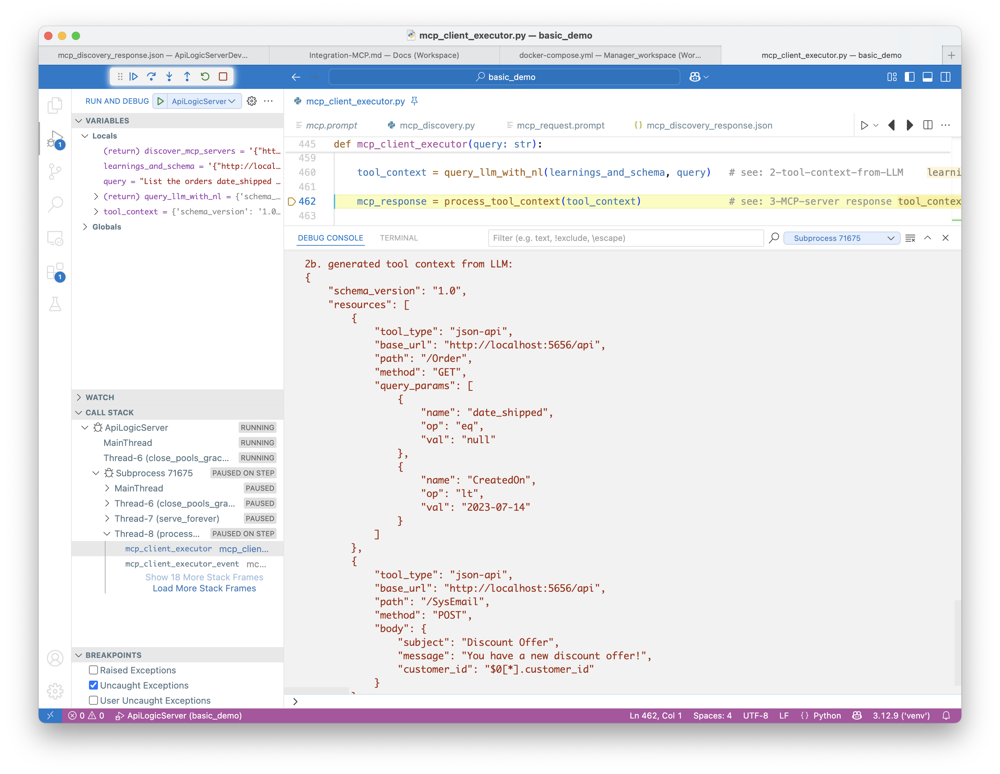
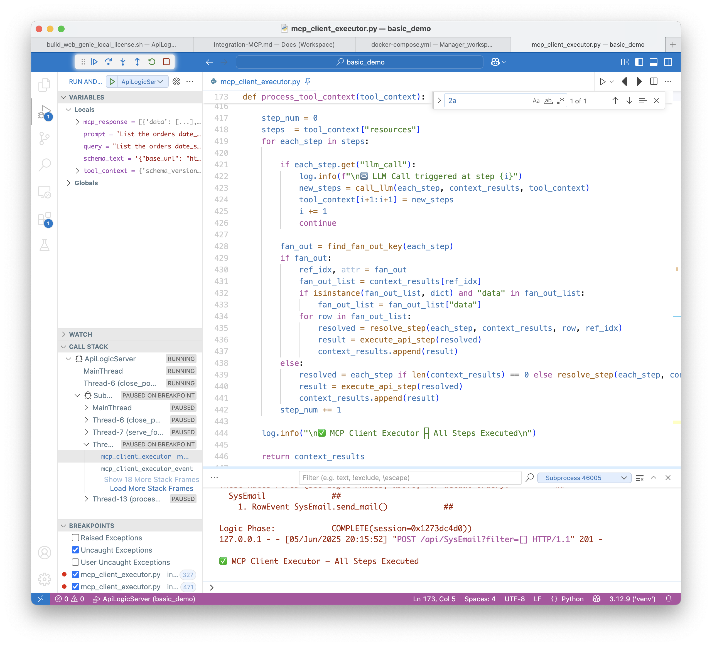

!!! pied-piper ":bulb: TL;DR - MCP: Enable Bus Users to use NL to create multi-step execution flows"

	Developers can use MCP to build **MCP Client Executors**.  These enable Business Users to use Natural Language to create multi-step execution flows across existing business-rule-enforced APIs.  For example, a Business User might request: 
	
	*Find the overdue orders, and send an email offering a discount*.  
	
	This is a new request, composed from existing services (find orders, send email).
	
	MCP Client Executors use LLMs for Natural Language translation over a wide set of underlying **MCP Server Executors** (aka *tools*). MCP enables LLMs to understand these underlying tools - their schema (e.g., *Customer*, *Product*), and how they are called (e.g, JSON:API).  
	
	MCP Client Executors operate as shown below:
	
	1. MCP Client Executors first **discover** servers (tools) - their schema, instructions, etc.
	2. MCP Client Executors then **call LLMs** to translate NL queries into multi-step execution flows called **Tool Context Blocks.**. 
	3. The MCP Client Executors then **process the Tool Context Block** steps, making calls on the  **MCP Server Executors** (tools).
	
		* MCP Server Executors are commonly provided via ***logic-enabled* APIs.**  (Note the logic is critical in maintaining integrity and security.)
	
	In some cases, you may have a database, but neither the APIs nor the logic.  GenAI-Logic API Logic Server can **mcp-ify existing databases** by:
	
	1. Creating JSON:APIs for *existing databases* with a single CLI command
	2. Enabling you to [declare business logic](Logic.md), enforced by the APIs during MCP execution flows.

 &nbsp;

## Architecture

  

1. MCP Client Executor Startup calls `.well-known` endpoint to load training and schema meta data

2. MCP Client Executor sends Bus User ***NL query + training + schema*** to the external LLM (here we are using ChatGPT - requires API Key).  LLM returns an ***MCP Tool Context*** JSON block.

	* An MCP Client Executor might be similar in concept to installed/Web ChatGPT (etc), but those *cannot* be used to access MCPs since they cannot issue http calls.  This is a custom client app (or, perhaps an IDE tool)

	* To explore `integration/mcp/mcp_client_executor.py`, [click here](https://github.com/ApiLogicServer/basic_demo/blob/main/integration/mcp/mcp_client_executor.py){:target="_blank" rel="noopener"}
	* Tool definitions are OpenAI specific, so we are sending the schema (in each prompt)

		* Note this strongly suggests this is a **subset** of your database - edit `docs/mcp_schema.json` as required. 
 

3. MCP Client Executor iterates through the Tool Context, calling the JSON:API Endpoint that enforces business logic.

&nbsp;

## Example: send emails for pending orders


The **basic_demo** sample enables you to create orders with business logic: check credit by using rules to roll-up item amount to orders / customers.  Setting the `date_shipped` indicates payment is received, and the customer balance is reduced.  

💡 The basic_demo project ([tutorial here](Sample-Basic-Demo.md){:target="_blank" rel="noopener"}) illustrates basic GenAI-Logic operation: creating projects from new or existing databases, adding logic and security, and customizing your project using your IDE and Python.

In this example, we want a new service to:

1. Find Orders placed over 30 days ago that are not shipped
2. Send an Email encouraging prompt payment

We want to do this without troubling IT.  MCP enables business users to self-server, while maintaining integrity through the existing logic-enabled JSON:APIs.

&nbsp;

### Setup

Create the **basic_demo** under the [Manager](Manager.md) as described in the Manager readme:  

1. In your IDE: `als create --project-name=basic_demo --db-url=basic_demo`


2. Run `als add-cust` to load mcp (and logic)
3. Optionally, define an environment variable: `APILOGICSERVER_CHATGPT_APIKEY` ChatGPT API Key (obtain one [like this](WebGenAI-CLI.md/#configuration)).

	* To make the demo less fiddly, the system loads the tool context from `integration/mcp/examples/mcp_tool_context.json`.  You can engage the LLM by setting `create_tool_context_from_llm` to `True`, which requires an API Key.

4. Start the Server (F5)
5. Use Run Config: **MCP - Model Context Protocol - Client Executor**

&nbsp;

### Prompt

Here is a NL prompt using *basic_demo* coded into `mcp_client_executor`

```
List the orders date_shipped is null and CreatedOn before 2023-07-14, and send a discount email (subject: 'Discount Offer') to the customer for each one.
```

&nbsp;

### Sample Flow

You can run `mcp_client_executor` under the debugger, and stop at each of the breakpoints noted in the screenshot below. 

#### 0 - MCP Client Executor

Here is the basic driver of the `mcp_client_executor` (see the Architecture diagram above):
 

#### 1 - Discover Servers

Discovery uses a config file `integration/mcp/mcp_server_discovery.json` to discover 1 or more servers, and invoke their `.well-known` endpoint (see `api/api_discovery/mcp_discovery.py`):
 
Observe response shown above (for actual content, [click here](https://github.com/ApiLogicServer/basic_demo/blob/main/integration/mcp/examples/mcp_discovery_response.json){:target="_blank" rel="noopener"}):

1. The config file is used to discover the servers. 

	* It identifies the `.well-known` endpoint used to discover server information.   For GenAI-Logic, it is `curl -X GET "http://localhost:5656/.well-known/mcp.json"`.
	
1. The server information (see above) includes:

	1. `base_url`
	2. `learning`: how to call the server
	3. `resources`: the exposed endpoints, their attributes and methods

The resource and learning meta data is created by API Logic Server, but you can control it:

  * The **learning** is at  [docs/mcp_learning/mcp.prompt](https://github.com/ApiLogicServer/basic_demo/blob/main/docs/mcp_learning/mcp.prompt){:target="_blank" rel="noopener"}.  This is also created by API Logic Server; edit as required to tune / expand training.

	  * For example, the learning describes how to use the request pattern to send email (further described below)

  * The **resources** (aka schema) is at at [docs/mcp_learning/mcp_schema.json](https://github.com/ApiLogicServer/basic_demo/blob/main/docs/mcp_learning/mcp_schema.json){:target="_blank" rel="noopener"}.  
  
	  * You can edit this as required to control what is discovered, and to minimize the information sent to the LLM.

<br>

#### 2 - Tool Context from LLM

We call the LLM, providing the NL Query and the discovery returned above.  The LLM returns the `tool context` (to see it, [click here](https://github.com/ApiLogicServer/basic_demo/blob/main/integration/mcp/examples/mcp_tool_context_response.json){:target="_blank" rel="noopener"}) - the set of APIs the MCP Client Executor is to call:

 


#### 3 - Invoke MCP Server

The calls include GET, and a POST for each returned row.  

 
&nbsp;

##### 3a - Fan-out

Fan-out means that we need to create email for each returned Order.  So, in processing step 2, we must iterate over the orders in step 1, and use the `customer_id` from the Order for the email:


&nbsp;

##### 3b - Logic (Request Pattern)

MCP is capable of executing email directly, but we have business policies providing for email opt-outs.  We must respect this logic.

As shown below, a common [logic pattern](Logic.md#rule-patterns){:target="_blank" rel="noopener"} is a `Request Object`, which implements the request pattern:

> Request PatternL you insert a row, triggering its business logic (a Python event handler)

Here, the logic (an *after_flush* event) checks the opt-out, and sends the mail (stubbed):


#### 4 - Context Results

The MCP Client Executor returns and prints the `context_results`.  These are accrued for each execution step, above.  In this example, it shows the GET, and 4 POST commands (last shown below).  This context would also be passed *back* to the LLM for Agentic Execution, as shown in the next section.


&nbsp;

### Advanced LLM Concepts

The following are implemented but not used in this example or tested.  We encourage participation in designing examples, and testing the implementation.

&nbsp;

#### Agentic Execution (`llm-call`)

As described in [this recommended video](https://www.youtube.com/watch?v=FLpS7OfD5-s){:target="_blank" rel="noopener"}, the MCP Client Executor can call the LLM *between* each MCP Server Executor call.  This enables the LLM to detect intermediate results, and call subsequent tools accordingly.

For example, consider this scenario:

> “Get all orders for Alice. If any are over $500, alert the sales manager.”

Here is a sample tool context - note the `llm-call/llm-goal`:

```json
[
  {
    "tool_type": "json-api",
    "base_url": "https://server-a.com/api",
    "path": "Order",
    "method": "GET",
    "query_params": [
      { "name": "customer", "op": "eq", "val": "Alice" }
    ],
    "body": [],
    "llm_call": true,  // <-- Indicates to pause and invoke LLM after this step
    "llm_goal": "Check which orders for Alice are over $500 and generate alert POSTs as needed"
  }
]
```

&nbsp;

#### Branching

An alternative approach would be for the LLM plan to include `llm-call` and branching.  Consider this scenario:

> “Check Alice’s orders. If any are overdue (i.e. date_due < today and not shipped), send a warning email. Otherwise, do nothing.”

The LLM might create a tool context like:

```json
[
  {
    "tool_type": "json-api",
    "base_url": "https://server-a.com/api",
    "path": "Order",
    "method": "GET",
    "query_params": [
      { "name": "customer_id", "op": "eq", "val": "Alice" }
    ],
    "body": [],
    "llm_call": true,
    "llm_goal": "If any orders are overdue (date_due < today and date_shipped is null), generate an email alert step. Otherwise, no further action."
  }
]
```

<br>

## MCP Security

For MCP calls made via SysMcp (see next section), API calls are made with the current request header.  In particular, role-based access operates with your auth-token, enforcing grants per your login.

For example, you could use the SysMcp in the Admin app (see next section), and enter this request:

```txt
List customers with credit_limit > 1000.
```

Inspect the console log, and observe that 2 rows are returned.

<br>

## Admin App: MCP Client Executor

The screen shot below illustrates using the Admin App to create and execute MCP requests.  The actual MCP processing is in the Api Logic Server, so you can build your own custom app to provide MCP execution, using the Api Logic Server business logic.  

See the sub-sections below to see how to provide this on your own projects.


<br>

### Create table: `SysMCP`

This can be a table in your database, or you can create it in a separate database.  

It requires a column called `prompt`.

&nbsp;

### `SysMcp` Logic: Request Pattern

The screen shot below shows logic you must create for the `SysMcp` table.

1. This is the same *request* pattern used for SysEmail.
2. The code invokes the same `integration/mcp/mcp_client_executor.py` described above.


### Admin App Customization

You might want to customize the `SysMcp` settings in `ui/admin/admin.yaml`.  For more information, [click here](https://github.com/ApiLogicServer/ApiLogicServer-src/blob/main/api_logic_server_cli/prototypes/basic_demo/customizations/ui/admin/admin.yaml){:target="_blank" rel="noopener"}.

<br>

## Appendix: Status

MCP support is GA for the MCP Server Executor.  The MCP Client Executor is in Tech Preview.  It is a great way to explore key MCP architecture.

We welcome participation in this project. Please contact us via [discord](https://discord.gg/HcGxbBsgRF).  For example, explore Agentic Execution.

<br>

## Appendix: MCP Background

Descriptions of MCP often describe them as *USB for servers*.  That meant little to use, and probably to you.  We hope the more concrete description here might be more useful.

Along the same lines, the best video we have found was [noted above](https://www.youtube.com/watch?v=FLpS7OfD5-s){:target="_blank" rel="noopener"}.

Other resources:

1. [see MCP Introduction](https://modelcontextprotocol.io/introduction)

2. [and here](https://apilogicserver.github.io/Docs/Integration-MCP/)

3. [and here](https://www.youtube.com/watch?v=1bUy-1hGZpI&t=72s)

4. and this [N8N link](https://docs.n8n.io/integrations/builtin/core-nodes/n8n-nodes-langchain.mcptrigger/?utm_source=n8n_app&utm_medium=node_settings_modal-credential_link&utm_campaign=%40n8n%2Fn8n-nodes-langchain.mcpTriggerlangchain.mcpTriggerlangchain.mcpTrigger)

5. and this [python sdk](https://github.com/modelcontextprotocol/python-sdk)

6. and [this video](https://www.youtube.com/shorts/xdMVgZfZ1yg)

&nbsp;

## Appendix: Key Clarifications

MCP is a new technology.  In my learning curve, I found much of the information a little bit vague and in some cases, misleading.  The sections below identify key clarifications to incorrect assumptions I had made, so I have listed them below in hopes they can help you.

&nbsp;

### App-Specific Client Executor

Several articles described the Client Executor as a "host such as Claude".  That lead me to believe that common chat apps could call MCPs.

Later, I discovered that most chat apps cannot call http, and so cannot directly call MCPs.  The Client Executor is analogous to a chat, but is written specifically  for MCP use.

&nbsp;

### Client Executor (not LLM) calls the MCP

I saw several diagrams with arrows from the LLM to the MCP.  That lead me to believe that the LLM *calls* the MCP. 

Later, I realized that the LLM is just preparing the Tool Context.  The Client Executor uses this to invoke the MCP.  I now think of the arrow as "knows how to include it in the Tool Context".

&nbsp;

### Server Executor == *logic-enabled* APIs

Finally, I presumed that the Client Executor would pass the Tool Context to the LLM.  This was simply a bad guess.  

The key idea is that one specific Server Executor would not be aware it is part of an orchestration.  In the case of database APIs, the Server Executor is the set of logic-enabled endpoints identified in the discovery schema.

Note the logic here is critical.  The Client Executor can not / should not "reach in" and be aware of logic specific to each involved database.
