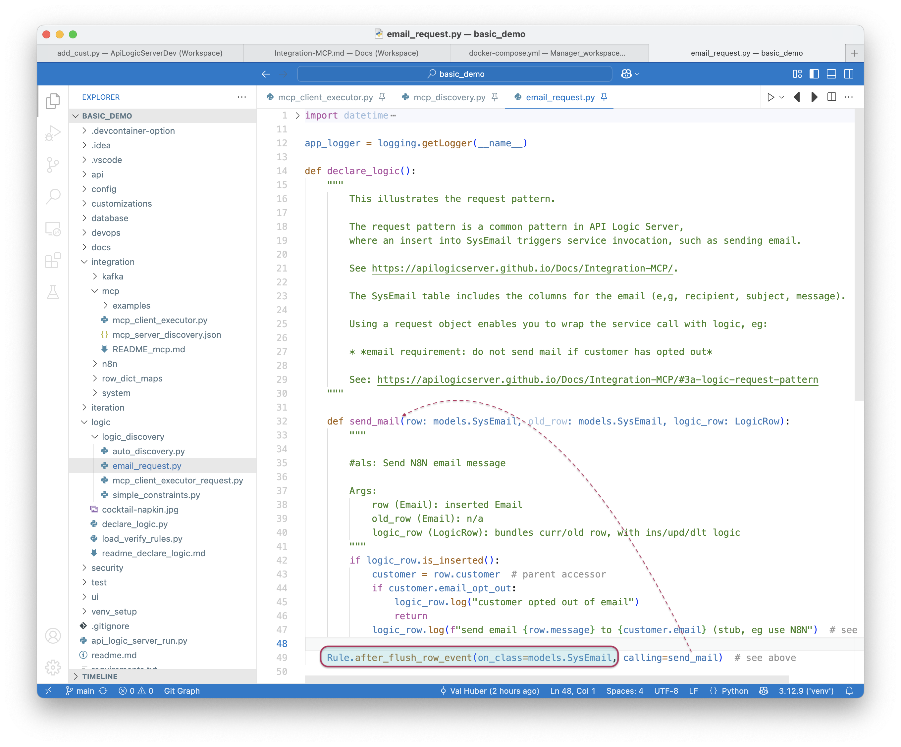

!!! pied-piper ":bulb: TL;DR - MCP: Enable Bus Users to use NL to create multi-service execution flows"

	MCP enables Business Users to use Natural Language to create declarative execution flows across multiple business-rule-enforced API services.  MCP is an open protocol than enables:
	
	1. **MCP Client Executors** to leverage LLMs to tranlate NL queries into multi-step execution flows called **Tool Context Blocks.**. 
	2. The MCP Client Executor executes the Tool Context block steps, making calls on the  **MCP Server Executors.**
	
		* MCP Server Executors are commonly provided via **logic-enabled JSON:APIs.**  (Note the logic is critical in maintaining integrity and security.)
	
	In some cases, you may have a database, but neither the APIs nor the logic.  GenAI-Logic API Logic Server can **mcp-ify existing databases** by:
	
	3. Creating JSON:APIs for existing databases with a single CLI command
	4. Enabling you to [declare business logic](Logic.md), which can be used via the APIs in MCP executipn flows.

 

## Architecture:

  

1. MCP Client Executor Startup

	* Calls `.well-known` endpoint to load schema
	* This is created by API Logic Server, and stored in `docs/mcp_schema.json`.  You can edit this as required to control what is discovered, and to minimize the information sent to the LLM.

2. MCP Client Executor sends Bus User ***NL query + schema*** (as prompt or tool definition) to the external LLM, here, ChatGPT (requires API Key).  LLM returns an ***MCP Tool Context*** JSON block.

	* An MCP Client Executor might be similar in concept to installed/Web ChatGPT (etc), but those *cannot* be used to access MCPs since they cannot issue http calls.  This is an internally developed app (or, perhaps an IDE tool)

		* We are using a test version: `integration/mcp/mcp_client_executor.py`
	* Tool definitions are OpenAI specific, so we are sending the schema (in each prompt)

		* Note this strongly suggests this is a **subset** of your database - edit `docs/mcp_schema.json` as required. 
 

3. MCP Client Executor iterates through the Tool Context, calling the JSON:API Endpoint that enforces business logic.

&nbsp;

## Example: send emails for pending orders


The **basic_demo** sample enables you to create orders with business logic to check credit by using rules to roll-up item amount to orders / customers.  Setting the `date_shipped` indicates payment is received, and the customer balance is reduced.

In this example, we want a new service to:

1. Find Orders placed over 30 days ago that are not shipped
2. Send an Email encouraging prompt payment

We want to do this without troubling IT.  MCP enables business users, while maintaining integrity through the existing logic-enabled JSON:APIs.

&nbsp;

### Setup

Create the **basic_demo** under the [Manager](Manager.md) as described in the Manager readme:  

1. In your IDE: `als create --project-name=basic_demo --db-url=basic_demo`
2. Run `als add-cust` to load mcp (and logic)
3. Start the Server (f5)
4. Run `python integration/mcp/mcp_client_executor.py`


You will need an environment variable: `APILOGICSERVER_CHATGPT_APIKEY` ChatGPT APIKey.

&nbsp;
### Prompt

Here is a NL prompt using *basic_demo* coded into `mcp_client_executor`

```
List the orders created more than 30 days ago, and send a discount offer email to the customer for each one.

Respond with a JSON array of tool context blocks using:
- tool: 'json-api'
- JSON:API-compliant filtering (e.g., filter[CreatedOn][lt])
- Use {{ order.customer_id }} as a placeholder in the second step.
- Include method, url, query_params or body, headers, expected_output.
```

%nbsp;

### Sample Flow

You can run `mcp_client_executor` under the debugger, and stop at each of the breakpoints noted in the screenshot below. 

#### 0 - MCP Client Executor

Here is the basic driver of the test program (see the Architecture diagram above):
 

#### 1 - Discovery

Discovery uses a config file `integration/mcp/mcp_server_discovery.json` to discover 1 or more servers, and invoke their `.well-known` endpoint to obtain the schema.
 

#### 2 - Tool Context from LLM

We call the LLM, providing the NL Query and the schema returned above.  It returns a Tool Context completion (response), with the steps to call in the MCP Server Executor, which here is the logic-enabled API Logic Server JSON:API.

 

#### 3 - Invoke MCP Server

The calls include GET, and a POST for each returned row.  

 
&nbsp;

##### 3a - Logic (Request Pattern)

MCP is capable of executing email directly, but we have business policies providing for email opt-outs.  We must respect this logic.

As shown below, a common logic pattern is a `Request Object`: you insert it, it's business logic runs.  Here, the logic checks the opt-out, and sends the mail:



&nbsp;

### Status: Work In Progress

This is an initial experiment, with a number of ToDo's: real filtering, update, etc.  That said, it might be an excellent way to explore MCP.

We welcome participation in this exploration. Please contact us via [discord](https://discord.gg/HcGxbBsgRF).

This exploration is changing rapidly. For updates, replace `integration/mcp` from [integration/msp](https://github.com/ApiLogicServer/ApiLogicServer-src/tree/main/api_logic_server_cli/prototypes/nw_no_cust/integration/mcp){:target="_blank" rel="noopener"}.

&nbsp;

## Appendix: MCP Background

  

For more information:

- [see MCP Introduction](https://modelcontextprotocol.io/introduction)

- [and here](https://apilogicserver.github.io/Docs/Integration-MCP/)

- [and here](https://www.youtube.com/watch?v=1bUy-1hGZpI&t=72s)

- and this [N8N link](https://docs.n8n.io/integrations/builtin/core-nodes/n8n-nodes-langchain.mcptrigger/?utm_source=n8n_app&utm_medium=node_settings_modal-credential_link&utm_campaign=%40n8n%2Fn8n-nodes-langchain.mcpTriggerlangchain.mcpTriggerlangchain.mcpTrigger)

- and this [python sdk](https://github.com/modelcontextprotocol/python-sdk)

- and [this video](https://www.youtube.com/shorts/xdMVgZfZ1yg)