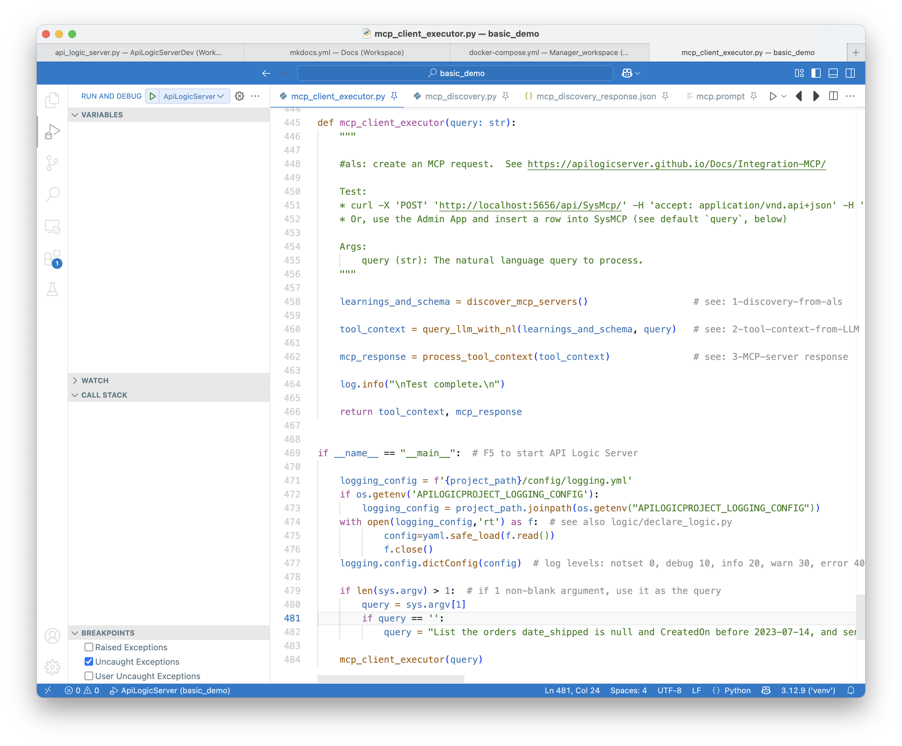
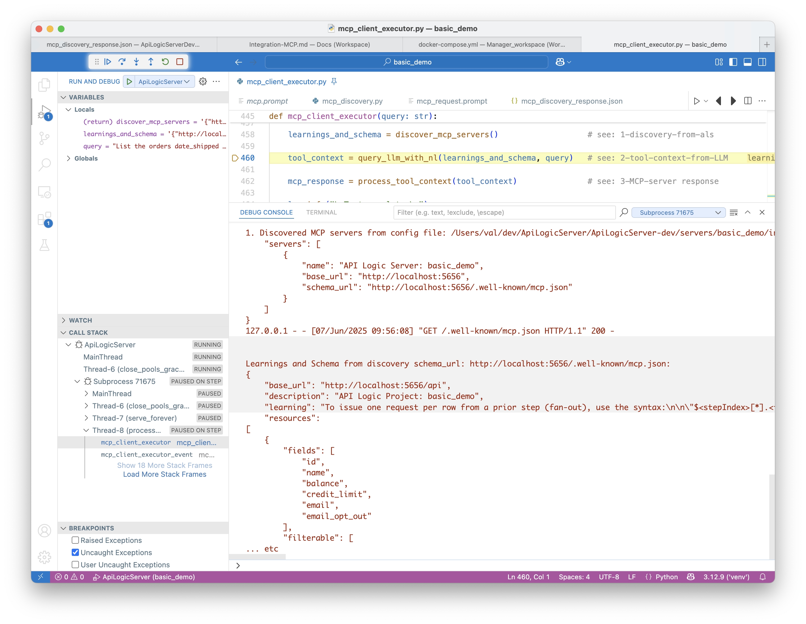

!!! pied-piper ":bulb: TL;DR - MCP: Enable Bus Users to use NL to create multi-step execution flows"

	MCP enables Business Users to use Natural Language to create multi-step execution flows across existing business-rule-enforced APIs.  For example, a Business User might request: 
	
	*Find the overdue orders, and send an email offering a discount*.  
	
	This is a new request, composed from existing services (find orders, send email).
	
	MCP is an open protocol than enables:
	
	1. **MCP Client Executors** to discover servers (tools) - their schema, instructions, etc.
	2. MCP Client Executors to call LLMs to translate NL queries into multi-step execution flows called **Tool Context Blocks.**. 
	3. The MCP Client Executors to process the Tool Context Block steps, making calls on the  **MCP Server Executors.**
	
		* MCP Server Executors are commonly provided via **logic-enabled JSON:APIs.**  (Note the logic is critical in maintaining integrity and security.)
	
	In some cases, you may have a database, but neither the APIs nor the logic.  GenAI-Logic API Logic Server can **mcp-ify existing databases** by:
	
	1. Creating JSON:APIs for *existing databases* with a single CLI command
	2. Enabling you to [declare business logic](Logic.md), which can be used via the APIs in MCP execution flows.

 &nbsp;

## Architecture

  

1. MCP Client Executor Startup

	* Calls `.well-known` endpoint to load schema
	* This is created by API Logic Server, and stored in `docs/mcp_schema.json`.  You can edit this as required to control what is discovered, and to minimize the information sent to the LLM.

2. MCP Client Executor sends Bus User ***NL query + schema*** (as prompt or tool definition) to the external LLM, here, ChatGPT (requires API Key).  LLM returns an ***MCP Tool Context*** JSON block.

	* An MCP Client Executor might be similar in concept to installed/Web ChatGPT (etc), but those *cannot* be used to access MCPs since they cannot issue http calls.  This is an internally developed app (or, perhaps an IDE tool)

		* We are using a test version: `integration/mcp/mcp_client_executor.py`
	* Tool definitions are OpenAI specific, so we are sending the schema (in each prompt)

		* Note this strongly suggests this is a **subset** of your database - edit `docs/mcp_schema.json` as required. 
 

3. MCP Client Executor iterates through the Tool Context, calling the JSON:API Endpoint that enforces business logic.

&nbsp;

## Example: send emails for pending orders


The **basic_demo** sample enables you to create orders with business logic to check credit by using rules to roll-up item amount to orders / customers.  Setting the `date_shipped` indicates payment is received, and the customer balance is reduced.

In this example, we want a new service to:

1. Find Orders placed over 30 days ago that are not shipped
2. Send an Email encouraging prompt payment

We want to do this without troubling IT.  MCP enables business users, while maintaining integrity through the existing logic-enabled JSON:APIs.

&nbsp;

### Setup

Create the **basic_demo** under the [Manager](Manager.md) as described in the Manager readme:  

1. In your IDE: `als create --project-name=basic_demo --db-url=basic_demo`
2. Run `als add-cust` to load mcp (and logic)
3. Start the Server (f5)
4. Run `python integration/mcp/mcp_client_executor.py`
	* You can use Run Config: **Run designated Python file**


The [basic_demo](Sample-Basic-Demo.md){:target="_blank" rel="noopener"} project illustrates basic GenAI-Logic operation: creating projects from new or existing databases, adding logic and security, and customizing your project using your IDE and Python.

You will need an environment variable: `APILOGICSERVER_CHATGPT_APIKEY` ChatGPT APIKey (obtain one [like this](WebGenAI-CLI.md/#configuration)).

&nbsp;
### Prompt

Here is a NL prompt using *basic_demo* coded into `mcp_client_executor`

```
List the unshipped orders created before 2023-07-14, and send a discount email (subject: 'Discount Offer') to the customer for each one.
```

&nbsp;

### Sample Flow

You can run `mcp_client_executor` under the debugger, and stop at each of the breakpoints noted in the screenshot below. 

#### 0 - MCP Client Executor

Here is the basic driver of the test program (see the Architecture diagram above):
 

#### 1 - Discovery

Discovery uses a config file `integration/mcp/mcp_server_discovery.json` to discover 1 or more servers, and invoke their `.well-known` endpoint (see `api/api_discovery/mcp_discovery.py`) to obtain the schema.
 

&nbsp;
#### 2 - Tool Context from LLM

We call the LLM, providing the NL Query and the discovered schema returned above.   Note the schema includes:

1. resources: the schema itself 
	* You would typically edit this file to expose only desired data, and reduce the size of the prompt
2. instructions on how to format `expected_response` (e.g., `query_params`)
3. and how to use the **Request Pattern** to send email, subject to logic (see Logic, below):

 The LLM returns a Tool Context completion (response), with the steps to call the MCP Server Executor, which here is the logic-enabled API Logic Server JSON:API:
 
#### 3 - Invoke MCP Server

The calls include GET, and a POST for each returned row.  

 
&nbsp;

##### 3a - Logic (Request Pattern)

MCP is capable of executing email directly, but we have business policies providing for email opt-outs.  We must respect this logic.

As shown below, a common [logic pattern](Logic.md#rule-patterns){:target="_blank" rel="noopener"} is a `Request Object`: you insert a row, triggering its business logic.  Here, the logic (an *after_flush* event) checks the opt-out, and sends the mail (stubbed):


&nbsp;

## Appendix: Status - End-to-End Illustration

This is intended to be a vehicle for exploring MCP.  It is not productized - we need to explore security, and perhaps integrating this into the Admin App.

We welcome participation in this exploration. Please contact us via [discord](https://discord.gg/HcGxbBsgRF).

&nbsp;

## Appendix: MCP Background

For more information:

1. [see MCP Introduction](https://modelcontextprotocol.io/introduction)

2. [and here](https://apilogicserver.github.io/Docs/Integration-MCP/)

3. [and here](https://www.youtube.com/watch?v=1bUy-1hGZpI&t=72s)

4. and this [N8N link](https://docs.n8n.io/integrations/builtin/core-nodes/n8n-nodes-langchain.mcptrigger/?utm_source=n8n_app&utm_medium=node_settings_modal-credential_link&utm_campaign=%40n8n%2Fn8n-nodes-langchain.mcpTriggerlangchain.mcpTriggerlangchain.mcpTrigger)

5. and this [python sdk](https://github.com/modelcontextprotocol/python-sdk)

6. and [this video](https://www.youtube.com/shorts/xdMVgZfZ1yg)

&nbsp;

## Appendix: Key Clarifications

MCP is a new technology.  In my learning curve, I found much of the information a little bit vague and in some cases, misleading.  The sections below identify key clarifications to incorrect assumptions I had made, so I have listed them below in hopes they can help you.

&nbsp;

### App-Specific Client Executor

Several articles described the Client Executor as a "host such as Claude".  That lead me to believe that common chat apps could call MCPs.

Later, I discovered that most chat apps cannot call http, and so cannot directly call MCPs.  The Client Executor is analogous to a chat, but is written specifically  for MCP use.

&nbsp;

### Client Executor (not LLM) calls the MCP

I saw several diagrams with arrows from the LLM to the MCP.  That lead me to believe that the LLM *calls* the MCP. 

Later, I realized that the LLM is just preparing the Tool Context.  The Client Executor uses this to invoke the MCP.  I now think of the arrow as "knows how to include it in the Tool Context".

&nbsp;

### Server Executor == *logic-enabled* APIs

Finally, I presumed that the Client Executor would pass the Tool Context to the LLM.  This was simply a bad guess.  

The key idea is that one specific Server Executor would not be aware it is part of an orchestration.  In the case of database APIs, the Server Executor is the set of logic-enabled endpoints identified in the discovery schema.

Note the logic here is critical.  The Client Executor can not / should not "reach in" and be aware of logic specific to each involved database.
