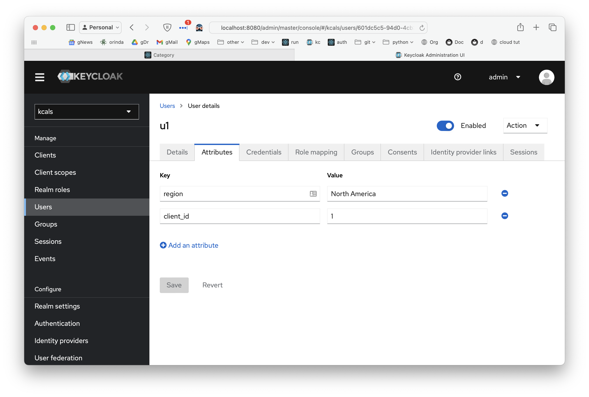
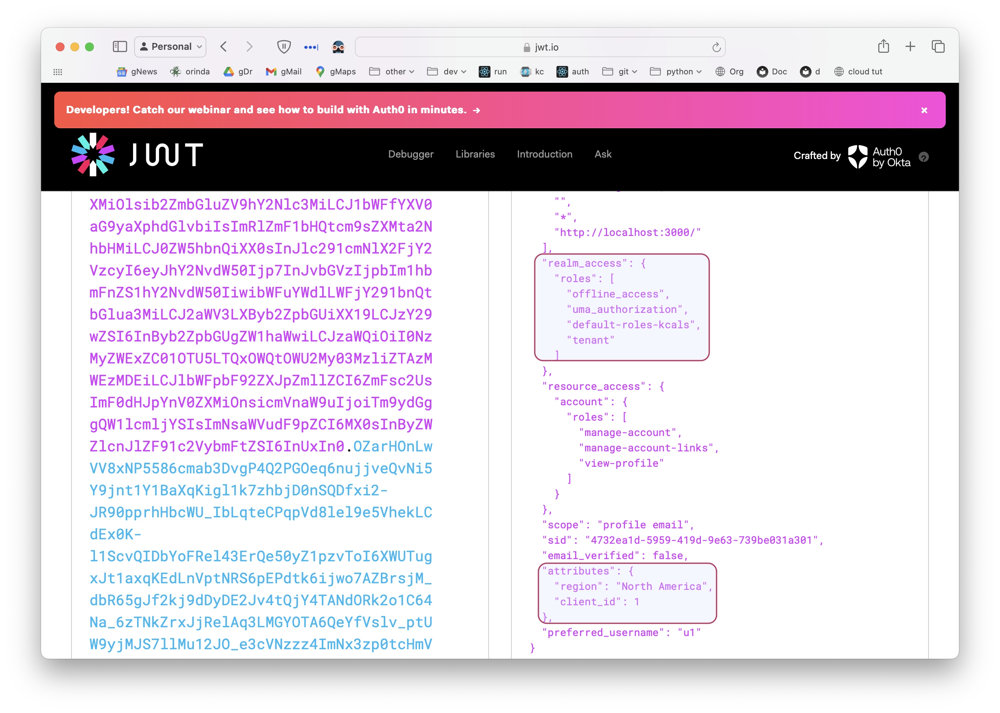

# Integration: ApiLogicServer + Keycloak

This repo contains a demo for apilogicserver integration with keycloak oidc JWT authentication.  We can now codegen kc-capable apps (though will still required setup as described below).

* ***kci*** refers to the running KeyCloakIntegration

Status - 3/10:

1. able to access keycloak for login using modified sra at localhost.
2. kci is running with authentication & authorization (minimal testing)
3. we can now run a generated app, presuming the Iterim Additional Setup

&nbsp;

## Configuring Security

With your project open, use the **Terminal > New Terminal** window:

```bash
ApiLogicServer add-auth --provider-type=[ keycloak | sql | none ] --db-url=
```

&nbsp;

### Anticipated Usage

We anticipate that developers will probably 

1. start with no auth
    * just to get running
2. then configure sqlite (`als add-auth --provider-type=sql --db-url=`)
    * simplest way to get started with auth - nothing to install or configure
        * declare your grants (which is not trivial)
    * switching to other sql dbms (e.g,. Postgresql) is now more tricky (doc to follow)
3. then configure keycloak (`als add-auth --provider-type=keycloak --db-url=`)
4. often switch back and forth during testing, or for different developers
    * It's important this be fast and easy - in particular, just 1 step to reduce errors

&nbsp;

### System Support

Therefore, as of 10.04.55, several changes **faciliate switching** between no / sql / keycloak authentication:

1.  All projects are created sql auth fully configured for sqlite.  This includes the SQLAlchemy models, the api auth endpoints, the database, etc.  

    * See the screenshot below
    * But, auth is initially ***disabled***
        * so, user behavior is still no security, just as now
        * they then use the `add-auth` command to configure, as described above

2. The auth setting in `ui/admin/admin.yaml` is created as `authentication: '{system-default}'`, and updated on load with the config values (overridden by env settings).

    * This means you do *not* have to alter your `admin.yanl` when you reconfigure auth

3. You can hard-code authentication, eg,

```yaml title="Hardcoded authentication"
authentication:
  keycloak:
    url: https://kc.hardened.be
    realm: kcals
    clientId: alsclient
```


## Iterim Additional Setup

```bash
ApiLogicServer add-auth --provider-type=keycloak --db-url=  # if not already done
cp -r devops/keycloak/nginx/admin-app ui/safrs-react-admin
```

Or, the entire sequence, using the testpy release (aside - the dev ide has run configs for this under **2. Create servers/ApiLogicProject**):

```bash
ApiLogicServer create --project-name= --db-url=
code ApiLogicProject  # then, in VSC terminal...
ApiLogicServer add-cust
ApiLogicServer add-auth --provider-type=keycloak --db-url=
cp -r devops/keycloak/nginx/admin-app ui/safrs-react-admin
cd devops/keycloak
docker compose up
# start ApiLogicServer server from the IDE (F5)
```


&nbsp;

## Run:

```
cd devops/keycloak
docker-compose up
```

This will run keycloak on the docker host (use admin, password):
- keycloak (http://localhost:8080) 

&nbsp;

### Define Users and Roles

This works - you can define users, and they are available (with their roles) at runtime (see the jwt.io screenshot, below):


### Define Attributes

I can enter User Attributes:



And, [using this](https://www.baeldung.com/keycloak-custom-user-attributes), register mappers:


You must provide the `Token Claim Name`:


### Authorization working

Login as u1.   Observe you only get 1 category.

&nbsp;

## Test:

### 1. Keycloak Login Unit Test

Verify keycloak login with demo, demo

```bash
# keycloak realm named "kcals"
KC_BASE=http://localhost:8080/realms/kcals

echo "\n\noidc token endpoint"
TOKEN_ENDPOINT=$(curl ${KC_BASE}/.well-known/openid-configuration | jq -r .token_endpoint)
echo "TOKEN_ENDPOINT: ${TOKEN_ENDPOINT} \n"

echo "retrieve an access token by logging in "
TOKEN=$(curl ${TOKEN_ENDPOINT} -d 'grant_type=password&client_id=alsclient' -d 'username=u1' -d 'password=p' | jq -r .access_token)
echo "TOKEN: ${TOKEN} \n"

# test the authentication
curl http://localhost:5656/api/Category -H "Authorization: Bearer ${TOKEN}" | jq .

```

### 2. Start APP Logic Server

Use first Run Config.

* If possible, I'd like to simplify setup, and make debugging easier, so trying to run the app natively.

&nbsp;

## Adapted Implementation

Several changes to adapt the original poc to API Logic Server structure:

1. Updated `security/system/authentication.py` 
    * Call a new `configure_auth` function in the Keycloak Provider
    * Pass jwt_data to `get_user(identity, jwt_data)` (arg 2, instead of password)
    * This removes dependency on this file to provider type.
2. Introduced `security/authentication_provider/keycloak/auth_provider`
    * Moved the settings and `get_jwt_public_key` to there
    * This centralizes all the keycloak elements into its provider
    * There is a `config/config.py` setting to activate the Keycloak Provider.
        * This will later be a CLI command.
3. Added the docker compose material (including imports) to the `devops` dir
4. Note **interim SRA** is included in `ui/safrs-react-admin`
5. To login, see the `Auth` object in the admin app: demo, demo


### Inspecting Access Tokens

You can use jwt.io:




## Initial Implementation (for reference)

- the `$PWD/projects` was mounted at `/projects` in the ApiLogicServer container
- A project named [`KCALS`](https://github.com/thomaxxl/kcals) was created (default nw, with authentication):

```bash
mkdir projects
chmod 777 projects # we need to be able to write to this directory from the container
docker run  $PWD/projects:/projects -it apilogicserver/api_logic_server bash -c "ApiLogicServer create --project_name=/projects/KCALS --db_url= ; ApiLogicServer add-auth --project_name=/projects/KCALS"
```

For users to be able to authenticate with JWTs signed by keycloak, we have to download the JWK signing key from keycloak and use that to validate the JWTs. 
JWT validation is implemented in [https://github.com/thomaxxl/kcals/security/system/authentication.py](https://github.com/thomaxxl/kcals/security/system/authentication.py). 

By default, apilogicserver authentication uses a user database. Our users are defined in keycloak however. I had to change auth_provider.py for this to (kinda) work.

&nbsp;

## React-Admin

Nginx is used to host the safrs-react-admin frontend at http://localhost/admin-app .

&nbsp;

## Persisting Keycloak Data

keycloak data is stored inside the keycloak container in /opt/keycloak/data .
To make this persistent, you should mount this volume. Currently, only the "import" folder is mounted.
This import folder contains json files exported by me. These json files are imported when the container starts with the " --import-realm" command line switch ( https://www.keycloak.org/server/importExport )

You can try this:

```bash
$ mkdir data
$ mv import data # the import folder containing the json files
$ chmod 777 data # make sure the container keycloak user can write to this folder
```

Then, change the docker-compose keycloak volumes to:

    volumes:
        - $PWD/data:/opt/keycloak/data

Finally, update the docker-compose file so that the imports don't overwrite the mounted volume settings:
1. Remove the `--import-realm`
2. Remove `- $PWD/import:/opt/keycloak/data/import`
This way, the /opt/keycloak/data will remain on the docker host mounted directory ($PWD/data).

Access data - this does not appear to work (no cli):
```bash
docker cp keycloak:/opt/keycloak/data ~/Desktop/keycloak

```

Export the data

```bash
docker exec -it keycloak bash
$ cd /opt/keycloak
$ bin/kc.sh export --help
$ bin/kc.sh export --dir export
$ exit
docker cp keycloak:/opt/keycloak/export ~/Desktop/keycloak-export

```
&nbsp;

## Notes: Accessing the jwt at runtime

To retrieve user info from the jwt, you may want to look into these functions:
https://flask-jwt-extended.readthedocs.io/en/stable/automatic_user_loading.html
as used in security/system/authentication.py

## Saved snippet

Aside - can use this as bearer... jwt.io will decode it

```python
data = {
            "grant_type": "password",
            "client_id": "alsclient",
            "username" :f"{username}",
            "password": f"{password}"
        }
        resp = requests.post(f"{TOKEN_ENDPOINT}", data)
        if resp.status_code == 200:
            resp_data = json.loads(resp.text)
            access_token = resp_data["access_token"]
            return jsonify(access_token=access_token)
```
&nbsp;
