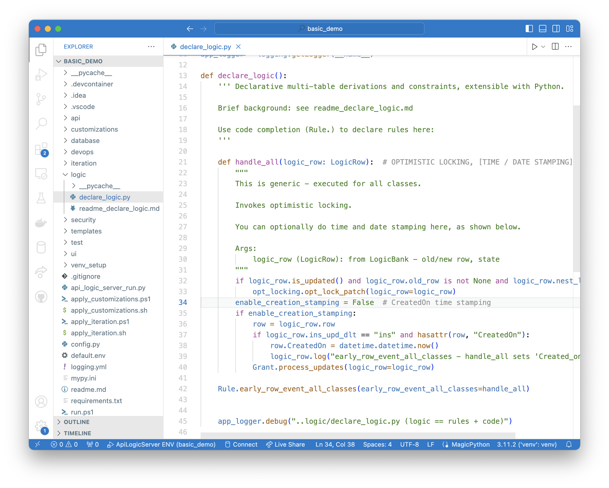

`Rule.early_row_event_all_classes` is provided for ***generic events** which apply to all tables.* 

These are intended to support familiar patterns of time, date, and user stamping.  For example:

Notes:

1. The initiating event is the insert/update of any row
2. We declare `Rule.early_row_event_all_classes` to invoke `handle_all`
      * This is equivalent to an `Event` rule, but applies to `all classes`
3. Note the use of `LogicRow` services, such as `nest_level`
      * Find other services with code completion
4. This pattern can be applied to other forms of stamping, such as created_by / updated_by
      * Alter the code to reflect your own naming conventions

