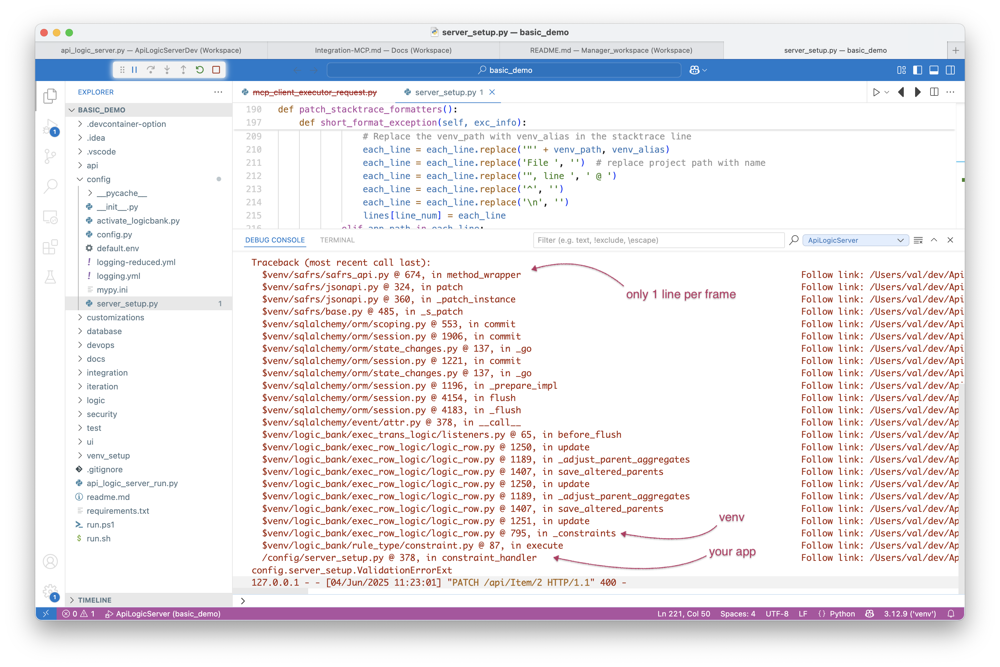

!!! pied-piper ":bulb: TL;DR - Debugging Logic"

    Debug rules using system-generated logging and your IDE debugger.

&nbsp;

## Using the debugger

Use the debugger as shown below.  Note you can stop in lambda functions.

* Key point: ***rows are instances of your Data Model classes*** (`database/models.py`).  These classes define the attributes and relationships; this information powers IDE code completion, the debugger, etc.

    * Recall the Data Model classes were built by API Logic Server, by introspecing the database

 

&nbsp;

## Logic Log

Logging is performed using standard Python logging, with a logger named `logic_logger`.  Use `info` for tracing, and `debug` for additional information (e.g., all declared rules are logged).

In addition, the system logs all rules that fire, to aid in debugging.  Referring the the screen shot above:

*   Each line represents a rule execution, showing row state (old/new values), and the _{reason}_ that caused the update (e.g., client, sum adjustment)
*   Log indention shows multi-table chaining

## Custom Stacktrace

VSCode stacktraces require several lines, so `config/setup_server.py` implements a custom stacktrace as shown below.

1. You can easily disable this if you prefer the standard
2. This applies to all stacktraces, not just for logic

