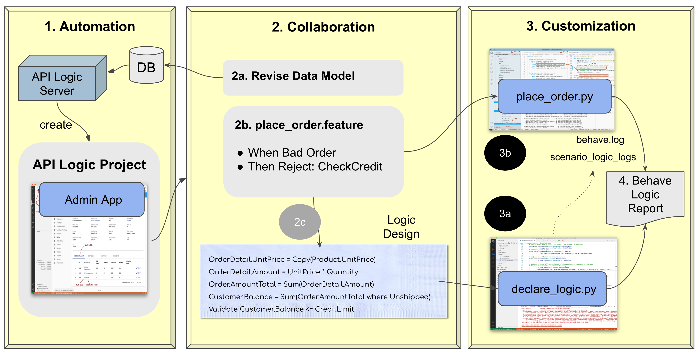
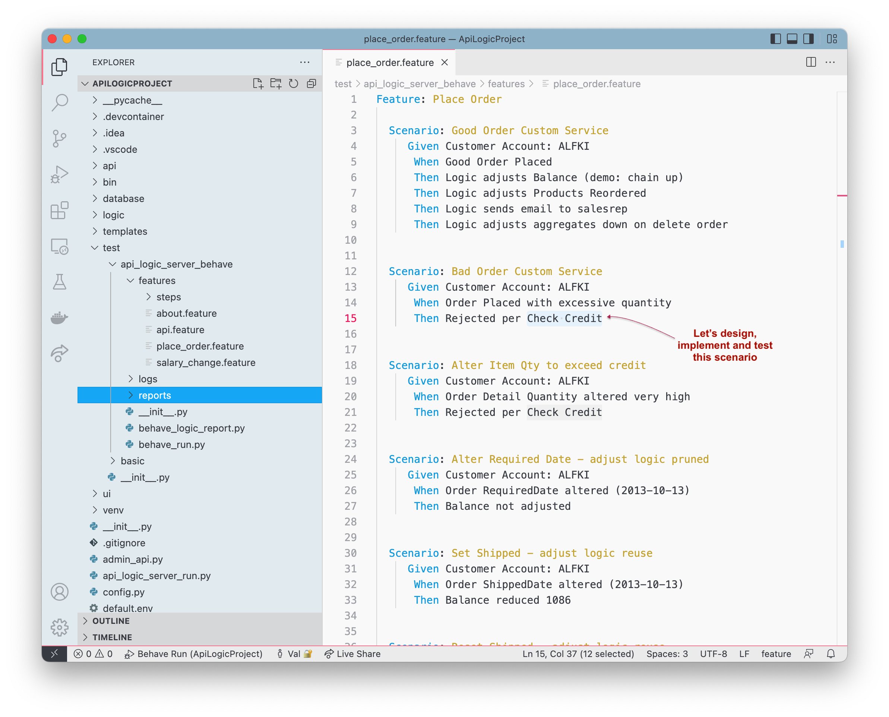
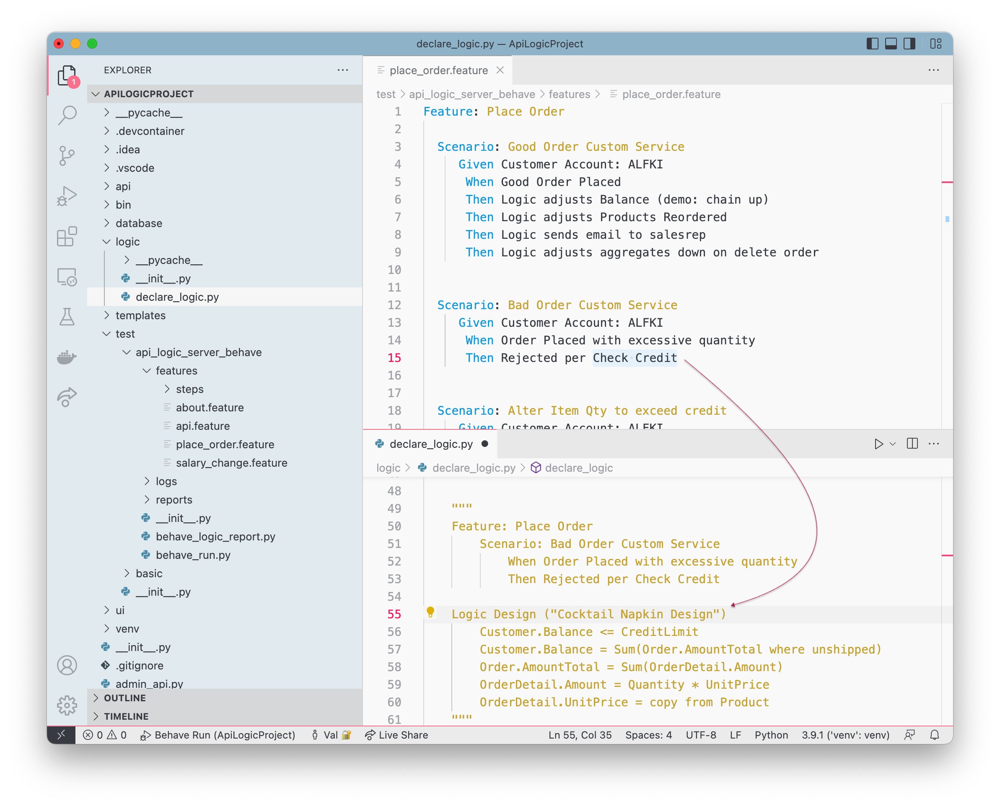
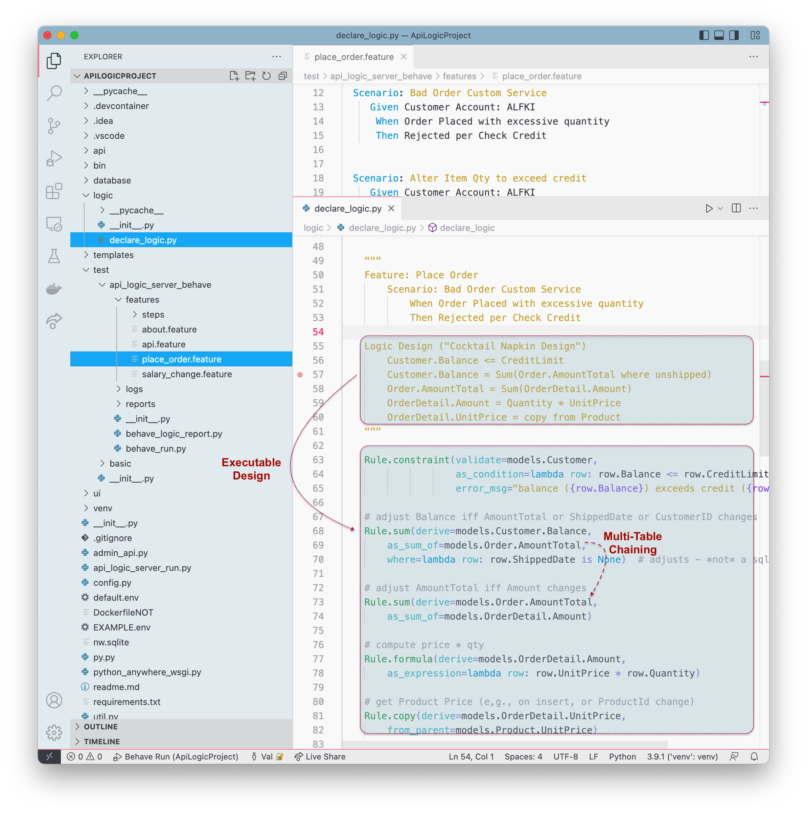
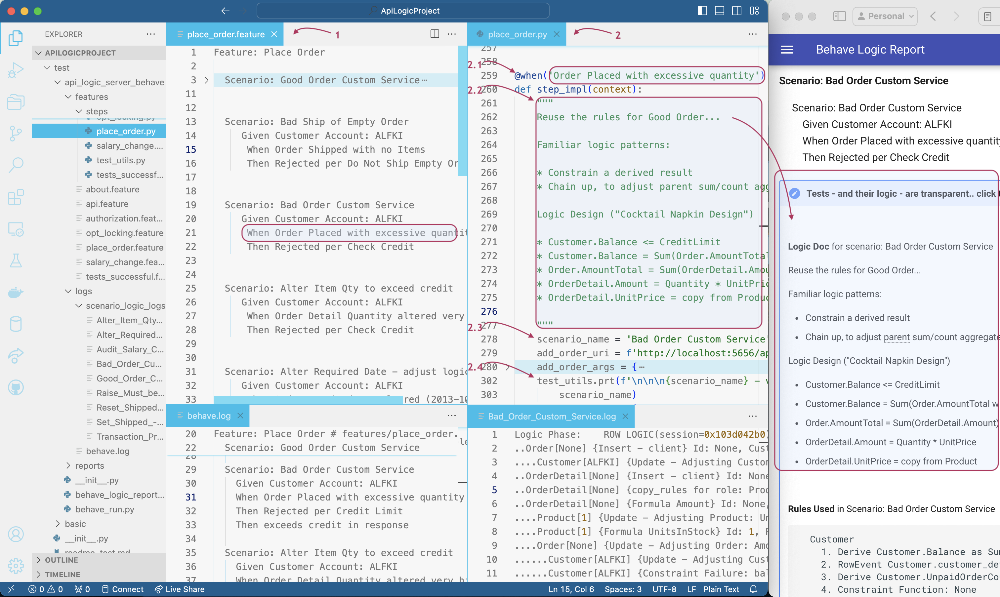

!!! pied-piper ":bulb: TL;DR - Collaboration drives Requirements, Tests, Logic Reports"

    Use API Logic Server with Behave: Working Software *Now* for Agile Collaboration, near instant iteration, and unified requirements capture / traceabilty / test suite development:
      
    1. Use the created Admin App as **Working Software *Now***, enabling Business User **Collaboration** to **capture logic requirements** in Behave.

    2. Use these requirements to **drive rule declaration**, and **develop tests** that verify the scenarios work.  Iterations are extremely rapid due to automatic logic **ordering and optimization**.

    3. Use the **Behave Logic Report** for **requirements traceability:** document the requirements, test results, including the *rules that fired for each test.*

This page describes an optional approach for using logic in a TDD-based Agile framework.

&nbsp;

# Automation + Collaboration: Fast, Right

**Automated App Creation** (Working Software Now) enables **Collaboration** to uncover **Automated Rules.**


This page explains how API Logic Server Automation, coupled with an [Agile (TDD - Test Driven Development) Process](http://dannorth.net/introducing-bdd/){:target="_blank" rel="noopener"}, can dramatically improve Time to Market and reduce Requirements Risk:
  
1. **Automated App Creation:** API Logic Server creates an API Logic Project with a single command.  The project implements an **Admin App** and underlying API.

1. **Customer Collaboration:** the Admin App (Working Software, _Now_) drives collaboration, resulting in *Features* (Stories), *Scenarios* (tests), and *Logic Designs* that define how data is computed, validated, and processed (e.g., issues email or messages, auditing, etc.).

1. **Automated Logic:** the Logic Design often translates directly into ***Executable* Rules,** which can be entered as customizations into the created API Logic Project.

2. **Transparency:** the [Behave Logic Report](Behave-Logic-Report.md){:target="_blank" rel="noopener"} documents the functionality of the system: Features (Stories) and Scenarios (tests) that confirm its operation.  The report includes the underlying Rules, extending transparency to the implementation level.

&nbsp;&nbsp;

> **Key Takeaway:** automation drives Time to Market by providing working software rapidly; this drives agile collaboration to define systems that meet actual needs, reducing requirements risk.

> **Virtuous Cycle:** the collaboration uncovers Logic Designs, which can be declared as spreadsheet-like rules for API Logic Server automation.

&nbsp;&nbsp;

# Resources

After you've reviewed the [logic background](Logic-Why.md), use this page to learn how to use logic.  Key resources:

1. [Rule Summary](Logic.md){:target="_blank" rel="noopener"}
2. [Sample Database](Sample-Database.md){:target="_blank" rel="noopener"}
3. [Behave](https://behave.readthedocs.io/en/stable/tutorial.html){:target="_blank" rel="noopener"} is a framework for defining and executing tests.  It is based on [TDD (Test Driven Development)](http://dannorth.net/introducing-bdd/){:target="_blank" rel="noopener"}, an Agile approach for defining system requirements as executable tests.
  * Here are some [details for using Behave with API Logic Server](Behave.md){:target="_blank" rel="noopener"}.

&nbsp;&nbsp;

# Process Overview

The diagram below provides more detail on the development process, further explained in the sections below.



&nbsp;&nbsp;

## 1. Create Api Logic Project

API Logic Server is used once you have a preliminary database design.  Use your existing procedures for database design.  Include at least minimal test data.

Then (presuming API Logic Server [is installed](https://github.com/valhuber/ApiLogicServer/blob/main/README.md)), create the project with this command, using `venv` based installs:

```
ApiLogicServer create  --db_url= --project_name=
```

or, like this, using docker-based installs:
```
ApiLogicServer create --db_url= --project_name=/localhost/ApiLogicProject
```

&nbsp;&nbsp;

#### 1a. Creates **Admin App**

The Agile objective of collaboration is typically best-served with _running_ screens.  The problem is, it takes quite a long time to create the API and screens to reach this point.  And this work can be wasted if there were misunderstandings.

Ideally, User Interface creation would be automatic.

So, the API Logic Server `create` command above builds first-cut screens, automatically from the data model.  

The app shown below [(more detail here)](https://github.com/valhuber/ApiLogicServer#admin-app-multi-page-multi-table-automatic-joins) is suitable for initial _business user collaboration_ (further discussed below), and basic _back office_ data maintenance.

You can [customize it](https://github.com/valhuber/ApiLogicServer#admin-app-customization) by editing a simple `yaml`file (e.g, field captions, ordering etc.)


&nbsp;&nbsp;

>  **Key Takeaway:** Admin App Automation enables collaboration, instantly.

&nbsp;&nbsp;

#### 1b. Also creates **API**

It is not difficult to create a single endpoint API.  The problem is that it's quite a bit more work to create an endpoint for each table, with support for related data, pagination, filtering and sorting.

Ideally, API creation would be automatic.

So, the API Logic Server `create` command above builds such an API instantly, suitable for _application integration_, and creating _custom User Interfaces_.  The API enforces the business logic described below.

The [created project is customizable,](https://github.com/valhuber/ApiLogicServer/blob/main/README.md#customize-and-debug) using a standard IDE.

&nbsp;&nbsp;

>  **Key Takeaway:** automatic API creation, with support for related data, pagination, filtering and sorting.

&nbsp;&nbsp;

## 2. Collaborate with **Admin App**

As noted above, running screens are an excellent way to engage business user collaboration, and ensure the system meets actual user needs.  Such collaboration typically leads in two important directions, described below.

&nbsp;&nbsp;

#### 2a. Iterate Data Model

You may discover that the data model is incorrect (_"Wait!  Customers have multiple addresses!!"_).  

In a conventional system, this would mean revising the API and App.  However, since these are created instantly through automation, such iterations are trivial.  Just rebuild.

&nbsp;&nbsp;

#### 2b. Define Behave Scenarios

Running screens also spark insight about the Features ("Place Order") and Scenarios ("Check Credit"): _"When the customer places an order, we need to reject it if it exceeds the credit limit"._  Capture these as described below.

Behave is designed for business user collaboration by making Features and Scenarios transparent.  Start using Behave by defining one or more `.feature` files.

For example, see the `place_order.feature`, as tested by the `Bad Order: Custom Service` Scenario, below.




&nbsp;&nbsp;

##### Add Custom Service

While the automatically-created API is a great start, you may uncover a need for a custom service.  This is easy to add - it's only about 10 lines of Python (`api/customize_api.py`), since the logic (discussed below) is enforced in the underlying data access.  For details, [see here](https://github.com/valhuber/ApiLogicServer/blob/main/README.md#api-customization).

&nbsp;&nbsp;

#### 2c. Logic Design

We now choose a scenario (e.g, `Bad Order`), and engage business users for a clear understanding of _check credit_.  This follows a ___familiar step-wise definition of terms:___

| Analyst Question         | Business User Answer               |
|:-------------------------|:-----------------------------------|
| What do you mean by _Check Credit_?                      | The balance must be less than the credit limit
| What is the _Balance_?  | The sum of the unshipped order amount totals
| What is the Order _AmountTotal_? | The sum of the Order Detail Amounts           |
| What is the _Amount_?     | Price * Quantity |
| What is the _Price_?                 | It's copied from the Product (unaffected by subsequent changes)          |

We capture in text as shown below.

Note this "cocktail napkin spec" is short, yet clear.  That's because instead of diving unto unnecessary technical detail of _how_ (such as pseudocode), it focuses on ___what___.


  

&nbsp;&nbsp;

## 3a. Declare Logic (from design)

Business Logic is the heart of the system, enforcing our business policies.  Logic consists of multi-table constraints and derivations, and actions such as sending email and messages.  A core Behave objective is to define and test such behavior.

It's generally accepted that such domain-specific logic _must_ require domain-specific code.  The problem is that this is:

* **slow** (it's often nearly half the system).
* **opaque** to business users.
* **painful to maintain** - it's no secret that developers hate maintenance, since it's less coding than _"archaeology"._  A painful amount of time is spent reading the existing code, to understand where to insert the new logic.

Ideally, our ___logic design is executable.___  

So, API Logic Server provides Logic Automation, where logic is implemented as:

* [Spreadsheet-like ***rules***](https://github.com/valhuber/LogicBank/wiki/Examples) for multi-table derivations and constraints, and

* Python, to implement logic not addressed in rules such as sending email or messages

So, [instead of several hundred lines of code](https://github.com/ApiLogicServer/basic_demo/blob/main/logic/procedural/declarative-vs-procedural-comparison.md), we declare 5 rules [(more details here)](https://github.com/valhuber/ApiLogicServer/blob/main/README.md#logic).  

Rules are entered in Python, with code completion, as shown below.  Observe how they exactly correspond to our design, and are executable by the API Logic Server rules engine:



Unlike manual code, logic is ***declarative:***

* **automatically reused** - re-use is usually achieved by careful design; rules make re-use automatic:
  * Since rules are about the data (not a specific transaction), they automate all the transactions that touch the data (add order, delete order, change order shipped date, etc).  Even ones you might have overlooked (move order to different customer).
  * Since rules are enforced as part of the API, they are automatically shared across *all* screens and services.
* **automatically ordered** - maintenance is simply altering the rules; the system computes their execution order by automatically discovering their dependencies.  No more archaeology.
* **transparent** - business users can read the spreadsheet-like rules.  We'll exploit this in the Behave Logic Report, described below.


&nbsp;&nbsp;

>  **Key Takeaway:** spreadsheet-like rules can dramatically reduce the effort for backend logic, and make it transparent

&nbsp;&nbsp;

>  **Key Takeaway:** keep your Logic Design high level (_what_ not _how_ -- think spreadsheet), and your design will often map directly to executable rules. 

&nbsp;&nbsp;

## 3b. Code/Run Behave Scenarios

Implement the actual scenarios (tests) in Python (`place_order.py`), using annotations (`@when`) to match scenarios and implementations.  In this project, the implementation is basically calling APIs to get old data, run transactions, and check results.



Execute the tests using the pre-supplied Launch Configurations:

1. Run Launch Configuration `API Logic Server` 
1. Run Launch Configuration `Run Behave Logic` 

The rules fire as transactions are run, and produce Logic Log files later used in Report Behave Logic (described below): 

1. `test/api_logic_server_behave/behave.log` - summarizes test success / failure
2. `api_logic_server_behave/scenario_logic_logs/Bad_Order_Custom_Service.log` - [Logic Log output](Logic-Why.md#extend-python).

   * The code on line 161 signals the name of Logic Log
   * Note the Logic Log actually consists of 2 sections:

      * The first shows each rule firing, including complete old/new row values, with 
      indentation for `multi-table chaining`
      * The "Rules Fired" summarizes which rules actually fired, representing a _confirmation of our Logic Design_

>  You can use the debugger to stop in a test and verify results

&nbsp;&nbsp;

## 4. **Create Behave Logic Report**

The log files are pretty interesting: a record of all our Features and Scenarios, including transparent underlying logic.  The problem is that it's buried in some text files inside our project.

Ideally, publishing this in a transparent manner (e.g., a wiki accessible via the Browser) would be a great asset to the team.

So, API Logic Server provides `report_behave_logic.py` to create a Behave Logic Report - _including logic_ - as a wiki file.

To run it, use Launch Configuration `Behave Logic Report`:

1. Reads your current `readme.md` file (text like you are reading now), and
2. Appends the [Behave Logic Report:](#behave-logic-report) by processing the files created in step 3b

   1. Reading the `behave.log`, and
   2. Injecting the `scenario_logic_logs` files
3. Creates the output report as a wiki file named `report_behave_logic.md`

&nbsp;&nbsp;

>  **Key Takeaway:** Behave makes *requirements and tests* transparent; rules make your *logic* transparent; combine them both into the [**Behave Logic Report.**](#behave-logic-report)

&nbsp;&nbsp;

# Process Summary: Automation + Collaboration

We've seen these key points:

1. API Logic Server kick-starts projects with **automated creation of Admin Apps**.

2. Working software promotes **business user collaboration** using Behave, to iterate the data model and create Logic Designs.

3. Logic Designs are automated with **spreadsheet-like rules**.

4. Behave creates an **executable Test Suite**.

5. Test Suite execution creates a **Behave Logic Report:** your Features, Scenarios, Test Results, _and_ the underlying rules-based logic.

Automation enables you to **deliver projects faster**; the Agile/Behave encourages collaboration to **reduce requirements risk**.


  

&nbsp;&nbsp;

# Appendix: Executing Basic Tests

In addition to Behave, you can use manual approaches for testing:

<details markdown>
<summary>Click to see how to run Basic tests</summary>


After you've [created the sample project](Tutorial.md), you can execute pre-defined tests as shown above:

1. Start the Server (e.g., under VS Code, Launch Configuration *ApiLogicServer*)
2. Open a terminal window, and `cd test/basic; python server_test.py go`
3. Examine the log in the *Debug Console*

>  You can build similar tests for your systems as you would in any project, either in Python (as shown here), in shell scripts (see the supplied example), etc.
</details>
