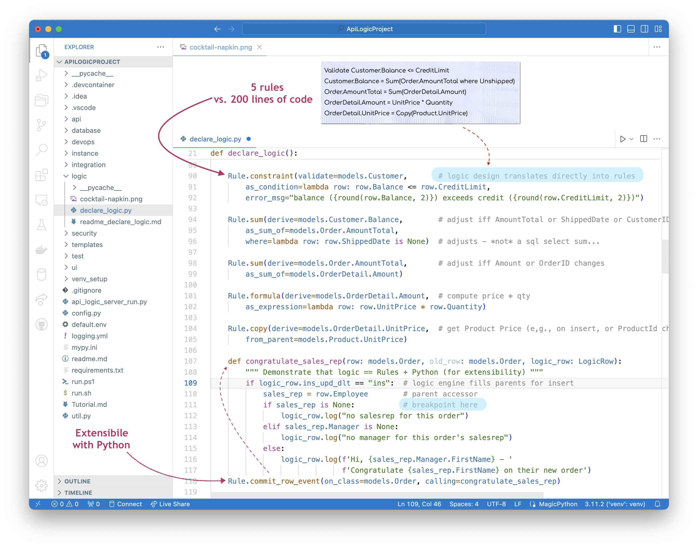

!!! pied-piper ":bulb: TL;DR - Specify expression / function that must be true, else exception"

    Constraints declare an expression (lambda) or function that must be true for a transaction to complete.  You also provide a message that is returned in the exception that is raised if the expression is not true.

## Provide expression as lambda

The simplest contraint is shown below.  The first rule is a constraint using a lambda.  Note the argument is the row, providing access to the attributes.  

You can stop in the debuggers and examine values when the lambda is invoked.

## Provide function - old_row, verb

For more complex cases, you can provide a function.  Note the arguments include `old_row` and `logic_row`.  The latter provides access to the verb, so you can make your logic apply only to the desired verbs.

&nbsp;

## Commit constraints - aggregate values

If your constraint needs to reference derived sums or counts, note these are not derived when the row is initially processed.  You can address such situations using CommitConstraints.

