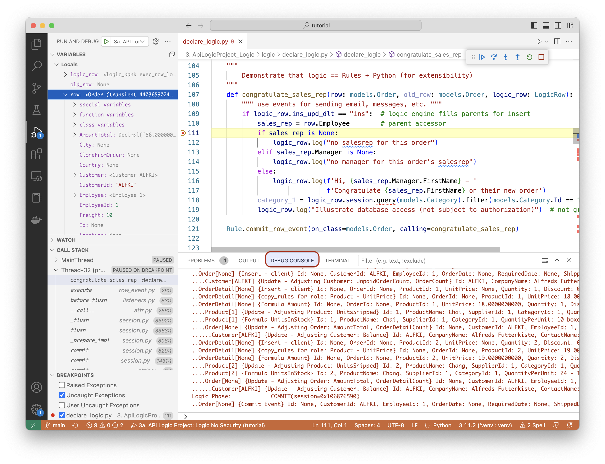

!!! pied-piper ":bulb: TL;DR - Specify expression / function that must be true, else exception"

    Events are callouts to Python functions, supplying `logic_row` as a argument.  Events provide extensibility, to address non-database logic (e.g., sending email and messages), and for complex logic that cannot be addressed in rules. 

&nbsp;

## Defining Events

To define events, you must declare and implement them, as described below.

&nbsp;

### Declare Event Rule

Declare the event, identifying the class and function to call:

```python
Rule.commit_row_event(on_class=models.Order, calling=congratulate_sales_rep)
```

&nbsp;

### Implement Python Function

Implement the Python function that handles the event, accepting the supplied arguments:



&nbsp;

## Event Types

There are multiple event types so that you can control how your logic executes within the rule engine.

&nbsp;

### `early_row_event`

These operate before your derivation / constraint logic executes for each row.  So, for example, derivations have not been performed.

&nbsp;

### `early_row_event_all_classes`

These operate before your logic executes for each row for **any class**.  It is an excellent way to implement generic logic such as time/date stamping.  It is also used by the system to activate optimistic locking logic, as shown below.

```python

def handle_all(logic_row: LogicRow):  # OPTIMISTIC LOCKING, [TIME / DATE STAMPING]
        """
        This is generic - executed for all classes.

        Invokes optimistic locking.

        You can optionally do time and date stamping here, as shown below.

        Args:
                logic_row (LogicRow): from LogicBank - old/new row, state
        """
        if logic_row.is_updated() and logic_row.old_row is not None and logic_row.nest_level == 0:
                opt_locking.opt_lock_patch(logic_row=logic_row)
        enable_creation_stamping = True  # CreatedOn time stamping
        if enable_creation_stamping:
                row = logic_row.row
                if logic_row.ins_upd_dlt == "ins" and hasattr(row, "CreatedOn"):
                row.CreatedOn = datetime.datetime.now()
                logic_row.log("early_row_event_all_classes - handle_all sets 'Created_on"'')

Rule.early_row_event_all_classes(early_row_event_all_classes=handle_all)
```

&nbsp;

### `row_event`

These operate after your derivation / constraint logic executes for each row.  So, for example, derivations have been performed.

&nbsp;

### `commit_row_event`

These operate after logic executes for ***all*** rows.  So, for example, sums and counts have been computed.  


&nbsp;

## Events Must Not Mutate `row`

Because `row_event` and `commit_row_event` both run **after** derivation/constraint logic has already executed for the row, setting `row.some_attribute = value` inside such a handler is not subject to the rule engine: the value is saved, but it is never re-derived-from, never triggers dependent formulas/sums/counts, and is never checked against a `Constraint`.

To prevent this, activation now **fails** (raises an error) if a `row_event`/`commit_row_event` function's source appears to assign to a `row` attribute (e.g., `row.Status = "Approved"`). Use one of these instead:

* **Insert a new row** - e.g., `logic_row.insert(...)`, or `logic_row.new_logic_row(...)` followed by `.insert(...)`. This *is* subject to full rule processing, so it's safe.
* **Use `early_row_event` / `early_row_event_all_classes`** instead, if you need to set an attribute on the *current* row - these run *before* derivation/constraint logic, so your change is picked up normally (this is how the time/date stamping example above works).
* **If you are certain the mutation is safe** (e.g., a plain column nothing else derives from or constrains), pass `allow_row_mutation=True` to bypass the check:

```python
Rule.commit_row_event(on_class=models.Order, calling=congratulate_sales_rep,
                      allow_row_mutation=True)
```

&nbsp;


