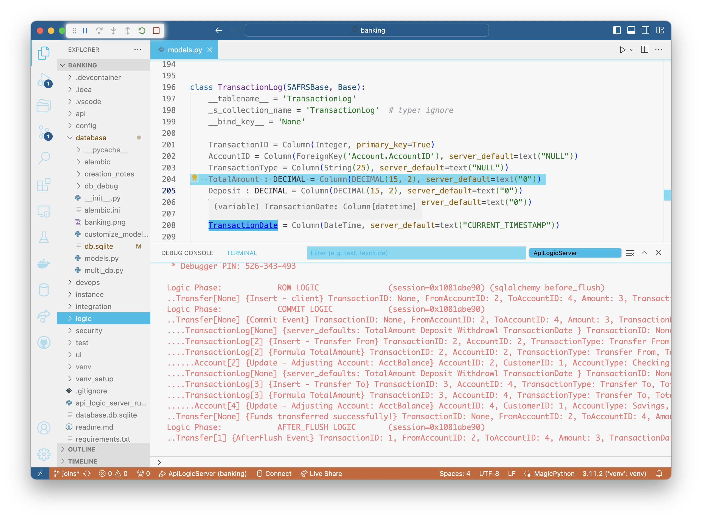
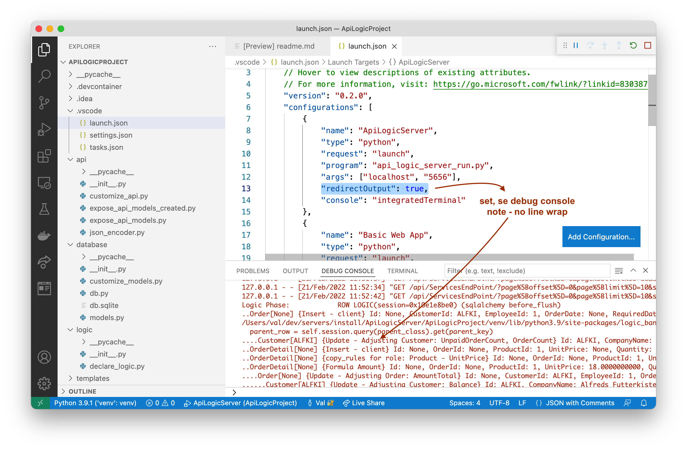

!!! pied-piper ":bulb: TL;DR - Using Logic: Understand functions vs. lambda, logic_row"

    For constraints / formulas that require an expression, you can use
        lambdas or functions.

    Functions have a `logic_row` arguments, providing access to old/new row, verb, etc.

&nbsp;

## Declaration and Activation

Declared rules are automatically activated by `api_logic_server_run..py` when it starts the server.  For more information, please see [Project Operation](Architecture-Project-Operation.md){:target="_blank" rel="noopener"}.

&nbsp;

## Function vs. Lambda

Constraint and Formula rules have arguments for providing an expression.  There are two ways to do this.

For simple expressions, provide a lambda (inline) function, e.g.:

```python
    Rule.formula(derive=models.OrderDetail.Amount,  # compute price * qty
        as_expression=lambda row: row.UnitPrice * row.Quantity)
```

To get access to `old_row` and `logic_row`, specify a function, e.g.:

```python
    """
        Demonstrate that logic == Rules + Python (for extensibility)
    """
    def congratulate_sales_rep(row: models.Order, old_row: models.Order, logic_row: LogicRow):
        """ use events for sending email, messages, etc. """
        if logic_row.ins_upd_dlt == "ins":  # logic engine fills parents for insert
            sales_rep = row.Employee        # parent accessor
            if sales_rep is None:
                logic_row.log("no salesrep for this order")
            elif sales_rep.Manager is None:
                logic_row.log("no manager for this order's salesrep")
            else:
                logic_row.log(f'Hi, {sales_rep.Manager.FirstName} - '
                              f'Congratulate {sales_rep.FirstName} on their new order')
            category_1 = logic_row.session.query(models.Category).filter(models.Category.Id == 1).one()
            logic_row.log("Illustrate database access (not subject to authorization)")  # not granted for user: u2

    Rule.commit_row_event(on_class=models.Order, calling=congratulate_sales_rep)
```

&nbsp;

## LogicRow: old_row, verb, etc

`LogicRow` is a system object you can access in declaring rules.  From the online documentation (use code completion):

!!! pied-piper ":bulb: TL;DR - LogicRow provides access to `old_row`, `ins_upd_dlt` etc."

    Wraps `row` and `old_row`, plus methods for detecting insert, update and delete

    Additional instance variables: ins_upd_dlt, nest_level, session, etc.

    Helper Methods:

    * are_attributes_changed, set_same_named_attributes, get_parent_logic_row(role_name), get_derived_attributes, log, etc

Here is an example:

```python
"""
    STATE TRANSITION LOGIC, using old_row
"""
def raise_over_20_percent(row: models.Employee, old_row: models.Employee, logic_row: LogicRow):
    if logic_row.ins_upd_dlt == "upd" and row.Salary > old_row.Salary:
        return row.Salary >= Decimal('1.20') * old_row.Salary
    else:
        return True

Rule.constraint(validate=models.Employee,
                calling=raise_over_20_percent,
                error_msg="{row.LastName} needs a more meaningful raise")
```

Note the `log` method, which enables you to write row/old_row into the log with a short message:

```python
logic_row.log("no manager for this order's salesrep")
```

Use code completion to see the full list of methods and properties:


You can find examples of these services in the [sample `ApiLogicProject`](Sample-Database.md#northwind-with-logic){:target="_blank" rel="noopener"}.

&nbsp;

## Inserting New Rows

Inserting coding depends on whether you are already in the context of a logic_row ("in logic"), or not ("in APIs and Messages").  These are described below.

&nbsp;

### In APIs and Messages

In API/Message development, you can submit transaction payloads as shown below:

```python
class ServicesEndPoint(safrs.JABase):

    @classmethod
    @jsonapi_rpc(http_methods=["POST"])
    def OrderB2B(self, *args, **kwargs):  # yaml comment => swagger description
        """ # yaml creates Swagger description
            args :
                order:
                    AccountId: "ALFKI"
                    Given: "Steven"
                    Surname: "Buchanan"
                    Items :
                    - ProductName: "Chai"
                      QuantityOrdered: 1
                    - ProductName: "Chang"
                      QuantityOrdered: 2
            ---

        Note attribute alias, Lookup automation in OrderB2B

        See: https://apilogicserver.github.io/Docs/Sample-Integration/
        Test with swagger, or, from command line:

        $(venv) ApiLogicServer login --user=admin --password=p
        $(venv) ApiLogicServer curl "'POST' 'http://localhost:5656/api/ServicesEndPoint/OrderB2B'" --data '
        {"meta": {"args": {"order": {
            "AccountId": "ALFKI",
            "Surname": "Buchanan",
            "Given": "Steven",
            "Items": [
                {
                "ProductName": "Chai",
                "QuantityOrdered": 1
                },
                {
                "ProductName": "Chang",
                "QuantityOrdered": 2
                }
                ]
            }
        }}}'

        """

        db = safrs.DB         # Use the safrs.DB, not db!
        session = db.session  # sqlalchemy.orm.scoping.scoped_session

        order_b2b_def = OrderB2B()
        request_dict_data = request.json["meta"]["args"]["order"]
        sql_alchemy_row = order_b2b_def.dict_to_row(row_dict = request_dict_data, session = session)

        session.add(sql_alchemy_row)
        return {"Thankyou For Your OrderB2B"}  # automatic commit, which executes transaction logic
```

Salient points:

1. Note the process of obtaining a `session` from safrs (the api engine)
2. Note the use of the `OrderB2B` "RowDictMapper" to transform payload  data into row instances
3. Observe that you add the row to the session; logic execution is automatic

&nbsp;

### In Logic

In logic development, before you save a new row, you will first need to instantiate a new row instance.  Consider the following code from the sample app `logic/declare_logic.py`:

```python
    if preferred_approach:  # #als: AUDITING can be as simple as 1 rule
        RuleExtension.copy_row(copy_from=models.Employee,
                            copy_to=models.EmployeeAudit,
                            copy_when=lambda logic_row: logic_row.ins_upd_dlt == "upd" and 
                                    logic_row.are_attributes_changed([models.Employee.Salary, models.Employee.Title]))
    else:
        def audit_by_event(row: models.Employee, old_row: models.Employee, logic_row: LogicRow):
            tedious = False  # tedious code to repeat for every audited class
            if tedious:      # see instead the RuleExtension.copy_row above (you can create similar rule extensions)
                if logic_row.ins_upd_dlt == "upd" and logic_row.are_attributes_changed([models.Employee.Salary, models.Employee.Title]):
                    # #als: triggered inserts  
                    copy_to_logic_row = logic_row.new_logic_row(models.EmployeeAudit)
                    copy_to_logic_row.link(to_parent=logic_row)
                    copy_to_logic_row.set_same_named_attributes(logic_row)
                    copy_to_logic_row.insert(reason="Manual Copy " + copy_to_logic_row.name)  # triggers rules...

        Rule.commit_row_event(on_class=models.Employee, calling=audit_by_event)
```

If you are doing auditing (a common pattern), we recommend you consider `copy_row`.  The alternative coding illustrates how do do insert manually, using `logic_row.new_logic_row(models.EmployeeAudit)`.

&nbsp;

### Insert defaulting

In either case, the new logic row is returned with default values.  These are obtained from your database schema, via `database/models.py`.  For example:



Observe the `server_default` property.  This value is used by LogicBank, as follows:

1. Defaults are applied when instantiating a new row, and for default values when saving an inserted row

2. Only constant values are defaulting, and dates and datetimes with the value `CURRENT_TIMESTAMP`

3. Defaulted values are depicted on the server console

&nbsp;

#### Aggregates defaulted to 0

Aggregate derivations (sums and counts) are defaulted to 0.

&nbsp;

#### All Defaults

You can set the environment variable `ALL_DEFAULTS` to force numeric values to 0, and string values to the null string.  This has no effect on dates.

&nbsp;

## Updating and Deleting

These require you first obtain the row, either through a model class accessor (e.g., retrieve a parent row), or a SQLAlchemy call.  In any case, alter the row as required, and issue `logic_row.update()' (or delete).  As for insert, this triggers logic execution.

&nbsp;

## Managing Logic: Your IDE, SCCS

[Declare Rules in your IDE](Logic-Why.md##rules-declare-extend-debug){:target="_blank" rel="noopener"} (e.g., VSCode, PyCharm) to declare logic using Python, with all the familiar features of code completion and syntax high-lighting.  You can also use the debugger, and familiar Source Code Control tools such as `git`.

&nbsp;

### Logic Debugging

If we use Swagger and run `ServicesEndPoint - Post/add_order`, we get the following :


#### IDE Debugger

This illustrates that you can stop in your rule logic (the red dot on line 111), and use your **IDE debugger** (here, VSCode) to see variables, step through execution, etc.

#### Logic Logging

In addition, the system creates a **logic log** of all rules that fire, to aid in debugging by visualizing rule execution:

*   Each line represents a rule execution, showing row state (old/new values), and the _{reason}_ that caused the update (e.g., client, sum adjustment)
*   Log indention shows multi-table chaining

> Logging is performed using standard Python logging, with a logger named `logic_logger`.  Use `info` for tracing, and `debug` for additional information (e.g., a declared rules are logged).


#### VSCode debugging

In VSCode, set `"redirectOutput": true` in your **Launch Configuration.**  This directs logging output to the Debug Console, where it is not word-wrapped (word-wrap obscures the multi-table chaining).



&nbsp;

### Managing Logic

Logic is Python code, so is managed using your existing SCSS approach (e.g., `git`), with related services for diff, merge, history, versioning, etc.