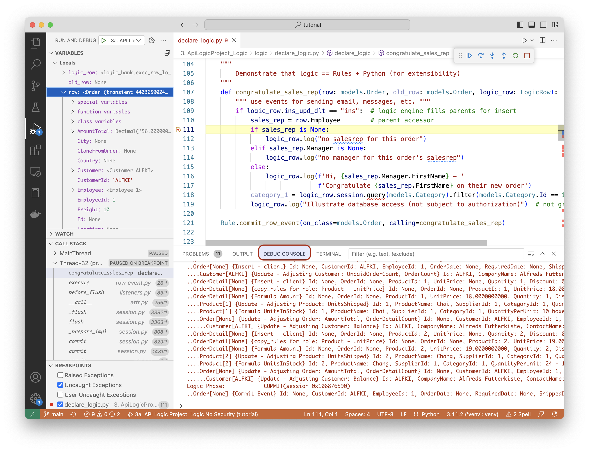

This page describes how to use the Rules.

## Declaration and Activation

Please see [Project Operation](../Architecture-Project-Operation){:target="_blank" rel="noopener"}.

&nbsp;

## Function vs. Lambda

Constraint and Formula rules have arguments for providing an expression.  There are two ways to do this.

For simple expressions, provide a lambda (inline) function, e.g.:

```python
    Rule.formula(derive=models.OrderDetail.Amount,  # compute price * qty
        as_expression=lambda row: row.UnitPrice * row.Quantity)
```

To get access to `old_row` and `logic_row`, specify a function, e.g.:

```python
    """
        Demonstrate that logic == Rules + Python (for extensibility)
    """
    def congratulate_sales_rep(row: models.Order, old_row: models.Order, logic_row: LogicRow):
        """ use events for sending email, messages, etc. """
        if logic_row.ins_upd_dlt == "ins":  # logic engine fills parents for insert
            sales_rep = row.Employee        # parent accessor
            if sales_rep is None:
                logic_row.log("no salesrep for this order")
            elif sales_rep.Manager is None:
                logic_row.log("no manager for this order's salesrep")
            else:
                logic_row.log(f'Hi, {sales_rep.Manager.FirstName} - '
                              f'Congratulate {sales_rep.FirstName} on their new order')
            category_1 = logic_row.session.query(models.Category).filter(models.Category.Id == 1).one()
            logic_row.log("Illustrate database access (not subject to authorization)")  # not granted for user: u2

    Rule.commit_row_event(on_class=models.Order, calling=congratulate_sales_rep)
```

&nbsp;

## LogicRow: old_row, verb, etc

From the online documentation (use code completion):

!!! pied-piper ":bulb: TL;DR - LogicRow provides access to `old_row`, `ins_upd_dlt` etc."

        Wraps row and old_row, plus methods for insert, update and delete - rule enforcement

        Additional instance variables: ins_upd_dlt, nest_level, session, etc.

        Helper Methods

            are_attributes_changed, set_same_named_attributes, get_parent_logic_row(role_name), get_derived_attributes, log, etc

Here is an example:

```python
"""
    STATE TRANSITION LOGIC, using old_row
"""
def raise_over_20_percent(row: models.Employee, old_row: models.Employee, logic_row: LogicRow):
    if logic_row.ins_upd_dlt == "upd" and row.Salary > old_row.Salary:
        return row.Salary >= Decimal('1.20') * old_row.Salary
    else:
        return True
Rule.constraint(validate=models.Employee,
                calling=raise_over_20_percent,
                error_msg="{row.LastName} needs a more meaningful raise")
```

Note the `log` method, which enables you to write row/od_row into the log with a short message.

&nbsp;

## Debugging

Debug rules using system-generated logging and your IDE debugger.

&nbsp;

### Using the debugger

Use the debugger as shown below.  Note you can stop in lambda functions.



&nbsp;

### Logic Log

Logging is performed using standard Python logging, with a logger named `logic_logger`.  Use `info` for tracing, and `debug` for additional information (e.g., all declared rules are logged).

In addition, the system logs all rules that fire, to aid in debugging.  Referring the the screen shot above:

*   Each line represents a rule execution, showing row state (old/new values), and the _{reason}_ that caused the update (e.g., client, sum adjustment)
*   Log indention shows multi-table chaining

&nbsp;

