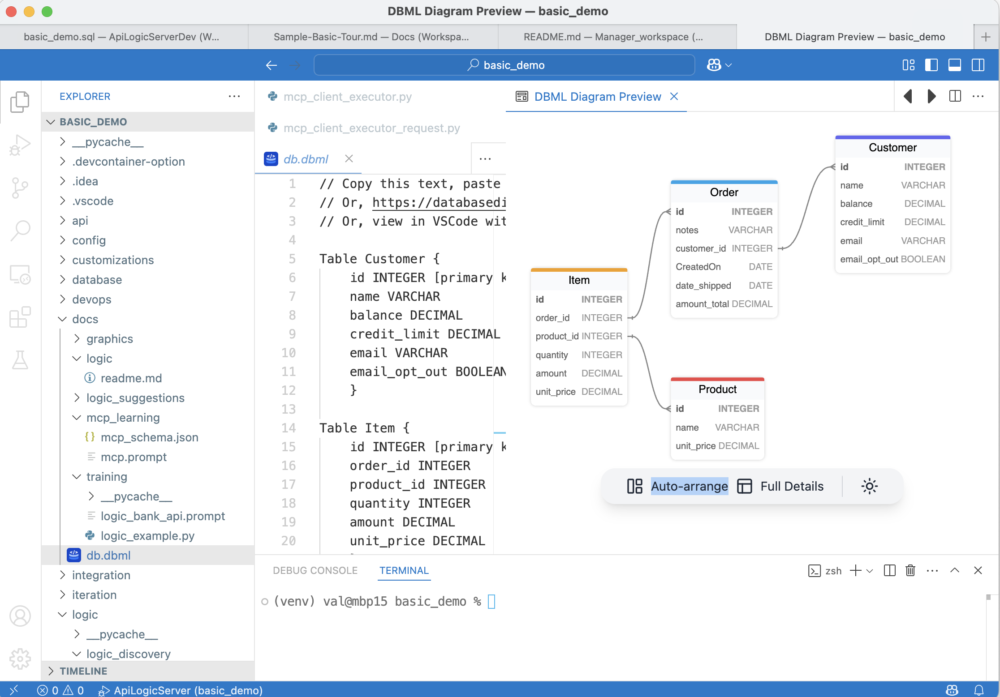

<style>
  .md-typeset h1,
  .md-content__button {
    display: none;
  }
</style>

!!! pied-piper ":bulb: **Unified Logic Model** — Combine deterministic rules with AI-powered creative reasoning"

    Business logic often requires **both** kinds of reasoning:
    
    - **Deterministic Logic** — "Customer balance must not exceed credit limit".  Such "classic" logic does not invoke AI at runtime.
    - **Creative Logic** — "Which supplier can still deliver if the strait is blocked?".  Such logic invokes AI at runtime to compute values.  Since AI is probabalistic, you  typically constrain the computed values with deterministic logic, and provide for audit trails to verify proper operation.
    
    GenAI-Logic enables you to **express both in the same natural language prompt**, and **execute them together** with proper governance.

**Under Construction**

&nbsp;

## Two Kinds of Logic

Not all business logic is the same. Understanding the distinction helps you choose the right tool for each situation.

### Deterministic (Classic) Logic

Some logic must be **consistent, verifiable, and repeatable** — the same inputs always produce the same outputs.  This is the *classic* logic we used to code by hand, now declared with rules in GenAI-Logic.

**Examples:**

- Credit limit validation
- Order total calculation (sum of line items)
- Customer balance updates (aggregate unpaid orders)
- Tax calculations based on fixed rules

**Characteristics:**

- ✅ Always produces the same result
- ✅ Can be tested exhaustively
- ✅ Full audit trail of calculations
- ✅ Multi-table chaining handled automatically

**Natural Language Expression:**

```
The Customer's balance is the sum of Order amount_total where date_shipped is null
The Order's amount_total is the sum of Item amount
The Item amount is quantity * unit_price
The Customer's balance must not exceed credit_limit
```

These translate directly into **declarative rules** that the LogicBank engine enforces automatically.

&nbsp;

### Creative (Probabilistic) Logic

Other logic benefits from **judgment, context awareness, and adaptive reasoning** — where optimization or external factors influence the decision.

**The Underlying Pattern:**

> AI selects a "Provider Row" from a Provider Candidate List, setting 1 or more values into a "Receiver Row"

**Examples:**

| Use Case: AI selects from Provider Candidate List | Receiver Row | Provider Row | Values Transferred | Sample |
|----------|---------------|--------------|-------------------|--------|
| **Optimal supplier selection** based on cost, lead time, and world conditions | `Item` | `Supplier` (via `ProductSupplierList`) | `unit_price`, `lead_time_days`, `supplier_id` | `basic_demo` |
| Best warehouse for fulfillment | `Order` | `Warehouse` | `warehouse_id`, `shipping_cost`, `distance` | |
| Preferred payment processor | `Transaction` | `PaymentProcessor` | `processor_id`, `fee_rate`, `processing_time` | |
| Resource allocation (support tickets) | `Ticket` | `Agent` | `agent_id`, `estimated_resolution_time`, `expertise_level` | |

**Characteristics:**

- 🎯 Leverages AI's ability to weigh multiple factors
- 🎯 Adapts to changing external conditions
- 🎯 Selects from candidates rather than computing values
- 🎯 Still requires governance (guardrails)

**Natural Language Expression:**

```
Use AI to Set Item field unit_price by finding the optimal Product Supplier based on cost, lead time, and world conditions
```

This delegates the **selection decision** to AI while keeping the result **auditable and governed** by deterministic rules.

&nbsp;

## Why Both Matter: Governable Creativity

**The Real Power:** Combining both approaches in a single unified model.

### Example: Order Processing with AI-Selected Supplier

Given this database:



```python title="Unified Deterministic and Probabilistic Logic"
Use case: Check Credit

1. The Customer's balance is less than the credit limit
2. The Customer's balance is the sum of the Order amount_total where date_shipped is null
3. The Order's amount_total is the sum of the Item amount
4. The Item amount is the quantity * unit_price
5. The Product count suppliers is the sum of the Product Suppliers
6. Item unit_price is derived as follows:
       - IF Product has suppliers,
             use AI to select optimal supplier based on cost, lead time, and world conditions
       - ELSE copy from Product.unit_price
```

**What happens:**

1. **AI makes creative decision** — Selects supplier considering multiple factors including real-time conditions
2. **Deterministic rules cascade** — Updates Item amount → Order total → Customer balance
3. **Guardrail enforces constraint** — Credit limit validation prevents bad transactions

**Result:** You get the **adaptability of AI** with the **reliability of rules**.

&nbsp;

## The "Get Values from Best Candidate" Pattern

This pattern handles scenarios where AI selects an optimal choice from a list of candidates and returns value(s) for use in business logic.

### Pattern Components

| Component | Description | Example |
|-----------|-------------|---------|
| **Receiver** | Object that needs value(s) | `Item`, `Order` |
| **Provider** | Candidate objects with source values | `Supplier` (via `ProductSupplierList`) |
| **Request Table** | Stores context, results, and audit trail | `SysSupplierReq` |
| **AI Handler** | Makes selection and populates request | `supplier_id_from_ai()` |
| **Wrapper Function** | Encapsulates pattern, returns request object | `get_supplier_selection_from_ai()` |
| **Integration** | How values reach receiver | Early Event (extracts fields from request object) |

### Request Pattern: Complete Audit Trail

Observe the request object:


Every AI decision is recorded in a **request table** with three types of fields:

**Standard AI Audit (same for all AI requests)**
```python
id = Column(Integer, primary_key=True)
request = Column(String(2000))        # Context: "Egyptian Cotton Sheets from Acme ($105) or Global ($110)"
reason = Column(String(500))          # Decision: "Selected Acme - lower cost, reliable delivery"
created_on = Column(DateTime)         # When decision was made
fallback_used = Column(Boolean)       # Did AI fail and use fallback?
```

**IMPORTANT:** `request` and `reason` must contain business-meaningful data:
- Use names, not IDs ("Acme" not "2")
- Include context values ("$105" not just supplier name)
- Populate in AI handler where data exists, not wrapper

**Parent Context Links (FKs to triggering entities)**
```python
item_id = Column(ForeignKey('item.id'))      # Which Item?
product_id = Column(ForeignKey('product.id')) # Which Product?
```

**AI Results (values selected by AI)**
```python
chosen_supplier_id = Column(ForeignKey('supplier.id'))  # Selected supplier
chosen_unit_price = Column(DECIMAL)                     # Their price
chosen_lead_time = Column(Integer)                      # Their lead time
```

&nbsp;

## When to Use This Pattern

### ✅ Good Fit

- **Selection from candidates** — Multiple options to choose from
- **AI-driven optimization** — Decision based on multiple weighted criteria
- **Value extraction** — Getting attribute(s) from chosen candidate
- **Audit requirement** — Need to track what AI decided and why

**Examples:**

- ✅ Optimal supplier selection
- ✅ Best warehouse for fulfillment
- ✅ Preferred payment processor
- ✅ Routing assignment (driver, route, carrier)
- ✅ Resource allocation (assign ticket to agent)

### ❌ Not Applicable

- ❌ Pure computation without candidates (dynamic pricing, risk scoring)
- ❌ Forecasting/prediction (no candidate selection)
- ❌ Classification without candidate list
- ❌ Simple deterministic calculations (use regular rules)

&nbsp;

## Benefits of the Unified Approach

### 1. Natural Language for Both

Express **deterministic** and **creative** logic the same way:

```
Customer balance is the sum of Order amount_total     ← Deterministic
Item unit_price uses AI to select optimal supplier    ← Creative
Customer balance must not exceed credit_limit         ← Guardrail
```

### 2. Complete Governance

- **Audit trail** — Every AI decision logged with reasoning
- **Fallback strategies** — Graceful degradation if AI unavailable
- **Deterministic guardrails** — Rules enforce boundaries on AI outputs
- **Human in the loop** — Review DSL before execution

### 3. Seamless Integration

- AI decisions **participate in rule chaining** like any other logic
- **No special handling** — Same transaction, same rollback, same logging
- **Testable** — Use mock responses for deterministic testing

### 4. Business Agility

- **Fast changes** — Modify prompt or criteria without code changes
- **Adaptive** — AI responds to real-world conditions
- **Reliable** — Deterministic rules prevent bad outcomes

&nbsp;

## The Business Logic Agent

This unified model forms the foundation of the **Business Logic Agent** — an architectural pattern that combines:

- **Probabilistic Intent** — AI interprets natural language and makes creative decisions
- **Deterministic Enforcement** — Rules engine guarantees correctness and governance
- **MCP Discovery** — AI assistants can understand and interact with the system


**Not AI vs. Rules — AI and Rules working together.**

&nbsp;