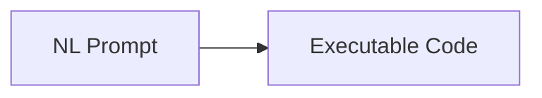
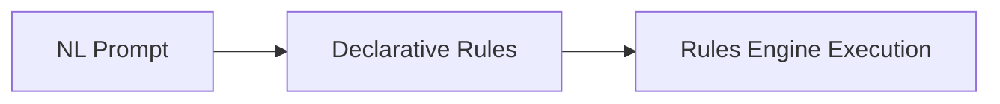

# Logic: GenAI Approaches

This page compares two architectural approaches for implementing business logic from natural-language (NL) requirements. The focus is analytical: how each approach handles dependency paths, change propagation, maintenance, and correctness.


!!! abstract "30 second summary"

    GenAI models can generate procedural code, but maintaining correct multi-table business logic as systems evolve requires anticipating all dependency paths.

    The architectural fork is straightforward:

    1. Procedural GenAI: generate procedural code that must enumerate these paths, or

    2. Declarative GenAI: generate declarative rules that a deterministic engine evaluates using an explicit dependency graph.

    *In practice, anticipating all paths is difficult to do reliably in procedural form.*

## Why This Matters (for enterprises)

- Incorrect invoices and pricing when rollups are missed
- Wrong credit approvals when balances don’t fully recompute
- Silent gaps when foreign keys change (old/new parent updates)
- Local patches multiply; drift and regressions increase
- Compliance/auditability degrade; maintenance costs rise

### Experiment at a Glance

| | Declarative (Rules) | Procedural (Generated Code) |
|---|---:|---:|
| Size | 5 rules | ~220 lines |
| Defects found | 0 | 2 |
| Dependency coverage | Derived from declared dependencies | Missed old‑parent, missed price re‑copy |

### How this powers the platform

This architectural choice underpins Enterprise Vibe Automation: generating complete business systems (Database + API + Admin UI + Logic) in minutes, with logic that remains correct as the system evolves. See the tour: [Product Tour](Sample-Basic-Tour.md), and the [Admin App](Admin-Tour.md) and [API](API.md) details.

---

## Sample NL Logic

Business Rules:

1. Customer's balance is less than credit limit  
2. Customer's balance is sum of Order amount_total where date_shipped is null  
3. Order's amount_total is sum of Item amount  
4. Item amount is quantity × unit_price  
5. Item unit_price is copied from Product unit_price  

---

## Methodology

1. Provide NL requirements (5 rules) to Copilot.
2. Capture initial output (procedural code vs. declarative rules).
3. Ask targeted questions about routine updates:
  - Reassign Order to different Customer.
  - Reassign Item to different Product.
4. Observe defects reported by Copilot itself.
5. Record fixes and categorize defect types (missed old‑parent decrement, missed attribute re‑copy).
6. Compare size, defect count, and dependency coverage semantics.

Rationale: Routine FK change scenarios expose whether dependency paths (old/new parent recalcs, child attribute propagation) were fully anticipated. They are not edge cases.

---

# 1. Alternatives

## Procedural GenAI



In this approach, the model emits procedural logic (see example: `credit_service.py`). The generated code must:

- Implement handlers  
- Manage dependency paths  
- Handle old/new parent adjustments  
- Recompute related values  
- Maintain correctness across maintenance cycles  

Because the dependency structure is implicit in code, completeness depends on enumerating every change scenario. Because the dependency structure is implicit in the code, it is difficult to verify that all relevant parent–child combinations have been anticipated.

---

## Declarative GenAI



In this approach, the model generates a compact declarative ruleset.  
Execution correctness follows from declared dependencies, not enumerated branches.

The engine:

- Derives the dependency graph  
- Computes ordering  
- Applies deltas  
- Manages old/new parent updates  
- Enforces constraints  

The declarative ruleset provides a clear and centralized description of the intended behavior, improving transparency for both developers and business stakeholders.

---

# 2. Experiment

We ran an A/B experiment: ask Copilot for logic from a natural‑language description, twice—once targeting procedural code and once targeting declarative rules. We then interrogated the generated procedural code for ordinary change scenarios (FK reassignments) to surface correctness gaps.

## Results

We asked GitHub Copilot to generate logic for a multi‑table credit/pricing requirement. It produced ~220 lines of code. When questioned about specific change scenarios, it found two defects and generated fixes.

### Declarative GenAI (5 Rules)

```python
Rule.constraint(
    validate=models.Customer,
    as_condition=lambda row:
        row.balance is None or
        row.credit_limit is None or
        row.balance <= row.credit_limit,
    error_msg="Customer balance ({row.balance}) exceeds credit limit ({row.credit_limit})"
)

Rule.sum(
    derive=models.Customer.balance,
    as_sum_of=models.Order.amount_total,
    where=lambda row: row.date_shipped is None
)

Rule.sum(
    derive=models.Order.amount_total,
    as_sum_of=models.Item.amount
)

Rule.formula(
    derive=models.Item.amount,
    as_expression=lambda row: row.quantity * row.unit_price
)

Rule.copy(
    derive=models.Item.unit_price,
    from_parent=models.Product.unit_price
)
```

---

### Procedural GenAI (220 lines)

When Copilot generated ~220 lines of procedural logic for the five NL rules, the code appeared reasonable at first glance. To evaluate correctness, we asked about routine change scenarios.

- **Reassigning an Order to a different Customer**  
  Copilot reviewed its own output and found a defect: it had not decremented the balance of the *old* Customer. It produced a corrective patch.

- **Reassigning an Item to a different Product**  
  A second defect surfaced: the code did not re-copy the Product’s unit_price into the Item after reassignment. Copilot produced another fix.

After generating both patches, Copilot added an unsolicited explanation:

> Determining all the dependency paths—especially old/new parent combinations—is difficult.  
> A declarative rules engine handles these dependencies more reliably.

These issues appeared immediately when we asked about ordinary update scenarios. These issues surfaced in routine scenarios, suggesting the difficulty of anticipating and enumerating all dependency paths in procedural implementations.

A detailed, step‑by‑step version of this comparison is available here: [What Happened Here](https://github.com/ApiLogicServer/ApiLogicServer-src/blob/main/api_logic_server_cli/prototypes/basic_demo/logic/procedural/declarative-vs-procedural-comparison.md#what-happened-here)

---

### Summary

| Approach | Lines | Defects | Notes |
|---------|-------|---------|-------|
| Procedural (Copilot) | ≈220 | 2 | Missed old‑parent adjustment; missed price re‑copy |
| Declarative (Rules) | 5 | 0 | Engine derives all paths |

Procedural defects arose because enumerating dependency paths (including both directions of FK changes and cascading recalculations) is combinatorial. A declarative engine handles these paths automatically.

### Comparison

#### Qualitative

| Aspect | Procedural | Declarative |
|--------|------------|-------------|
| Artifact size | Large (hundreds of lines) | Small (few rules) |
| Path completeness | Unverifiable | Derived from declared dependencies |
| Maintenance | Trace handlers across code | Modify centralized rules |
| Old/new parent handling | Manual | Automatic |
| Cascading recalcs | Manual | Engine‑managed |
| Business transparency | Logic spread across functions | Rules readable by business users |
| Hallucination exposure | High: behavior follows generated code | Lower: model generates rules; engine governs semantics |
| Incremental updates | Often recomputes full aggregates | Uses deltas based on dependency changes |

#### Visual Summary


---

## Business Logic Agent (foundation)

This page explains the foundation for a Business Logic Agent: GenAI expresses intent as rules; the deterministic engine enforces dependencies, order, and constraints for every transaction. The agent orchestrates NL → rules, while the engine enforces dependency ordering, deltas, and constraints. For how this works with MCP, see [MCP Integration](Integration-MCP.md).

---

# 3. Analysis

At this point the experiment suggests a clear advantage for Declarative GenAI. Given rapid AI evolution, we asked: is this advantage temporary (to be erased by larger models or better prompts), or is it inherent? Based on the experiment and prior deployments, this appears to be an architectural limitation rather than a temporary one. Model scale improves pattern generation but does not supply deterministic dependency execution. Enumerating all update paths in procedural code remains combinatorial; declarative rules paired with an engine externalize dependency semantics in a way that continues to hold as models advance.

## Model Improvement

Larger or better models improve pattern generation but do not provide dependency execution semantics. Procedural correctness still depends on anticipating and enumerating all relevant update paths.  
Improving prompts does not change this structural limitation.

Declarative logic reduces hallucination exposure by narrowing the model’s role to generating rule intent; execution semantics remain deterministic within the engine.

---

## Architectural Boundary

Declarative logic separates intent (rules) from execution (engine). Rules remain stable; engine improvements accumulate without requiring rule changes.

In prior enterprise systems (e.g., Versata deployments), replacing procedural aggregate maintenance with declarative, delta‑based logic produced substantial real‑world performance improvements. One system reduced transaction time from roughly three minutes to a few seconds because only affected values were recalculated.  
Performance varies by workload, but incremental evaluation can materially reduce processing time.

Declarative rules also make application logic more transparent: the logic can be reviewed directly by developers and business users, supporting validation and auditability.

While no approach guarantees correctness in every possible scenario, declarative rules provide a clearer basis for reasoning about update propagation than procedural code generated by a model.

---

## Maintenance

Two critical questions become easier to answer:

- *What does this do now?*  
  – Declarative rules provide a single, centralized description of behavior.

- *Where do I make a change safely?*  
  – Updating or adding rules avoids tracing procedural side effects.

---

## Residual Code

Custom logic (events, integrations) will always exist. Declarative rules ensure the correctness‑critical core remains centralized and deterministic.

---

# 4. Artifacts

| Item | Purpose | Location |
|------|----------|----------|
| Declarative rules | Intent specification | `basic_demo/logic/logic_discovery/check_credit.py` |
| Procedural sample | Generated code | `basic_demo/logic/procedural/credit_service.py` |
| Full comparison | Experiment notes | GitHub (link above) |
| MCP demo | Copilot → rules → constraint | `Integration-MCP-AI-Example.md` |
| Deterministic logic rationale | Background | `Tech-Prob-Deterministic/` |

---

# Summary

Procedural GenAI requires explicit enumeration of dependency paths. This enumeration is error‑prone, difficult to verify, and sensitive to omissions.

Declarative GenAI expresses logic concisely as rules; the engine derives and enforces required paths deterministically.  
This reduces hallucination impact, improves maintainability and transparency, and can improve performance by applying incremental updates rather than full recomputes.

Natural language provides intent.  
Declarative rules capture logic.  
The engine ensures consistent execution.

---

## See it live (next steps)

- Walk through the end‑to‑end flow: [Product Tour](Sample-Basic-Tour.md)
- Explore MCP automation: [MCP Integration](Integration-MCP.md)
- Review the Admin App: [Admin App Tour](Admin-Tour.md)
- Review the API: [Automatic Multi‑Table API](API.md)
