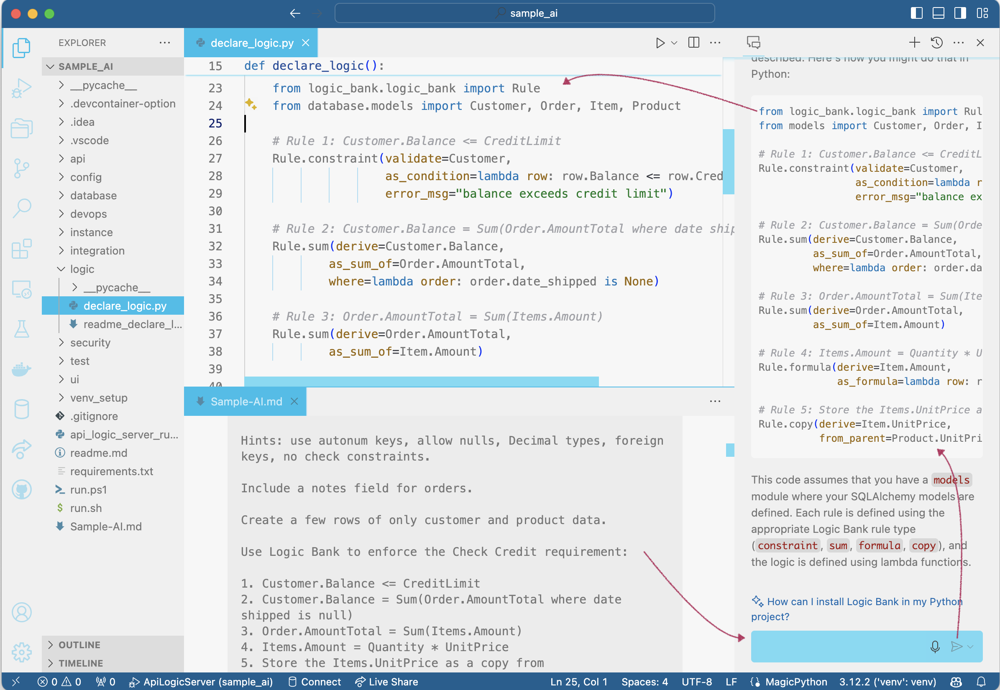
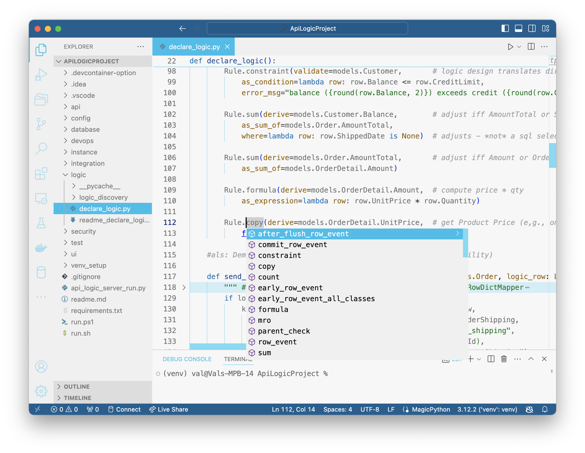

!!! pied-piper ":bulb: TL;DR - Logic: multi-table derivations and constraints, using Rules and Python"

    Logic addresses __multi-table derivations and constraints__, using Rules and Python.  

    **Rules** are:

    1. **Declared** in your IDE - 40X more concise - with GenAI or Code Completion
    2. **Activated** on server start
    3. **Executed** - *automatically* -  on updates (using SQLAlchemy events)
    4. **Debugged** in your IDE, and with the console log


# Rule Types
The table shows excerpts only; see the ```ApiLogicProject``` (Northwind) sample for full syntax.

| Rule | Summary   | Example | Notes |
| :-------------: |:-------------:| :-----:| :-----:|
| Constraint     | Boolean function must be True<br>else transaction rolled back | ```row.Balance <= row.CreditLimit```<br>```row.Salary >= Decimal('1.20') * old_row.Salary``` | Multi-field<br>```old_row``` |
| Formula | Function computes column value | ```row.UnitPrice * row.Quantity```<br>```row.OrderHeader.ShippedDate``` | lambda, or function<br>Parent ```(OrderHeader)``` references |
| Sum | Derive parent-attribute as sum of designated child attribute; optional child qualification | ```Rule.sum(derive=Customer.Balance, as_sum_of=Order.AmountTotal,where=lambda row: row.ShippedDate is None)``` | Parent attribute can be hybrid (virtual)<br>scalable: pruning, adjustment |
| Count | Derive parent-attribute as count of child rows; optional child qualification | ```Rule.count(derive=Order.OrderDetailCount, as_count_of=OrderDetail)``` | counts are useful as child existence checks |
| Copy      | Child value set from Parent     | ```OrderDetail.ProductPrice = copy(Product.Price)``` | Unlike formula references, parent changes are not propagated<br>e.g, Order totals for Monday are not affected by a Tuesday price increase |
| Event      | Python Function    | on insert, call ```congratulate_sales_rep``` | See [Extensibility](Logic-Why.md#extend-python) for a information on early, row and commit events |
| Parent Check      | Ensure Parent row exists | Orders must have a Customer | See [Referential Integrity](https://github.com/valhuber/LogicBank/wiki/Referential-Integrity) |
| Allocation      | Allocate a provider amount to recipients | allocate a payment to outstanding orders | See [Allocation](https://github.com/valhuber/LogicBank/wiki/Sample-Project---Allocation) for an example |
| Copy Row      | Create child row by copying parent | audit Employee Salary changes to EmployeeAudit | See [Rule Extensibility](https://github.com/valhuber/LogicBank/wiki/Rule-Extensibility) |

&nbsp;

# Declaring Rules

Rules are declared in your IDE, using GenAI or Code Completion.  Edit the file `declare_logic.py` in your project, or, one of the files in the [discovery directory](IDE-Customize.md/#discoverability-logic-services){:target="_blank" rel="noopener"}.

&nbsp;

## With GenAI Logic Automation

If you have Copilot installed, you can use GenAI to create rules.  Enter your GenAI prompt, and use Copilot's **Insert at Cursor** button to pasted into `declare_logic.py`

You will typically need to make some small changes, such as the import statements.

In the example below, we have pasted the prompt from the GenAI Automation prompt used to create the system.  You can of course enter new text, or paste from any source.



&nbsp;

## With Code Completion

You can also use Code Completion to add rules, and their arguments.




&nbsp;

## Iterative Rules

Logic definition is an incremental process.  You can start with a few rules, and add more as needed.  There is no need to define all rules at once, or rebuild the project.

Note rules are automatically ordered and invoked, so you can add new ones in any location.

Similarly, you can change rules without worrying about the order of execution.

&nbsp;

# Learning Rules

Inside the larger process above, here is the best way to learn how to use rules:

1. **Rule Summary**: review the table above; there are a small number of rules, since their power lies in chaining

    * **Alert:** Logic consists of rules and Python.  You will quickly learn to use logic events; focus on the *rules as the preferred* approach, using Python (events, etc) as a *fallback*.

2. Review the **Rule Patterns**, below

3. Use the _case study_ approach to learn about using rules, by exploring the examples in the report, below.

4. Be aware of [Rule Extensibility](https://github.com/valhuber/LogicBank/wiki/Rule-Extensibility).

> Pre-req: before learning rules, use the [Tutorial](Tutorial.md){:target="_blank" rel="noopener"} to familiarize yourself with basic capabilities and procedures.

&nbsp;&nbsp;


## Rule Patterns

| Pattern | Notes | Example
| :------------- | :-----| :---- |
| **Chain Up** | parent sums and counts mean that child row changes can ***adjust*** parents | [Derive Balance](Behave-Logic-Report.md/#scenario-good-order-custom-service){:target="_blank" rel="noopener"} |
| **Constrain a Derived Result** | constraints may require derived values | [Balance < creditLimit](Behave-Logic-Report.md#scenario-bad-order-custom-service){:target="_blank" rel="noopener"} |
| **Chain Down** | child copy and parent references mean that parent row changes can ***cascade*** to children | [Ship Order](Behave-Logic-Report.md#scenario-set-shipped-adjust-logic-reuse){:target="_blank" rel="noopener"} |
| **State Transition Logic** | `old_row` useful comparing old/current values | [Meaningful Raise](Behave-Logic-Report.md#scenario-raise-must-be-meaningful){:target="_blank" rel="noopener"} |
| **Counts as Existence Checks** | Use counts to check if any children exist | [Don't Ship Empty Orders](Behave-Logic-Report.md#scenario-bad-ship-of-empty-order){:target="_blank" rel="noopener"} |
| **Auditing** | Note the Copy Row rule (and alternatives) | [Salary Audit](Behave-Logic-Report.md#scenario-audit-salary-change){:target="_blank" rel="noopener"} |
| **Ready Flag** | Multi-session editing, then adjust related data when ready (aka checkout) | [Ship Order](Behave-Logic-Report.md#scenario-set-shipped-adjust-logic-reuse){:target="_blank" rel="noopener"} |
| **Events for Lib Access** | Events enable Python, use of standard libs (e.g., Kafka) | [Ship Order](Behave-Logic-Report.md#scenario-good-order-custom-service){:target="_blank" rel="noopener"} |

&nbsp;

## Case Study

The best way to learn the rules is by a Case Study approach:

1. Print this page, for reference

2. Print the [Database Diagram](Sample-Database.md){:target="_blank" rel="noopener"}

    * Most of the examples are drawn from this database

3. For each Rule Pattern, above:

    * Click the Example link in the table above to open the Behave Logic Report

        * Aside: later, you can prepare such documentation for your own projects, ([like this](Behave.md){:target="_blank" rel="noopener"}).

    * Review the Scenario -- take these as your requirements

    * Spend 5 minutes (perhaps in pairs) and **cocktail-napkin design** your solution, using
    
        * The data model diagram
        * List of Rule Types, and 
        * Rule Patterns

    * Reveal the solution: open the disclosure box: "Tests - and their logic - are transparent.. click to see Logic"

