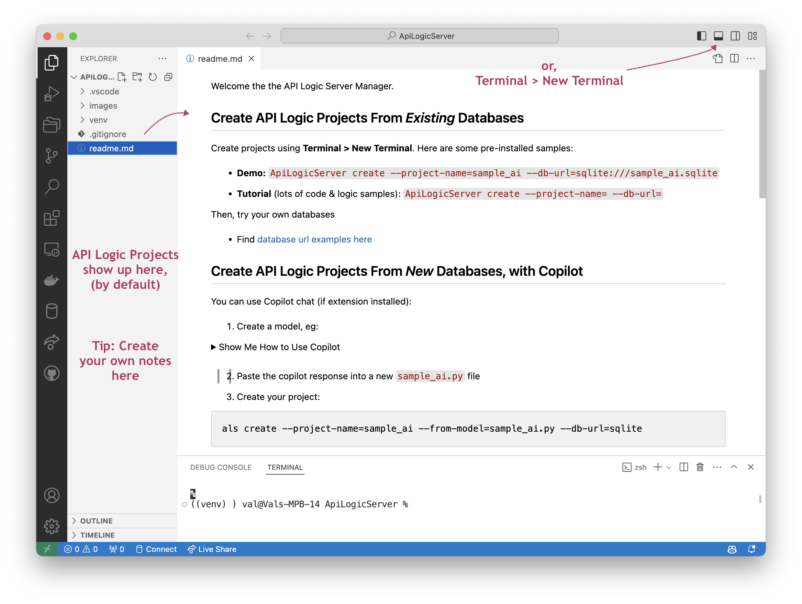

Modern IDEs are remarkably powerful and user-friendly.  Many developers use them as an alternative the their OS finder/explorer.

As of release 10.03.66, you can use your IDE to create and customize API Logic Projects:

```bash title="Install API Logic Server, Start the API Logic Project Manager"
mkdir ApiLogicServer
cd ApiLogicServer

python -m venv venv                  # may require python3 -m venv venv
source venv/bin/activate             # windows: venv\Scripts\activate
python -m pip install ApiLogicServer

als start
```



Created projects will show up here as directories.  You create projects anywhere, and move them; this is just the default.

> `als genai` commands require projects be located inside the Manager directory.

&nbsp;

## Choose your IDE

The default IDE is VSCode.  You can specify your favorite IDE, e.g.

```bash title="Choose IDE"
als start pycharm   # For Mac, you may need use charm, not pycharm
```

&nbsp;

## Pre-created projects

We have pre-created 2 important projects you will want to review at some point:

* [tutorial](https://apilogicserver.github.io/Docs/Tutorial/) - short (< 1 hour) walk-through of using API Logic Server using the northwind (customers, orders...) database
* sample - the completed tutorial.  It's the same database, but with logic/Python ***customizations added***.  It's a great resource for exploring.  

    * Hint: use your IDE to search for `#als`

You can always re-create them as follows:

1. Open a terminal window (**Terminal > New Terminal**), and paste the following CLI command:

```bash
ApiLogicServer create --project-name=tutorial --db-url=
ApiLogicServer create --project-name=sample --db-url=nw+
```


&nbsp;

## Creating Projects: auto_open

By default, the Manager starts with an environment variable `APILOGICSERVER_AUTO_OPEN`.  It's defaulted to *code*; you can set it:

```bash title="auto_open"
export APILOGICSERVER_AUTO_OPEN=charm  # powershell:  $env:APILOGICSERVER_AUTO_OPEN="pycharm"
```

Pycharm Notes: your value may be *charm* or *pycharm*, depending on your installation.  Also, on windows, the Manager terminal window is tied up when you create a project.

Or, use "" to disable auto_open.

You can set other environment variables here; these defaults are provided:

```bash title="Set Environment Variables"
export APILOGICSERVER_VERBOSE=true
```

> Note: your `venv` is defaulted for VSCode.  It must be [configured](Project-Env.md){:target="_blank" rel="noopener"} in PyCharm.

Here's a useful link about [environment variables](https://www3.ntu.edu.sg/home/ehchua/programming/howto/Environment_Variables.html#zz-3.){:target="_blank" rel="noopener"}.

&nbsp;

## Managing Your Projects

Created projects will show up here as directories.  (You create projects anywhere, and move them; this is just the default).

If you want to customize/run the project, do so in *another instance* of VSCode.  You may find it helpful to acquire this extension: `Open Folder Context Menus for VS Code`.  It will enable you to open the project in another instance of VSCode.

&nbsp;

## Manager Using Docker

Please see [this page](DevOps-Docker.md#2a-using-the-manager){:target="_blank" rel="noopener"}.