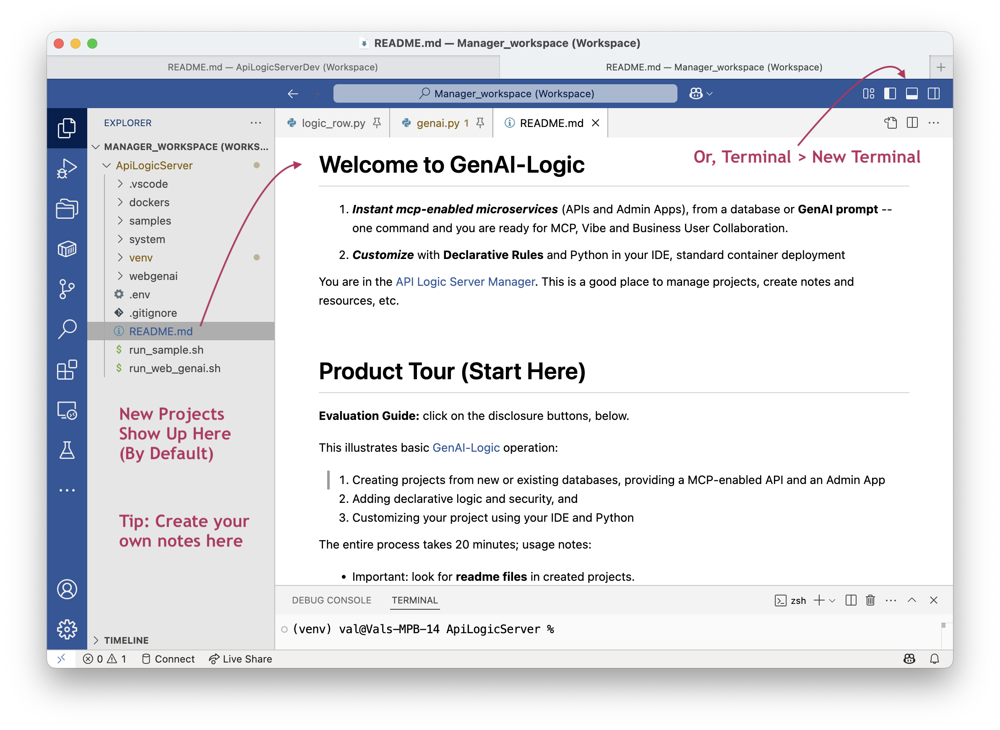

As of release 10.03.66, you can:

```bash title="Start the API Logic Project Manager"
als start
```



Created projects will show up here as directories. (You create projects anywhere, and move them; this is just the default).

&nbsp;

## Choose your IDE

The default IDE is VSCode.  You can specify your favorite IDE, e.g.

```bash title="Choose IDE"
als start charm
```

&nbsp;

## Creating Projects: auto_open

By default, the Manager starts with an environment variable `APILOGICSERVER_AUTO_OPEN`.  It's defaulted to *code*; you can set it:

```bash title="auto_open"
export APILOGICSERVER_AUTO_OPEN=charm  # powershell:  $env:APILOGICSERVER_AUTO_OPEN="pycharm"
```

Pycharm Notes: your value may be *charm* or *pycharm*, depending on your installation.  Also, on windows, the Manager terminal window is tied up when you create a project.

Or, use "" to disable auto_open.

You can set other environment variables here, e.g.

```bash title="Set Environment Variables"
export APILOGICSERVER_VERBOSE=true
```

> Note: your `venv` is defaulted for VSCode.  It must be [configured](Project-Env.md){:target="_blank" rel="noopener"} in PyCharm.

Here's a useful link about [environment variables](https://www3.ntu.edu.sg/home/ehchua/programming/howto/Environment_Variables.html#zz-3.){:target="_blank" rel="noopener"}.

&nbsp;

## Customizing Projects

If you want to customize/run the project, do so in another instance of VSCode. You may find it helpful to acquire this extension: `Open Folder Context Menus for VS Code`. It will enable you to open the project in another instance of VSCode.

&nbsp;

