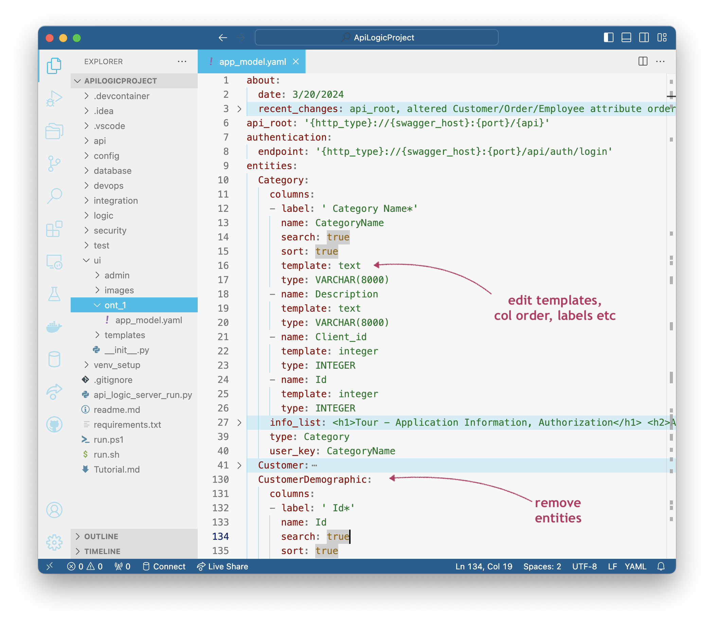

**Under Construction - Preview**

!!! pied-piper ":bulb: TL;DR - Front Office App Dev"

    The Ontimize App Builder provides extremely rapid "front office" app creation, with unlimited customization and wealth of UI components (editable grid, graph, tree, etc).  It complements the "back office" Admin App.

    While a separate product, it is highly integrated with API Logic Server:

    1. **Unified Database:** driven by the same Data Model, and underlying JSON:API / logic
    2. **Unified Repository:** Artifacts are files stored in your project directory for unified source, and managed by any standard IDE
    3. **Shared Dev Server:** the API Logic Server serves the API, the Admin App, and the Ontimize App.  This simplfies development
    
    API Logic Server automation can simplify app dev by eliminating the daunting "clean sheet of paper".  This can make it difficult.  By contrast, automated app creation means you **alter what's been built** through automation.

    > It should be possible for users with limited Python, Flask, SQLAlchemy, JavaScipt technology (`npm` build, etc), or Ontimize knowledge to <br>1. Create a backend API<br>2. Declare rules for multi-table derivations and constraints<br>3. Create a front office Ontimize app, and<br>4. Make significant customizations


## Basic Work Flow

After creating your project in the usual manner, follow the steps below.

### 1. Create Application

```bash
ApiLogicServer app-create --app=app1
```

This creates `ui/app1/app_model.yaml`.  

#### Parallel dev

At this point, distinct dev teams can safely proceed in parallel:

* backend: develop logic and custom APIs (e.g., for application integration)
* ui: proceed as described below

Salient points:

* logic is **automatically factored out of ui code** (in particular, not in controllers).  This increases re-use across apps, and re-use for integration

* **ui dev is not dependent on server api creation** -- JSON:APIs are self-serve, so ui developers are not blocked by backend api dev

### 2. Edit Model

Edit to remove unwanted entities, order columns, set templates, etc.

<details markdown>

<summary> Show me how -- apply customizations </summary>

&nbsp;



</details>

### 3. Build Application

```bash
ApiLogicServer app-build --app=app1
```
### 4. Customize Application

This will the the data model to build out the Ontimize app.  It's executable.

You can then use your IDE or other tooling (e.g., Ontimize CLI) to edit the artifacts to customize the look and feel.