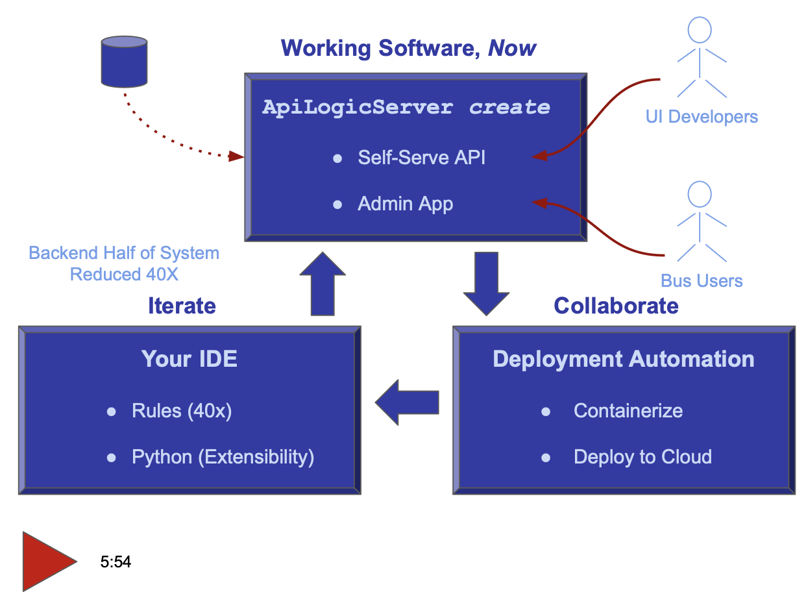

[](https://pepy.tech/project/apilogicserver)
[](https://pypi.python.org/pypi/apilogicserver/)
[](https://pypi.python.org/pypi/apilogicserver/)

[](#instant-evaluation-no-install "Click for instant cloud-based, no-install eval")


&nbsp;

!!! pied-piper ":bulb: Positioning"

    For Developers and their organizations seeking to reduce delivery and maintenance cycles,

    API Logic Server creates executable projects from a database with a single command, **customizable with standards:** Python, Flask, SQLAlchemy, and tools such as GitHub and your IDE.

    Unlike Frameworks, API Logic Server provides **unique spreadsheet-like rules** that decrease backend code by **40X**, and promote quality.

&nbsp;


---

### Video: Create, Run, Customize

API Logic Server is an open source Python project, consisting of a CLI and set of runtimes (SAFRS API, Flask, SQLAlchemy ORM, business logic engine) for project execution.

It runs as a standard pip install, or under Docker. For more on API Logic Server Architecture, [see here](Architecture-What-Is.md).

Click the image below for a video tutorial, showing complete project creation, execution, customization and debugging ([instructions here](Tech-Agile.md){:target="_blank" rel="noopener"}).  Or, see it using AI: [click here](Tutorial-AI.md).

[](https://youtu.be/sD6RFp8S6Fg "Using VS Code with the ApiLogicServer container"){:target="_blank" rel="noopener"}

&nbsp;

# Getting Started - Install, Tutorial

API Logic Server is designed to make it easy to get started:

* **Install and run Tutorial** - 
[install](https://valhuber.github.io/ApiLogicServer/Install-Express.md){:target="_blank" rel="noopener"}, and explore the [tutorial](https://valhuber.github.io/ApiLogicServer/Tutorial/){:target="_blank" rel="noopener"}.  The tutorial creates 2 versions of the [sample database](https://valhuber.github.io/ApiLogicServer/Sample-Database.md){:target="_blank" rel="noopener"}

     * without customizations - so you to see exactly what is automated from the `ApiLogicServer create` command
     * with customizations - so you can see how to customize 

* **Installed Sample Databases** -
Here are [some installed sample databases](Data-Model-Examples.md){:target="_blank" rel="noopener"} you can use with simplified abbreviations for `db_url`.

* **Dockerized Test Databases** - 
Then, you might like to try out some of our [dockerized test databases](https://valhuber.github.io/ApiLogicServer/Database-Connectivity.md){:target="_blank" rel="noopener"}.

* **Your Database** - Finally, try your own database.

&nbsp;

In addition to this app dev oriented tutorial, you can also explore:

* **Deployment:** the [Deployment Tutorial](Tutorial-Deployment.md){:target="_blank" rel="noopener"} illustrates various ways to containerize and deploy your applications

* **Using AI:** the [AI-Driven Automation Tutorial](Tech-AI.md){:target="_blank" rel="noopener"} shows how you can use ChatGPT to create new databases from english descriptions, to bootstrap a very rapid create / collaborate / iterate Agile cycle.

&nbsp;

# Project Information


### Preview Version

This pre-release includes:

* Running [Kafka publish](Sample-Integration.md); consume now working.

* Fix for MySQL CHAR/String import [Issue 26](https://github.com/ApiLogicServer/ApiLogicServer-src/issues/26){:target="_blank" rel="noopener"}


You can try it at (you may need to use `python3`):

```bash
python -m pip install --index-url https://test.pypi.org/simple/ --extra-index-url https://pypi.org/simple ApiLogicServer==10.0.0
```

Or use (not available currently):

```bash
docker run -it --name api_logic_server --rm -p 5656:5656 -p 5002:5002 -v ~/dev/servers:/localhost apilogicserver/api_logic_server_x
```

Or, you can use [the beta version on codespaces](https://github.com/ApiLogicServer/beta){:target="_blank" rel="noopener"}.

&nbsp;


We communicate [via slack](https://join.slack.com/t/apilogicserver/signup?x=x-p3388652117142-3395302306098-5241761647201).

&nbsp;

## Contact Us

We'd love to hear from you.

1. email: apilogicserver@gmail.com
2. slack: [https://apilogicserver.slack.com](https://apilogicserver.slack.com)

