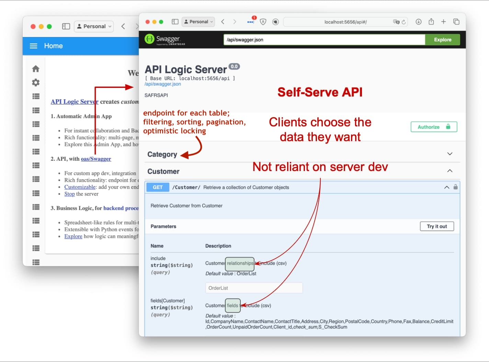

<style>
  .md-typeset h1,
  .md-content__button {
    display: none;
  }
</style>

# Instantly Create and Run Database APIs - Flask, SQLAlchemy.  Customize with Python and Rules.

Python, Flask and SQLAlchemy are a great foundation for building servers.  And it's straight-forward to build a single endpoint -- many great courses, articles on building a basic `Hello World` server.

But, it's a long way from `Hello World` to a running system, with a full API (filtering, pagination, optimistic locking), a usable UI, integration, etc.  And then there's the business logic, often nearly half the effort.  There's *got* to be a better way.

> Imagine you could **create a running system, *instantly.*** <br><br>**Customize it in standard ways:** your IDE, Python, Flask, and SQLAlchemy.  <br><br>And, declare **business logic with spreadsheet-like rules,** reducing business logic by 40X?  

Well, you've just imagined API Logic Server.  Here's how it works.

&nbsp;

## 1. Create: Automate Project Creation With a Single CLI Command

The [**`ApiLogicServer create`**](Project-Structure.md){:target="_blank" rel="noopener"} CLI command creates an executable project by reading the database schema in the `db_url` argument.  For example, this will create an executable, customizable project from the pre-installed sample database:

```bash
ApiLogicServer create --project_name=ApiLogicProject --db_url=nw
```

&nbsp;

## 2. Run: Automated JSON:API, Admin App

The **project is executable**, providing a [**JSON:API**](API.md){:target="_blank" rel="noopener"} and an [**Admin App**](Admin-Tour.md){:target="_blank" rel="noopener"}:


The Admin App provides a link to the Swagger to explore the JSON:API:



&nbsp;

## 3. Customize: Rules and Python

The **project is customizable in your IDE**.  Declare rules in Python for logic and security.  Rules are an ***executable design,*** as shown below.

> Rules are unique and significant - [40X more concise than code](Logic-Why.md){:target="_blank" rel="noopener"}, and extensible with Python.


&nbsp;

## 4. Integration: custom endpoints, Kafka messages

For application integration, you can use standard Flask to create new endpoints:


And, extend logic - with Python - to produce Kafka messages:


&nbsp;

## Download and Try

This quick tour has shown how to create and customize a system in days instead of weeks or months.  Not just faster, also much simpler.  

> It's because the system is ***declarative:*** you specify what you want to happen, instead of coding it out each little detail.

You can repeat this demo in 15 minutes.  Install [API Logic Server](https://apilogicserver.github.io/Docs/), and follow the Tutorial.  

Then, try it with one of your own databases (MySql, Sql/Server, Ingres, Oracle, Sqlite).  Join our Slack, and tell us what you think!
