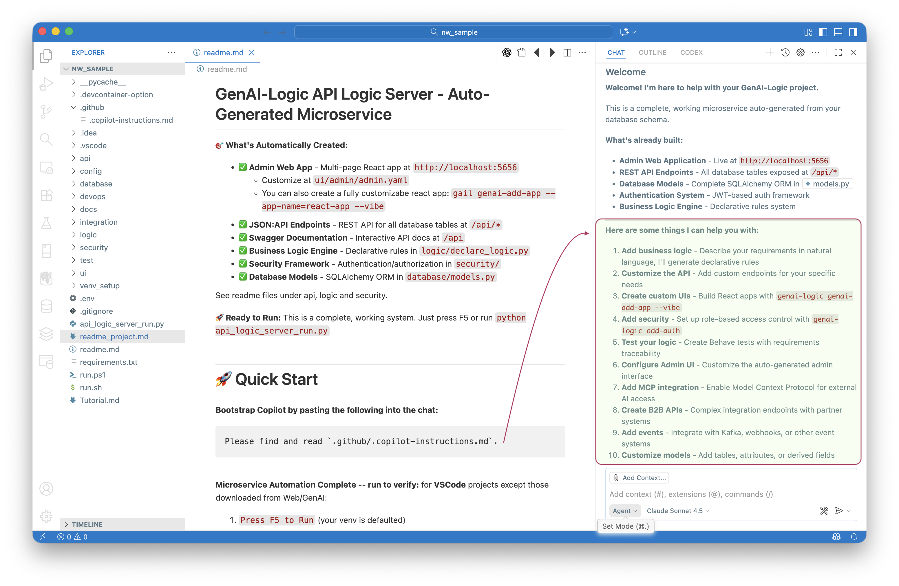
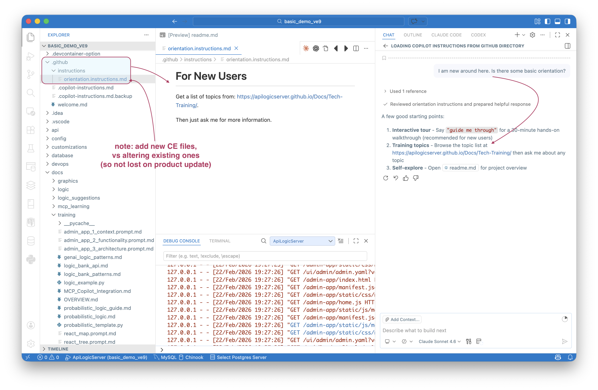
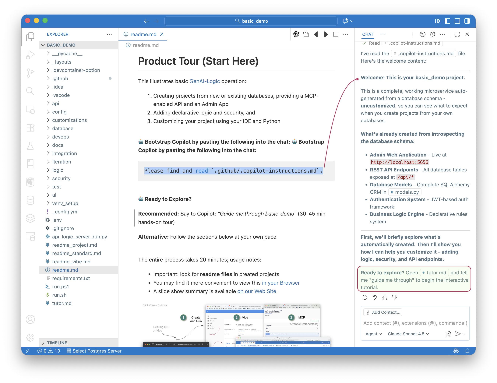

!!! pied-piper ":robot: Every Project Comes Pre-Configured for AI Assistance"

    Every project created by GenAI-Logic includes comprehensive training materials, readme's with code examples, and integration points that work seamlessly with GitHub Copilot, Claude, ChatGPT, and other AI assistants.

    Your project includes `.github/.copilot-instructions.md`, AI training documents (`docs/training`), and working code examples that serve as a ***"message in a bottle"*** for AI assistants.

    No more explaining your project structure from scratch - AI assistants can immediately understand your codebase and underlying software to help you build features.

    AI assistants can help you add business logic rules, customize APIs, create test scenarios, and integrate with external services.

    They also provide an AI Guided Tour, where an intelligent AI Assistant introduces you to the key concepts of GenAI-Logic.

&nbsp;

This page describes:

• what makes your project AI-enabled out of the box  
• the training materials included as your "message in a bottle"  
• how to get started with AI assistance  
• the AI-friendly workflows built into every project  

&nbsp;


## AI Usage

GenAI-Logic provides functionality by a combination of core services (project creation, api execution, rules engine), and by leveraging/extending AI Assistants in your IDE.

&nbsp;

### Authoring

When you create a new project with `genai-logic create`, you're not just getting a basic API and admin interface. Each project is thoughtfully designed to be **AI-friendly** from day one.

Bootstrap this by telling your AI Assistant to bootstrap itself:

```bash
Please load `.github/.copilot-instructions.md`
```



&nbsp;

### AI Logic

All of the services above occur in your IDE.  You can see what is generated and fix / remove it (human in the loop).

In addition, you can use ***AI at runtime** to execute logic.  For example, this demo illustrates using AI to choose an optimal supplier - for more information, see [MCP AI Example](Integration-MCP-AI-Example.md){:target="_blank" rel="noopener"}.

> AI can be used to compute values, and we we know AI can make mistakes.<br>Govern such AI Logic using business rules -- AI can propose, rules decide what commits.

&nbsp;

### Models Used

Runtime access and genai-* CLI services use ChatGPT.  You will need to configure your key, typically as an environment variable.

Copilot access is your choice.  We get good results and typically use Claude Sonnet 4.6.

&nbsp;

## AI-Enabled Projects

AI is enabled as described below.

&nbsp;

### 🤖 Context Engineering

Your project includes comprehensive training materials that serve as a "message in a bottle" for AI assistants:

1. **`.github/.copilot-instructions.md`** - this is the "message in a bottle" that enabled your AI Assitant to understand GenAI-Logic projects, and deliver the services above
2. **`docs/training/`** - AI training documents with detail examples and patterns
3. **`readme.md`** - Project overview with quick start instructions
4. **Code examples** - real working examples in the `readme's` throughout the project


&nbsp;

### 🧠 Context-Aware Architecture

The project structure itself provides rich context for AI understanding:

• **Declarative logic patterns** in `logic/declare_logic.py`  
• **API endpoint examples** with SQLAlchemy models  
• **Test scenarios** that demonstrate business requirements  
• **Integration templates** for common patterns  

&nbsp;

### 💡 AI-Friendly Workflows

Your project supports natural AI-assisted development:

• **Natural language to business rules** - Describe requirements, get executable logic  
• **Automated testing** - Behave scenarios that serve as living documentation  
• **Code completion** - Rich type hints and patterns for IDE assistance  
• **Documentation generation** - Self-documenting APIs and logic  

<br>

### Extend Context Engineering

You can cause VSCode Copilot to pre-load your own instructions by placing `*.instructions.md` files in `.github`.  See the example in the Manager: `samples/readme_samples.md`:



&nbsp;

## Training

There are important resources to help you get started.

&nbsp;

### 🎓 AI Guided Tour

It's been clear for quite some time that lab-based training was far superior to *death by powerpoint*.  But running labs is not simple - it usually requires in-person expertise to deal with inevitable problems.

AI enables us to put a "message in a bottle" - an AI tutor that can walk you through the tutorial, and, unlike a readme, support you:

* answer questions ("*how do I customize this*")
* get you unstuck (*"ah, you forgot to start the server"*)

Key aspects of the tour:

* *Provocation-based* learning (not instruction)
* *Hands-on* discovery (doing, not reading)
* AI as companion *during* the lab (not before/after)

The tour begins in the [manager](Manager.md), which encourages you to create the basic demo.  That creates the `basic_demo` project, which provides a special readme to start the tour:



&nbsp;


> Ed: this was an interesting technical problem - AI prefers to be reactive (not driving a tutorial), and make decisions about 'that seems to be working'.  We needed it to be proactive and not skip steps - to act outside its comfort zone.  To read more, [click here](Tech-AI-Tutor.md).

&nbsp;

### 🚀 Quick Reference `readmes`

Each project includes working examples (see various `readme` files within the project) you can build upon:

• Pre-configured rules demonstrating common business patterns  
• Sample API calls with proper request/response formats  
• Test data and scenarios for immediate experimentation  
• Integration hooks for external services  

&nbsp;

### 🎯 Next Steps

To find more:

• [Logic Guide](Logic/) - Learn about declarative business rules  
• [API Documentation](API/) - Understand your auto-generated API  
• [Testing Guide](Behave/) - Write and run business scenarios  
• [Sample Projects](Sample-Database/) - Explore working examples  

Your AI-enabled project is ready to evolve with your needs. Just describe what you want, and let AI help you build it! 

