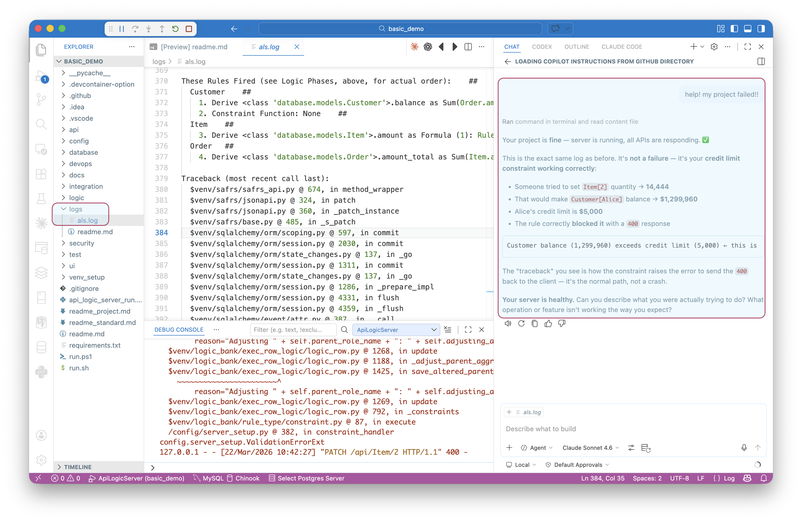

!!! pied-piper ":robot: Every Project Comes Pre-Configured for AI Assistance"

    Every project created by GenAI-Logic includes comprehensive training materials, readme's with code examples, and integration points that work seamlessly with GitHub Copilot, Claude, ChatGPT, and other AI assistants.

    Projects are pre-created with `.github/.copilot-instructions.md`, AI training documents (`docs/training`), and working code examples that serve as a ***"message in a bottle"*** for AI assistants — no more explaining your project structure from scratch.

    **Where AI helps most:**

    | Use Case | Recommended |
    |---|---|
    | Project creation from a domain prompt | Claude Code terminal |
    | Add behavior to a running project (Executable Requirements) | Claude Code terminal |
    | Add logic rules from natural language | Copilot or Claude Code |
    | Debug — analyze logs, trace rule firing | Claude Code |
    | Learning — how rules work, performance, patterns | Copilot or Claude Code |
    | Project ops — libraries, CLI commands, test setup | Copilot or Claude Code |

    See [Where AI Helps](#where-ai-helps) for details on each use case and which client to use.

&nbsp;

## AI Role: the 3-Legged Stool

<br>GenAI-Logic provides functionality by a combination of core services (project creation, api execution, rules engine), and by leveraging/extending AI Assistants in your IDE.


<details markdown>

<summary>Diagram - Tech Details </summary>

<br>
As shown above, GenAI-Logic functionality is delivered by 3 key elements:

<br>

**1. Architecture Automation**

GenAI-Logic provides automation both at Project Creation, and Runtime:

* Project Creation - schema discovery to create projects, with architecture automation to integrate and start the engines

* Runtime Engines - engines to execute APIs, Logic, Security, database access, etc

<br>

**2. AI**

The primary use of AI is to use your AI Assistant for:

* Authoring (e.g., create logic, APIs), and
* Explanations - find how the system works (e.g., how does logic work, what about performance, etc)

Importantly, these authoring services preserve *Human in the Loop:* review what AI creates, accept/alter as required.  The resultant system is deterministic.

You can also elect to use AI at runtime, by specifying rules with `Use AI to...`.  For example, the *MCP AI Demo* illustrates using AI to choose an optimal supplier - for more information, see [MCP AI Example](Integration-MCP-AI-Example.md){:target="_blank" rel="noopener"}.

> AI can be used to compute values, and we know AI can make mistakes.<br>Govern such AI Logic using business rules -- AI can propose, deterministic rules decide what commits.

We use the following models:

* CLI services use ChatGPT.  You will need to configure your key, typically as an environment variable.

* Copilot access is your choice.  We get good results and typically use Claude Sonnet 4.6.

<br>

**3. Context Engineering**

Each project contains thousands of lines of Context Engineering that inform AI Assistant about the CLI and runtime engines.

</details>


| Leg | What it provides | Without it |
|-----|-----------------|------------|
| **Logic Automation** (Rules, API Engines) | Correct, auto-enforced business logic across all write paths; enterprise API; governed AI execution | **- Procedural Logic:** Dependency bugs, hard to maintain <br> **- Fat API:** Unshared, Path-dependent logic <br>**- Demo-class APIs** (no optimistic locking, etc) |
| **Generative AI** | Rapid creation, iteration, test generation from natural language | Weeks of manual development |
| **Context Engineering** | Guides AI to the right architecture (declarative rules, proper data model) | AI defaults to "Fat API" procedural code — works but ungoverned |

**Key insight:** Without Context Engineering, AI generates working demos that lack enterprise 
architecture. Without rules automation, AI generates procedural code with correctness bugs. 
Together: a several-week effort became **30 minutes**, producing a correct, enterprise-class, 
fully tested system.

> *"A/B result: 16 declarative rules vs. equivalent procedural code with 2 critical bugs."*

&nbsp;

## Moving the Starting Line

Traditional projects spend their first sprints on infrastructure — project scaffolding, database connectivity, ORM models, REST API plumbing (pagination, optimistic locking), admin UI, authentication, CI/CD. The actual business problem doesn't appear until the team is already depleted.

`genai-logic create` delivers all of that in seconds: a running multi-table API with pagination and optimistic locking, admin app, logic engine, auth skeleton, and CI/CD templates — committed and functional on day one. **Your first sprint begins at the business problem.**

Combined with Context Engineering, this means the declarative rules that encode your domain logic are the *first* meaningful code written — not the reward for surviving infrastructure month.

&nbsp;

## Where AI Helps


The diagram shows the key workflow: you express logic as **NL Intent** (in whatever form is natural to you), Context Engineering guides AI to translate it into **Data Rules**, and the Rules Engine enforces those rules at commit — from every source, with no bypass.

**NL Intent can take many forms** — you don't need to think in code:

| Form | Example |
|---|---|
| **Regulations** | *"Per PC 2025-0917, surtax applies to shipments with ship date >= 2025-12-26"* |
| **Gherkin** | *"Given a customer whose balance exceeds their credit limit, Then reject the order"* |
| **Pseudocode** | *"total = sum of line amounts; if country is exempt, surtax = 0"* |
| **Rules** | *"Customer.balance is the sum of unpaid Order.amount_total"* |

AI (guided by Context Engineering) translates any of these into executable LogicBank rules. This means domain experts, business analysts, and developers can all contribute logic in the form they find most natural.

&nbsp;

### Two Kinds of Logic

Once expressed, logic falls into two categories:

| Kind | When to use | Example |
|---|---|---|
| **Deterministic** | Outcome must be repeatable and verifiable | `Customer.balance must not exceed credit_limit` |
| **Probabilistic (AI)** | Judgment or optimization required — cannot be computed, must be *chosen* | `Use AI to set unit_price by finding the optimal supplier based on cost, lead time, and world conditions` |

Both are expressed in the same natural language prompt. Deterministic rules enforce correctness; AI handles decisions that depend on external factors or multi-criteria optimization. AI outputs participate in normal rule chaining — governed and audited.

> See [Logic Using AI](Logic-Using-AI.md) for the full treatment, including the Request Pattern, audit trail, and worked example.

&nbsp;

### AI Clients

GenAI-Logic works with any AI assistant, but two are particularly well-suited:

| Client | Best for |
|---|---|
| **GitHub Copilot** (in IDE) | Conversational, human-in-the-loop tasks — explaining, learning, one-off logic additions |
| **Claude Code** (terminal or IDE extension) | Autonomous, multi-step creation workflows — runs to completion without hand-holding |

For **project creation and executable requirements**, Claude Code terminal is recommended: one command runs the full sequence (schema derivation, seed data, LogicBank rules) without pausing for confirmation.

&nbsp;

### Use Cases

| Use Case | Where | Command | Recommended |
|---|---|---|---|
| **Project Creation** | Manager workspace | `implement project <name> from <prompt>` | Claude Code terminal |
| **Executable Requirements** | Project workspace | `implement reqs <name>` | Claude Code terminal |
| **Logic — add rules** | Project workspace | Natural language in chat | Copilot or Claude Code |
| **Debug** | Project workspace | Read `logs/als.log` | Claude Code |
| **Learning** | Either | Natural language in chat | Copilot or Claude Code |
| **Project Ops** | Either | Natural language in chat | Copilot or Claude Code |

&nbsp;

### Why Claude Code Terminal for Creation

**Project Creation** runs from the **Manager workspace**. The Manager's `.github/.copilot-instructions.md` guides Claude Code through the full sequence in one uninterrupted command:

1. Scaffold project from `starter.sqlite`
2. Read training docs silently (`subsystem_creation.md`, `logic_bank_api.md`, etc.)
3. Pre-DDL analysis — extract constants → SysConfig, FK inventory, Request Pattern scan
4. Write DDL, rebuild models, seed data, implement LogicBank rules
5. Write provenance (`docs/requirements/readme.md`) and ad-libs report

**Executable Requirements** runs from the **project workspace**, after opening the created project. Place requirement sets in `docs/requirements/<name>/` and say `implement reqs <name>`.

Both workflows are proven by the `demo_customs_cbsa` (project creation) and `demo_customs` (EAI executable requirements) samples.

&nbsp;

## AI-Enabled Projects

AI is enabled as described below.

&nbsp;

### 🤖 Context Engineering

When you create a new project with `genai-logic create`, project contains extensive Context Engineering to guide your AI Assistant to leverage Logic Automation.

```bash title="Bootstrap this by telling your AI Assistant to bootstrap itself"
Please load `.github/.copilot-instructions.md`
```


Your project includes comprehensive training materials that serve as a "message in a bottle" for AI assistants:

1. **`.github/.copilot-instructions.md`** - this is the "message in a bottle" that enabled your AI Assitant to understand GenAI-Logic projects, and deliver the services above
2. **`docs/training/`** - AI training documents with detail examples and patterns
3. **`readme.md`** - Project overview with quick start instructions
4. **Code examples** - real working examples in the `readme's` throughout the project


<br>

#### Log Analysis

Given AI understanding of your project per Context Engineering, it is an excellent way to diagnose issues by reading the `logs` folder:



<br>

#### Extend Context Engineering

You can cause VSCode Copilot to pre-load your own instructions by placing `*.instructions.md` files in `.github`.  See the example in the Manager: `samples/readme_samples.md`:


&nbsp;

### 🧠 Context-Aware Architecture

The project structure itself provides rich context for AI understanding:

• **Declarative logic patterns** in `logic/declare_logic.py`  
• **API endpoint examples** with SQLAlchemy models  
• **Test scenarios** that demonstrate business requirements  
• **Integration templates** for common patterns  

&nbsp;

### 💡 AI-Friendly Workflows

Your project supports natural AI-assisted development:

• **Natural language to business rules** - Describe requirements, get executable logic  
• **Automated testing** - Behave scenarios that serve as living documentation  
• **Code completion** - Rich type hints and patterns for IDE assistance  
• **Documentation generation** - Self-documenting APIs and logic  

&nbsp;

## Training

There are important resources to help you get started.

&nbsp;

### 🎓 AI Guided Tour

It's been clear for quite some time that lab-based training was far superior to *death by powerpoint*.  But running labs is not simple - it usually requires in-person expertise to deal with inevitable problems.

AI enables us to put a "message in a bottle" - an AI tutor that can walk you through the tutorial, and, unlike a readme, support you:

* answer questions ("*how do I customize this*")
* get you unstuck (*"ah, you forgot to start the server"*)

Key aspects of the tour:

* *Provocation-based* learning (not instruction)
* *Hands-on* discovery (doing, not reading)
* AI as companion *during* the lab (not before/after)

The tour begins in the [manager](Manager.md), which encourages you to create the basic demo.  That creates the `basic_demo` project, which provides a special readme to start the tour:


&nbsp;


> Ed: this was an interesting technical problem - AI prefers to be reactive (not driving a tutorial), and make decisions about 'that seems to be working'.  We needed it to be proactive and not skip steps - to act outside its comfort zone.  To read more, [click here](Tech-AI-Tutor.md).

&nbsp;

### 🚀 Quick Reference `readmes`

Each project includes working examples (see various `readme` files within the project) you can build upon:

• Pre-configured rules demonstrating common business patterns  
• Sample API calls with proper request/response formats  
• Test data and scenarios for immediate experimentation  
• Integration hooks for external services  

&nbsp;

### 🎯 Next Steps

To find more:

• [Logic Guide](Logic/) - Learn about declarative business rules  
• [API Documentation](API/) - Understand your auto-generated API  
• [Testing Guide](Behave/) - Write and run business scenarios  
• [Sample Projects](Sample-Database/) - Explore working examples  

Your AI-enabled project is ready to evolve with your needs. Just describe what you want, and let AI help you build it! 

