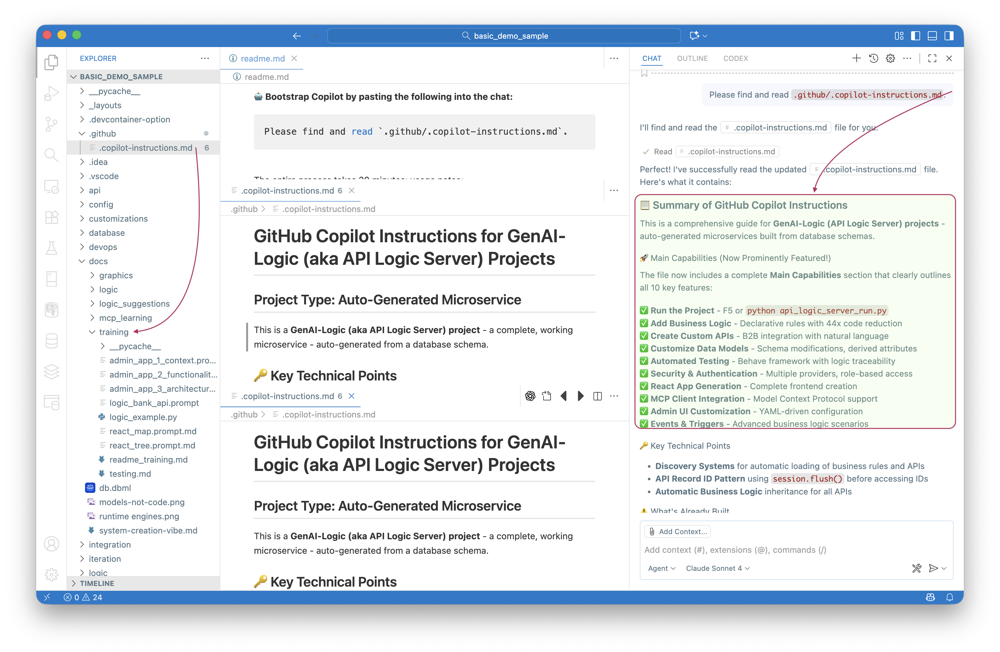

!!! pied-piper ":robot: Every Project Comes Pre-Configured for AI Assistance"

    Every project created by API Logic Server includes comprehensive training materials, code examples, and integration points that work seamlessly with GitHub Copilot, Claude, ChatGPT, and other AI assistants.

    Your project includes `.github/.copilot-instructions.md`, AI training documents (`docs/training`), and working code examples that serve as a ***"message in a bottle"*** for AI assistants.

    No more explaining your project structure from scratch - AI assistants can immediately understand your codebase and underlying software to help you build features.

    AI assistants can help you add business logic rules, customize APIs, create test scenarios, and integrate with external services.

 

# AI-Enabled Projects

When you create a new project with `genai-logic create`, you're not just getting a basic API and admin interface. Each project is thoughtfully designed to be **AI-friendly** from day one.

## Main Capabilities

Your AI-enabled project includes these key capabilities:

✅ **Run the Project** - F5 or `python api_logic_server_run.py`  
✅ **Add Business Logic** - Declarative rules with 44x code reduction  
✅ **Create Custom APIs** - B2B integration with natural language  
✅ **Customize Data Models** - Schema modifications, derived attributes  
✅ **Automated Testing** - Behave framework with logic traceability  
✅ **Security & Authentication** - Multiple providers, role-based access  
✅ **React App Generation** - Complete frontend creation  
✅ **MCP Client Integration** - Model Context Protocol support  
✅ **Admin UI Customization** - YAML-driven configuration  
✅ **Events & Triggers** - Advanced business logic scenarios  

This page describes:

• what makes your project AI-enabled out of the box  
• the training materials included as your "message in a bottle"  
• how to get started with AI assistance  
• the AI-friendly workflows built into every project  

 

## Your Project is Ready for AI

Here's what makes your project AI-enabled:

 

### 🤖 Built-in AI Guidance

Your project includes comprehensive training materials that serve as a "message in a bottle" for AI assistants:

1. **`.github/.copilot-instructions.md`** - Detailed instructions that guide AI assistants on how to work with your specific project
2. **`docs/training/`** - AI training documents with examples and patterns
3. **`readme.md`** - Project overview with quick start instructions
4. **Code examples** - Real working samples in `logic/declare_logic.py` and throughout the codebase

 

### 🧠 Context-Aware Architecture

The project structure itself provides rich context for AI understanding:

• **Declarative logic patterns** in `logic/declare_logic.py`  
• **API endpoint examples** with SQLAlchemy models  
• **Test scenarios** that demonstrate business requirements  
• **Integration templates** for common patterns  

 

### 💡 AI-Friendly Workflows

Your project supports natural AI-assisted development:

• **Natural language to business rules** - Describe requirements, get executable logic  
• **Automated testing** - Behave scenarios that serve as living documentation  
• **Code completion** - Rich type hints and patterns for IDE assistance  
• **Documentation generation** - Self-documenting APIs and logic  

 

### 🚀 Ready-to-Go Examples

Each project includes working examples you can build upon:

• Pre-configured rules demonstrating common business patterns  
• Sample API calls with proper request/response formats  
• Test data and scenarios for immediate experimentation  
• Integration hooks for external services  

 

## Getting Started with AI Assistance

1. **Open your project** in VS Code or your preferred IDE
2. **Check `.github/.copilot-instructions.md`** - this trains AI assistants about your project
3. **Explore `logic/declare_logic.py`** - see how business rules work
4. **Review `docs/training/`** - understand the AI training materials included
5. **Ask your AI assistant** to help you add new features or modify existing ones

The training materials act like a "message in a bottle" - they contain all the context and examples an AI assistant needs to help you effectively. No more explaining your project structure from scratch!

 

## Next Steps

• [Logic Guide](Logic/) - Learn about declarative business rules  
• [API Documentation](API/) - Understand your auto-generated API  
• [Testing Guide](Behave/) - Write and run business scenarios  
• [Sample Projects](Sample-Database/) - Explore working examples  

Your AI-enabled project is ready to evolve with your needs. Just describe what you want, and let AI help you build it! 🎯
