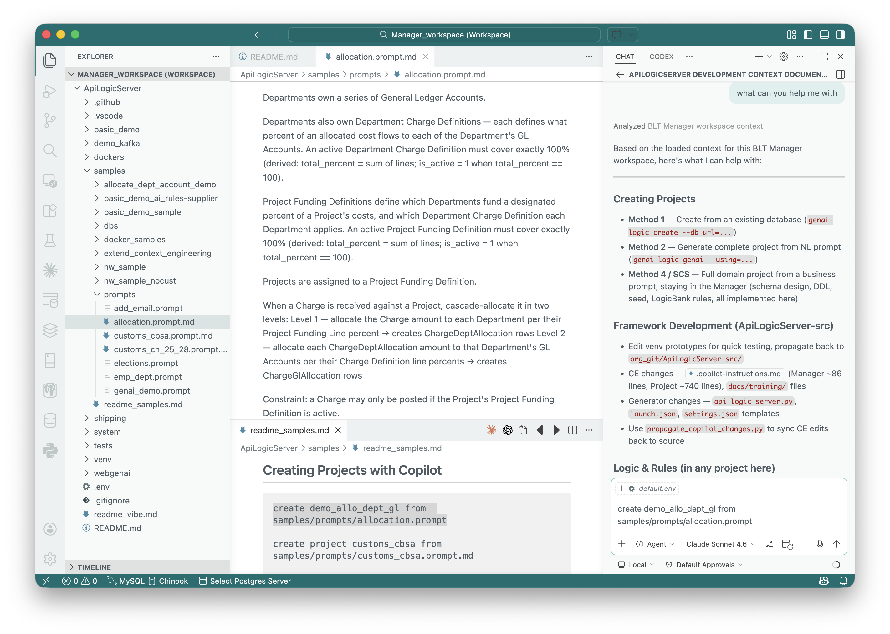
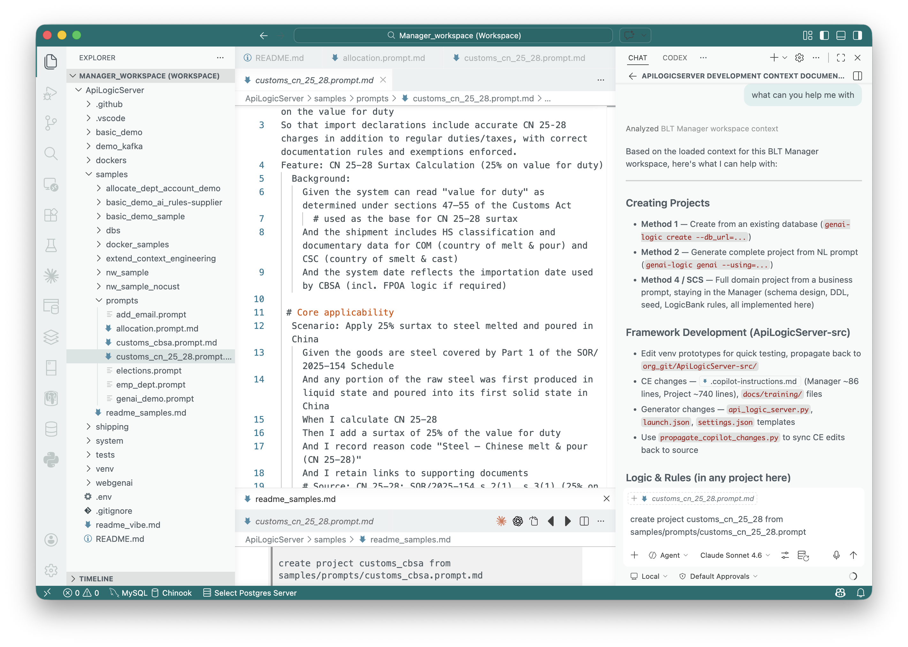

---
hide:
 - title
---
<style>
  .md-typeset h1,
  .md-content__button {
    display: none;
  }
</style>

!!! pied-piper ":bulb: TL;DR - Create Project And New Database, Using AI"

    You can use your AI Assistant (e.g., Copilot with Claude Sonnet 4.6) to create entire systems, including a new Database, an API, Admin App, Logic, and Application Integration.

    This creates a standard project, designed for further iterative development using your IDE.

&nbsp;

## From A Prompt

The Manager includes several prompts you can use (see `samples/prompts`).  Some examples:

&nbsp;

### Allocation System

Use the Manager (for more information, see [Allocation](Sample_Allo_Dept_GL_full.md){:target="_blank" rel="noopener"}):



&nbsp;

### From Regulations

AI has remarkable abilties to read regulations for proect creation.  For example, this remarkable command:

* Finds, reads and understands the reference statutes from web-based documents
* Builds an executable GenAI-Logic project, including:

    * A database (including sample data), Admin App and API
    * Business logic, expressed as rules
    * Business documentation


```text title="Create Customs Surtax System"
Create a fully functional application and database
 for CBSA Steel Derivative Goods Surtax Order PC Number: 2025-0917 
 on 2025-12-11 and annexed Steel Derivative Goods Surtax Order 
 under subsection 53(2) and paragraph 79(a) of the 
 Customs Tariff program code 25267A to calculate duties and taxes 
 including provincial sales tax or HST where applicable when 
 hs codes, country of origin, customs value, and province code and ship date >= '2025-12-26' 
 and create runnable ui with examples from Germany, US, Japan and China" 
 this prompt created the tables in db.sqlite.
```

&nbsp;

Since this prompt is provided in samples, you can just enter this in Copilot:

```text
create project customs_cbsa from samples/prompts/customs_cbsa.prompt.md
```

For more information, [click here](Customs-readme-full.md){:target="_blank" rel="noopener"}.

&nbsp;

### From specifications

AI can interpret many sources of input, such as xml documents, or "Cucumber" specifications:

