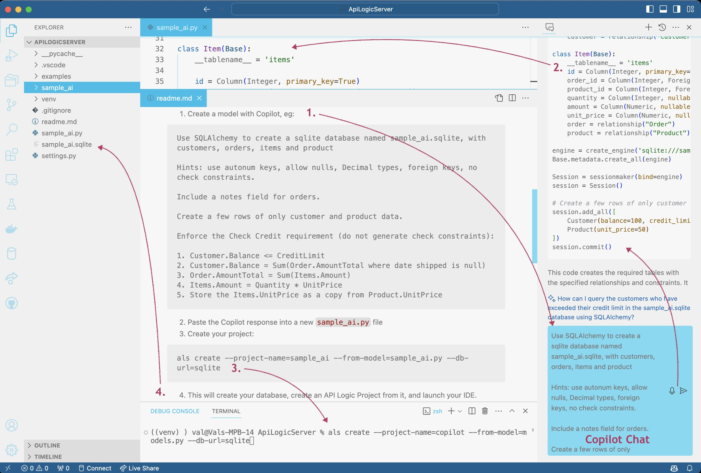

You can use Copilot chat (if extension installed) to create new databases and projects:

1. Create a model, eg:

<details markdown>

<summary> Show Me How to Use Copilot </summary>

&nbsp;

Paste this into the Copilot prompt:

```
Use SQLAlchemy to create a sqlite database named sample_ai.sqlite, with customers, orders, items and product

Hints: use autonum keys, allow nulls, Decimal types, foreign keys, no check constraints.

Include a notes field for orders.

Create a few rows of only customer and product data.

Enforce the Check Credit requirement (do not generate check constraints):

1. Customer.Balance <= CreditLimit
2. Customer.Balance = Sum(Order.AmountTotal where date shipped is null)
3. Order.AmountTotal = Sum(Items.Amount)
4. Items.Amount = Quantity * UnitPrice
5. Store the Items.UnitPrice as a copy from Product.UnitPrice
```


</details>

<br>

2. Paste the copilot response into a new `sample_ai.py` file

3. Create your project:

```bash
als create --project-name=sample_ai --from-model=sample_ai.py --db-url=sqlite
```

4. This will create your database, create an API Logic Project from it, and launch your IDE.