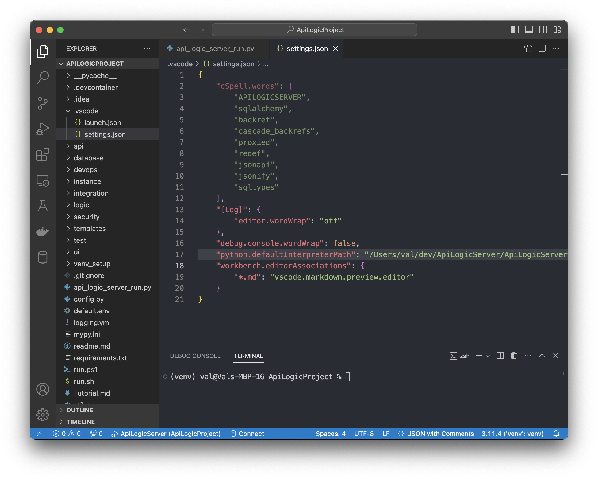
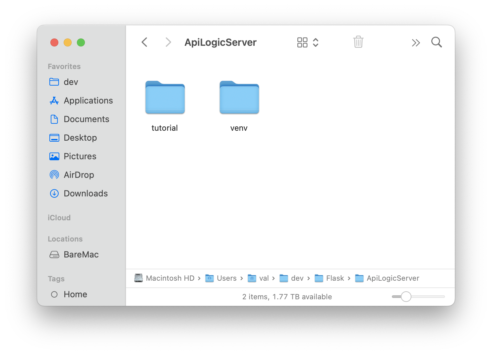
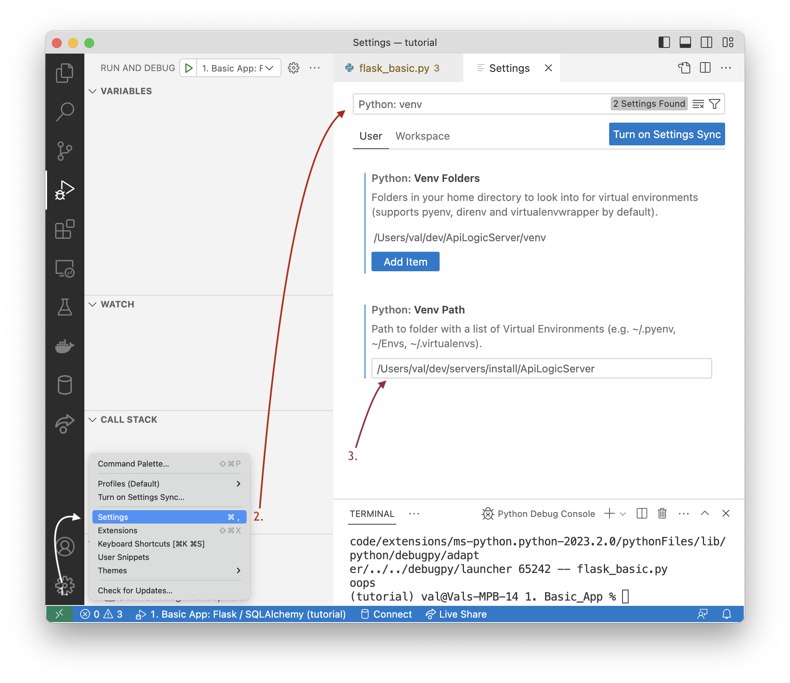
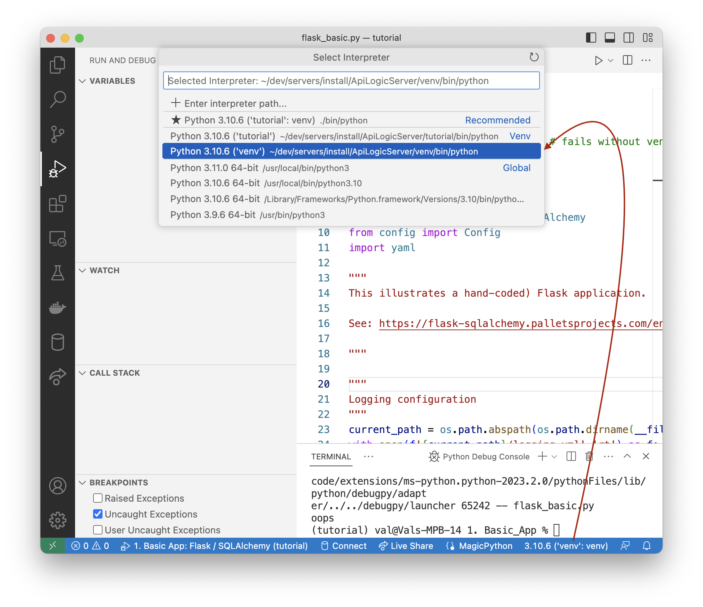

This section applies only to `pip` installs.  Docker based installs eliminate such environment issues, and are therefore worth a look.

Important: in addition to Python environment, there are other configuration settings to consider as described in the [Quick Start](IDE-Execute.md).

## Per-project `venv`

You created a virtual environment when you installed ApiLogicServer.  This ```venv``` will work for all of your created ApiLogicServer projects, or you can use a per-project ```venv```, as follows.

The created project contains a ```requirements.txt``` used to create a [virtual environment](https://docs.python.org/3/library/venv.html).
You can create it in the usual manner:

```sh
cd ApiLogicProject
python3 -m venv venv       # may require python -m venv venv
source venv/bin/activate   # windows venv\Scripts\activate
python3 -m pip install -r requirements.txt
```
&nbsp;

## Shared `venv`

VSCode users may wish to share a `venv` over multiple projects.  Two altermnatives are described below.

&nbsp;

### From Create (default)

Projects created starting with version 10.0.8 (see preview) have a preset `python.defaultInterpreterPath` in `.vscode/settings.json`.  The Python interpreter used to create the project (i.e, your ApiLogicServer install location) will be the default interpreter / venv.  Note this only takes effect when you start VSCode; you can override it manually.

<details markdown>

<summary> Show me how </summary>



</details>

&nbsp;

### From Settings

Use __Settings > Python: Venv Path__, and specify a directory containing `venv` directories (e.g, where you installed API Logic Server).  This is a convenient way to get started.

Recall this does _not_ apply to docker or Codespace environments.  

&nbsp;

A typical way to install API Logic Server is to create a directory called `ApiLogicServer`, and create a `venv` inside it, like this:

```bash title="Install API Logic Server in a Virtual Environment"
python -m venv venv                  # may require python3 -m venv venv
venv\Scripts\activate                # mac/linux: source venv/bin/activate
python -m pip install ApiLogicServer
```

&nbsp;

The resultant directory structure:



This `venv` can be re-used by defining a global path in your `Python: venv` setting:



Then, choose this `venv` with `select interpreter` (you sometimes have to open a Python file):



</details>


### From Environmental Variable

You can also set up the default `venv` for VSCode.  For example, if you installed ApiLogicServer in `/dev/ApiLogicServer`:

```bash
export VIRTUAL_ENV=~/dev/ApiLogicServer/venv
```
Exercise caution - this might affect other projects.

&nbsp;

## `venv_setup` - shortcut setup procedures

Ss of release 5.02.10, projects are created with a `venv_setup` directory which may be helpful in establishing and verifying your Python environment.  For more information, see the [Trouble Shooting Guide](Troubleshooting.md#ide-issues){:target="_blank" rel="noopener"}.

&nbsp;

## `venv` Troubleshooting

By far, most of the support calls we get involve `venv` setup.

To find more information, please [click here](Troubleshooting.md#verify-your-python-environment){:target="_blank" rel="noopener"}.

&nbsp;

## Notes

### Issues with `pip`

The install sometimes fails due on machines with an older version of `pip`.  If you see a message suggesting you upgrade  `pip` , do so.

### VSCode may fail to find your `venv`

If VSCode does not find your `venv`, you can [specify it manually](https://code.visualstudio.com/docs/python/environments#_manually-specify-an-interpreter) using `Python: Select Interpreter`

For more information, see [Work with Environments](https://code.visualstudio.com/docs/python/environments#_work-with-environments).

### Copy Not Recommended

Recommend re-creating a venv rather than moving/copying; for more information, [see here](https://stackoverflow.com/questions/7438681/how-to-duplicate-virtualenv){:target="_blank" rel="noopener"}.

### F5 / Debugger uses `launch.json` `"python"` key, not `settings.json`

> **Alert:** `python.defaultInterpreterPath` in `settings.json` controls the Pylance/status-bar picker, but **not the F5 debugger**.  F5 (debugpy) uses the `"python"` key inside each configuration in `.vscode/launch.json`.

Starting with release 15.x, created projects include `"python": "${workspaceFolder}/../venv/bin/python"` in each server launch configuration.  This portable relative path works correctly on any machine without modification — no absolute path is baked in at creation time.

> **Subfolder Caveat:** This path assumes your project lives **one level below** the Manager directory (e.g., `ApiLogicServer/my_project/`).  If your project is nested deeper (e.g., `ApiLogicServer/custom_apps/my_project/`), the `../venv` reference will resolve incorrectly.  In that case, adjust the `"python"` value in `.vscode/launch.json` manually, e.g.:
> ```json
> "python": "${workspaceFolder}/../../venv/bin/python"
> ```