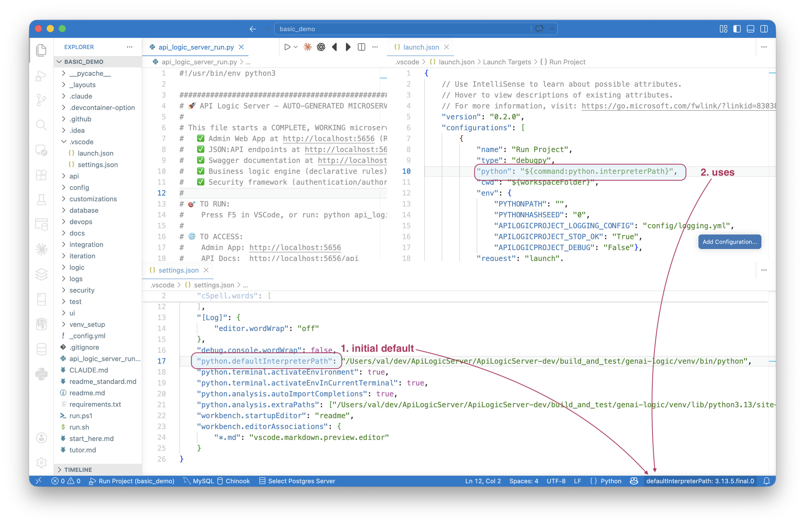

!!! pied-piper "venv - locates Python libraries"
    Project execution fails instantly if the Python libararies (LogicBank, API etc) are missing.  The are located via the ***virtual environment*** (`venv`) as described here.

    This is generally defaulted for projects created in the manager ([click here for more information](Manager.md){:target="_blank" rel="noopener"}).

    In addition to Python environment, there are other configuration settings to consider as described in the [Quick Start](IDE-Execute.md).

    This section applies only when you `pip install` GenAI-Logic.  Docker-based installs eliminate environment issues, but require docker and more setup.

&nbsp;

## How Projects Find Their `venv`

All created projects use `"python": "${command:python.interpreterPath}"` in `launch.json`.  VS Code resolves this at runtime from the interpreter selected in the status bar — stored in `.vscode/settings.json` as `python.defaultInterpreterPath`.

**The picker is the single source of truth** — no manual file editing required.



&nbsp;

## Scenario 1 — Projects Created in the Manager (default)

`als create` writes `python.defaultInterpreterPath` into `.vscode/settings.json` pointing to the Manager venv.  F5 works immediately — no setup needed.  If you re-open a project that was already created here, the interpreter is already cached — F5 still works.


<details markdown>
<summary> If the interpreter ever gets lost (e.g. after a VS Code update) </summary>

1. ⌘⇧P → `Python: Clear Workspace Interpreter Setting`
2. ⌘⇧P → `Python: Select Interpreter` → choose `venv/bin/python` in the Manager folder


</details>

&nbsp;

## Scenario 2 — Imported / Cloned Projects

When a project is cloned from git, `.vscode/settings.json` is absent (gitignored — it contains machine-specific paths).  The VS Code `python-envs` extension then **actively overrides** the interpreter to the system Python, causing F5 to fail.

> **Recommended on Mac/Linux: Option 2 (symlink)** — one command, then F5 works.  Use Option 1 if you just want to run without touching VS Code.  Use Option 3 on Windows or when the project is outside the Manager folder.

Three options:

<details markdown>
<summary>Why <code>Python: Select Interpreter</code> may not be enough</summary>

The `python-envs` extension scans for a `venv/` folder *inside* the project.  If none is found, it writes `"python-envs.defaultEnvManager": "ms-python.python:system"` into `settings.json`, which takes precedence over `python.defaultInterpreterPath`.  Manually picking an interpreter via the status-bar may appear to work but can be silently overridden on the next VS Code window reload.  The options below avoid this problem entirely.

</details>

### Option 1 — `als run` (simplest, no VS Code setup)

From the Manager terminal (with venv activated):

```bash
als run --project-name=<project-name>
# or from inside the project:
cd <project> && als run --project-name=.
```

Runs the server using the Manager venv directly.  Output goes to `logs/als.log` (previous run auto-saved to `logs/als.log.1`).

### Option 2 — Symlink (Mac/Linux, enables F5)

Creates a `venv` symlink inside the project pointing to `../venv` (the Manager venv).  VS Code detects it as a local venv and selects the correct interpreter automatically.

```bash
cd <project>
sh venv_setup/venv.sh symlink
# reload VS Code window — F5 now works
```

### Option 3 — Local venv (all platforms)

Creates a real local `venv/` with all dependencies:

```bash
sh venv_setup/venv.sh go        # Mac/Linux
.\venv_setup\venv.ps1 go        # Windows
```

Use this on Windows or when the project is not inside the Manager folder.

> To verify your environment after any option: `python venv_setup/py.py` — shows interpreter, ALS version, and sys.path.

> See `venv_setup/readme_venv.md` in any project for full details, and the [Troubleshooting Guide](Troubleshooting.md#verify-your-python-environment){:target="_blank" rel="noopener"} if problems persist.

&nbsp;

## Important Notes

### Issues with `pip`

If the install fails with a message suggesting you upgrade `pip`, do so:

```bash
pip install --upgrade pip
```

&nbsp;

### Copy `venv` Not Recommended

It is simpler to re-create a venv than to move/copy one; for more information, [see here](https://stackoverflow.com/questions/7438681/how-to-duplicate-virtualenv){:target="_blank" rel="noopener"}.

&nbsp;

### Environmental Variables — Not Recommended

Setting `VIRTUAL_ENV`, `PYTHONPATH`, or `PATH` in environment variables has no effect on VS Code's interpreter selection and can break terminal `PATH` on some platforms.  Use `Python: Select Interpreter` in the status bar instead.
