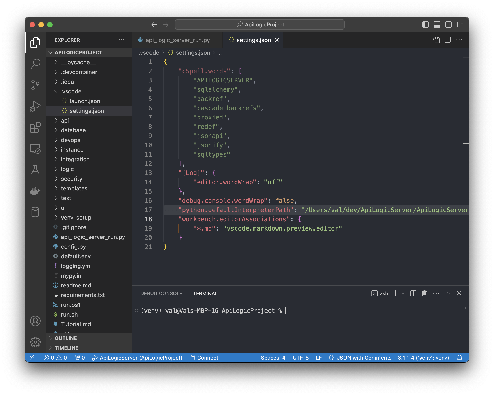

This section applies only to `pip` installs.  Docker-based installs eliminate environment issues and are worth a look.

Important: in addition to Python environment, there are other configuration settings to consider as described in the [Quick Start](IDE-Execute.md).

&nbsp;

## How Projects Find Their `venv`

All created projects use `"python": "${command:python.interpreterPath}"` in `launch.json`.  VS Code resolves this at runtime from the interpreter selected in the status bar — stored in `.vscode/settings.json` as `python.defaultInterpreterPath`.

**The picker is the single source of truth** — no manual file editing required.

&nbsp;

## Scenario 1 — Projects Created in the Manager (default)

`als create` writes an absolute `python.defaultInterpreterPath` into `.vscode/settings.json` pointing to the Manager venv Python.  When VS Code opens the project, F5 works immediately — no setup needed.

<details markdown>
<summary> Show me how </summary>



</details>

&nbsp;

## Scenario 2 — Existing Projects (already in Manager)

If a project was created in this Manager and you re-open it, the interpreter is already cached by VS Code — F5 works.

If the interpreter ever gets lost (e.g. after a VS Code update), fix it with:

1. ⌘⇧P → `Python: Clear Workspace Interpreter Setting`
2. ⌘⇧P → `Python: Select Interpreter` → choose `venv/bin/python` in the Manager folder

&nbsp;

## Scenario 3 — Imported / Cloned Projects

When a project is cloned from git, `.vscode/settings.json` is absent (gitignored — it contains machine-specific paths).  The VS Code `python-envs` extension then **actively overrides** the interpreter to the system Python, causing F5 to fail.

> **Why `Python: Select Interpreter` may not help here:** The `python-envs` extension scans for a `venv/` folder *inside* the project.  If none is found, it writes `"python-envs.defaultEnvManager": "ms-python.python:system"` into `settings.json`, which takes precedence over `python.defaultInterpreterPath`.  Manually picking an interpreter via the status-bar may appear to work but can be silently overridden on the next VS Code window reload.  The options below avoid this problem entirely.

Two options:

### Option 1 — `als run` (simplest, no VS Code setup)

From the Manager terminal (with venv activated):

```bash
als run --project-name=<project-name>
# or from inside the project:
cd <project> && als run --project-name=.
```

Runs the server using the Manager venv directly.  Output goes to `logs/als.log` (previous run auto-saved to `logs/als.log.1`).

### Option 2 — Symlink (Mac/Linux, enables F5)

Creates a `venv` symlink inside the project pointing to `../venv` (the Manager venv).  VS Code detects it as a local venv and selects the correct interpreter automatically.

```bash
cd <project>
sh venv_setup/venv.sh symlink
# reload VS Code window — F5 now works
```

### Option 3 — Local venv (all platforms)

Creates a real local `venv/` with all dependencies:

```bash
sh venv_setup/venv.sh go        # Mac/Linux
.\venv_setup\venv.ps1 go        # Windows
```

Use this on Windows or when the project is not inside the Manager folder.

> See `venv_setup/readme_venv.md` in any project for full details.

&nbsp;

## `venv_setup` Directory

Projects include a `venv_setup` directory with helper scripts and `py.py` to verify your environment:

```bash
python venv_setup/py.py          # shows interpreter, ALS version, sys.path
```

For more information, see the [Troubleshooting Guide](Troubleshooting.md#ide-issues){:target="_blank" rel="noopener"}.

&nbsp;

## `venv` Troubleshooting

By far, most support calls involve `venv` setup.  [Click here](Troubleshooting.md#verify-your-python-environment){:target="_blank" rel="noopener"} for more information.

&nbsp;

## Important Notes

### Issues with `pip`

If the install fails with a message suggesting you upgrade `pip`, do so:

```bash
pip install --upgrade pip
```

&nbsp;

### Copy `venv` Not Recommended

It is simpler to re-create a venv than to move/copy one; for more information, [see here](https://stackoverflow.com/questions/7438681/how-to-duplicate-virtualenv){:target="_blank" rel="noopener"}.

&nbsp;

### Environmental Variables — Not Recommended

Setting `VIRTUAL_ENV`, `PYTHONPATH`, or `PATH` in environment variables has no effect on VS Code's interpreter selection and can break terminal `PATH` on some platforms.  Use `Python: Select Interpreter` in the status bar instead.
