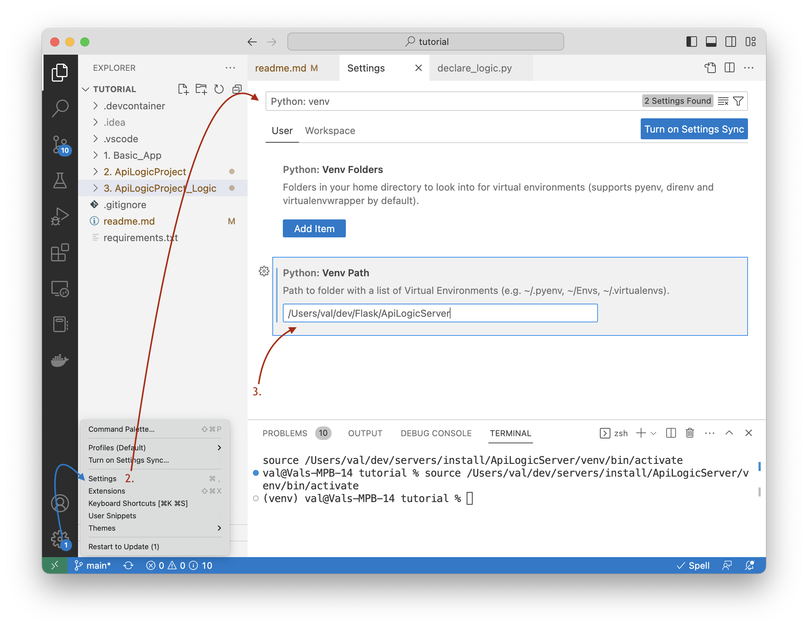

This section applies only to `pip` installs.  Docker based installs eliminate such environment issues, and are therefore worth a look.

Important: in addition to Python environment, there are other configuration settings to consider as described in the [Quick Start](IDE-Execute.md).

## Per-project `venv`

You created a virtual environment when you installed ApiLogicServer.  This ```venv``` will work for all of your created ApiLogicServer projects, or you can use a per-project ```venv```, as follows.

The created project contains a ```requirements.txt``` used to create a [virtual environment](https://docs.python.org/3/library/venv.html).
You can create it in the usual manner:

```sh
cd ApiLogicProject
python3 -m venv venv       # may require python -m venv venv
source venv/bin/activate   # windows venv\Scripts\activate
python3 -m pip install -r requirements.txt
```
&nbsp;

## Shared `venv`

VSCode users may wish to share a `venv` over multiple projects.  Two altermnatives are described below.

&nbsp;

### From Create (default)

Created projects have a preset `python.defaultInterpreterPath` in `.vscode/settings.json` pointing to the absolute path of the Python used during creation (i.e., your ApiLogicServer venv).  This takes effect when you open the project in VSCode — F5 works immediately with no manual configuration.

**Team / cloned projects:** `.vscode/settings.json` is gitignored in created projects, because it contains a machine-specific absolute path.  After cloning, VSCode will prompt you to `Select Interpreter` once — point it to your `venv/bin/python`.  VSCode caches this per-machine; `launch.json` picks it up automatically from that point on.

<details markdown>

<summary> Show me how </summary>


</details>

&nbsp;

### From Settings

Use __Settings > Python: Venv Path__, and specify a directory containing `venv` directories (e.g, where you installed API Logic Server).  This is a convenient way to get started.

Recall this does _not_ apply to docker or Codespace environments.  

&nbsp;

A typical way to install API Logic Server is to create a directory called `ApiLogicServer`, and create a `venv` inside it, like this:

```bash title="Install API Logic Server in a Virtual Environment"
python -m venv venv                  # may require python3 -m venv venv
venv\Scripts\activate                # mac/linux: source venv/bin/activate
python -m pip install ApiLogicServer
```

&nbsp;

The resultant directory structure:


This `venv` can be re-used by defining a global path in your `Python: venv` setting:



Then, choose this `venv` with `select interpreter` (you sometimes have to open a Python file):


</details>


### From Environmental Variable

> **Not recommended.** Setting `VIRTUAL_ENV` (or `PYTHONPATH` / `PATH`) in environment variables has no effect on VS Code's interpreter selection and can break terminal `PATH` on some platforms.  Use the status-bar picker (`Python: Select Interpreter`) instead — it is the single source of truth for both Pylance and F5.

&nbsp;

## `venv_setup` - shortcut setup procedures

Ss of release 5.02.10, projects are created with a `venv_setup` directory which may be helpful in establishing and verifying your Python environment.  For more information, see the [Trouble Shooting Guide](Troubleshooting.md#ide-issues){:target="_blank" rel="noopener"}.

&nbsp;

## `venv` Troubleshooting

By far, most of the support calls we get involve `venv` setup.

To find more information, please [click here](Troubleshooting.md#verify-your-python-environment){:target="_blank" rel="noopener"}.

&nbsp;

## Notes

### Issues with `pip`

The install sometimes fails due on machines with an older version of `pip`.  If you see a message suggesting you upgrade  `pip` , do so.

### VSCode may fail to find your `venv`

If VSCode does not find your `venv`, you can [specify it manually](https://code.visualstudio.com/docs/python/environments#_manually-specify-an-interpreter) using `Python: Select Interpreter`

For more information, see [Work with Environments](https://code.visualstudio.com/docs/python/environments#_work-with-environments).

### Copy Not Recommended

Recommend re-creating a venv rather than moving/copying; for more information, [see here](https://stackoverflow.com/questions/7438681/how-to-duplicate-virtualenv){:target="_blank" rel="noopener"}.

### F5 / Debugger: use the Python Picker

**If F5 fails**, click the Python version in the VS Code status bar and select the correct venv.  That's it — everything follows automatically.

**How it works:** Starting with release 16.x, created projects include `"python": "${command:python.interpreterPath}"` in each server launch configuration.  VS Code resolves this at runtime from whatever interpreter the status-bar picker has selected (stored in `python.defaultInterpreterPath` in `.vscode/settings.json`).  The picker is the single control — no manual file editing required.

> **Note for cloned/moved projects:** `.vscode/settings.json` is gitignored in created projects, so clones will not contain a stale machine-specific path.  VSCode will prompt `Select Interpreter` once — choose your `venv/bin/python`.  `launch.json` picks it up automatically from that point on.

??? note "Technical detail"
    `launch.json` uses the VS Code variable `${command:python.interpreterPath}`, which resolves at runtime to the value of `python.defaultInterpreterPath` in `.vscode/settings.json`.  That value is written by the picker when you select an interpreter — so the picker is the single source of truth for both Pylance and F5.