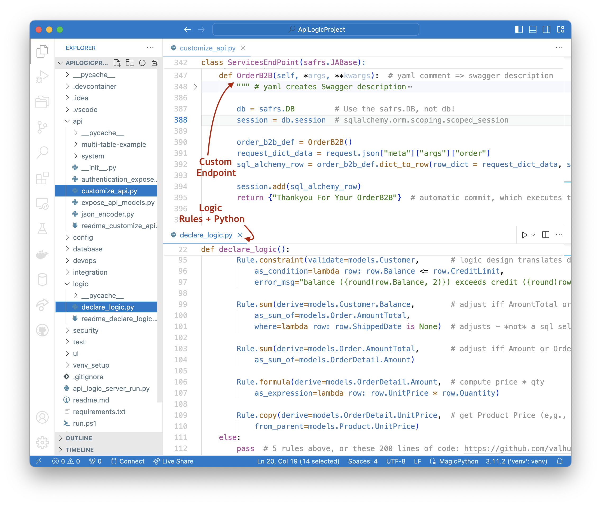

## Project Creation

The ApiLogicServer CLI `create` (or `create-and-run`) command creates the project structure shown below - for more information, [see here](../Internals).

&nbsp;

## API Execution: `api_logic_server_run.py`

Execution begins in `api_logic_server_run.py`.  Your customizations are done to the files noted in the callouts below.

`api_logic_server_run.py` (a file created in your ApiLogicProject) sets up a Flask app, the database, logic and api:

1. **Database Setup:** It imports`api/expose_api_models` which imports `database/models.py`, which then imports `database/customize_models.py` for your model extensions.  `api_logic_server_run.py` then sets up flask, and opens the  database with `db = safrs.DB`

2. **Logic Setup:** It then calls `LogicBank.activate`, passing `declare_logic` which loads your declared rules into Logic Bank.

3. **API Setup:** It next invokes `api/expose_api_models`.  This calls safrs to create the end points and the swagger information, based on the created `database/models.py` (the models used by the SQLAlchemy ORM).   It finally calls `api/customize.py` where you can add your own services.  The sample includes a trivial Hello World, as well as `add_order`.

## Logic Execution

SAFRS API listens for API calls, e.g., from the Admin App.  When updates are issued:

4. **Invokes SQLAlchemy updates:** SAFRS calls SQLAlchemy, passing a set of rows comprising a database transaction

5. **`before_flush`:** SQLAlchemy provides a `before_flush` event, where all the update rows are assembled and passed to `Logic Bank`  (no relation to retail!).

6. **Logic Execution:** Logic Bank reviews the rows, and based on what has change, prunes rules for unchanged data, and executes / optimizes relevant logic in an appropriate order.  

### Declarative Logic is critical

Logic addresses multi-table derivations, constraints, and actions such as sending messages or emails.  These can constitute nearly half the effort in transactional systems.

## Admin App Execution: `ui/admin/admin.yaml`

[http://localhost:5656/](http://localhost:5656/) redirects to `ui/admin/index.html` which loads the react-admin single-page app into your browser.

It then loads your `ui/admin/admin.yaml`, and responds to the various clicks by invoking the API (and hence the update logic), or the swagger at [http://localhost:5656/api](http://localhost:5656/api).

## Key Observations: Extensible Declarative Automation

While the most striking element of ApiLogicServer is automation - a running UI and API from a database - there are some important aspects, described below.

&nbsp;

### _Customizable, Declarative_ Models

Observe that the key files for defining API, UI and Logic are not procedural code.  They are _declarative:_ specifications of _what_ you want to happen, not _how_ it's implemented:

* Logic looks more like a specification than code

* UI looks like a list of Objects and Attributes to display

* API looks like a list of Objects

This is important because they are orders of magnitude shorter, and therefore far easier to understand, and to customize.

For example, consider the UI, defined by `ui/admin/admin.yaml`.  This is in lieu of hundreds of lines of very complex HTML and JavaScript.

### Extensible

ApiLogicServer makes provisions for you to add standard Python code for aspects of your project that are automated - custom end points, extensions to the data model, logic (rules _plus Python_).  

And, of course, the API means you are unblocked for creating custom UIs and integrations.

&nbsp;

### Includes Logic

As noted above, multi-table constraints and derivations can constitute nearly half the effort in transactional systems.

Unlike most systems that address such logic with "your code goes here", ApiLogicServer provides _**declarative** spreadsheet-like rules,_ extensible with Python, as [described here](../Logic:-Rules-plus-Python).  Rules are 40X more concise than code.  

Rule execution is via a _transaction logic_ engine, a complementary technology to traditional RETE engines.  The [transaction logic engine](https://github.com/valhuber/LogicBank/wiki/Rules-Engines) is specifically designed to optimize integrity and performance for transactional logic, which is not possible in RETE engines. See [here](https://github.com/valhuber/LogicBank/wiki/Logic-Walkthrough) for more information on their operation.

