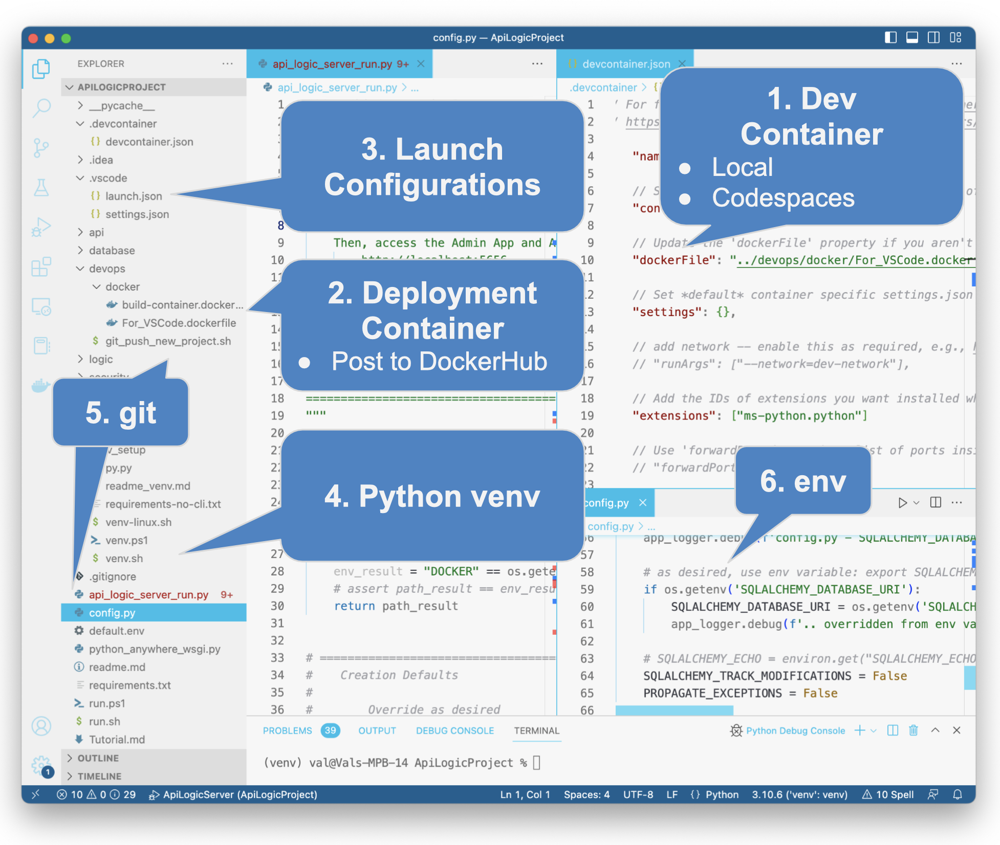

---
hide:
 - title
---
<style>
  .md-typeset h1,
  .md-content__button {
    display: none;
  }
</style>

!!! pied-piper ":bulb: TL;DR - ApiLogicServer create"

    The `ApiLogicServer create` CLI command creates a customizable / executable API Logic Project providing:

    * **A [JSON:API](API.md){:target="_blank" rel="noopener"} -** Endpoint for each table, with filtering, sorting, pagination, optimistic locking, including __related data access__, based on relationships in the models file (typically derived from foreign keys)

    * **[An Admin App](Admin-Tour.md){:target="_blank" rel="noopener"} -** multi-page, multi-table, with automatic joins

    Customize the project in your IDE to add custom endpoints, rules and Python for logic and security.  Projects are fully configured for development (e.g. run configurations) and deployment (e.g., image creation, env variables).

## ApiLogicServer create

The key `ApiLogicServer create` options are:

* `--project_name` defines the directory created for your project

* `--db_url` identifies the database.  Specify a [SQLAlchemy url](Database-Connectivity.md){:target="_blank" rel="noopener"}, or one of the [preloaded sample database abbreviations](Data-Model-Examples.md){:target="_blank" rel="noopener"}

Discover other options with `ApiLogicServer create --help`.

Discover other commands with `ApiLogicServer --help`.

The key files that drive execution are described below.  Note they are models - instead of lengthy generated code (*what*), they are Python declarations of ***how***.

&nbsp;

### 1. Data Model Classes

The [Data Model Classes](Data-Model-Classes.md){:target="_blank" rel="noopener"} enable SQLAlchemy database operations for the system and your custom code.  They are created automatically on project creation.

See [rebuild](Project-Rebuild.md){:target="_blank" rel="noopener"} for more information.

### 2. API

The [JSON:API](API.md){:target="_blank" rel="noopener"} is driven by the model classes, so is very short.

### 3. Admin App

The [Admin App](Admin-Customization.md/#edit-adminyaml) is also a model (not extensive html and javascript), expressed in yaml.

&nbsp;

## Create From Model

In addition to creating projects from databases, you can also create them from SQLAlchemy models.  For example:

* Copilot can produce models
* Many Python programmers prefer to use SQLAlchemy as their database tool

```bash title="Create from Model"
als create --project-name=sample_ai --from-model=sample_ai.py --db-url=sqlite
```

&nbsp;

## Project Structure

When you create an ApiLogicProject, the system creates a project like this that you customize in your IDE:


[Explore the Tutorial Project](https://github.com/valhuber/Tutorial-ApiLogicProject#readme), and observe that the projects are rather small.  That is because the system creates _models_ that define _what, not now_.  Explore the project and you will find it easy to understand the API, data model, app and logic files.

Note the entire project is file-based, which makes it easy to perform typical project functions such as source control, diff, merge, code reviews etc.

&nbsp;

When you create an ApiLogicProject, the system creates a project like this, pre-configured for Developer Oprations.  See the notes below.



&nbsp;

### 1. Dev Container

You can customize projects using a local install, or a container (see the Install Guide).  Container support includes the `.devcontainer` folder, and the `devops/docker/ForVSCode.dockerfile`.  You should not need to alter these.

In addition to desktop-based development, these enable Codespaces support (see the Express Eval).

&nbsp;

### 2. Deployment Container

A common approach to deployment is to create a container for your project.  The `build-container.dockerfile` is created for this purpose.

You will need to edit it to reflect your project and Docker account names.

&nbsp;

### 3.  Launch Configurations

These are created so you can run the API Logic Server, run tests, etc.  You should not need to modify these, but you may wish to extend them.  

Note the file that starts the project is `api_logic_server_run.py`, which obtains arguments from `conf/config.py` and environmental variables.

&nbsp;

### 4. Python `venv`

The creation process builds a standard `requirements.txt` file.  You can create your `venv` with this, and (if your IDE does not provide it) the `venv.sh/ps1` files to initialize your `venv`.

&nbsp;

### 5. GitHub

Your project includes a suggested `.gitignore` file (alter as desired).  You can use git in standard ways to push and pull changes.  Some IDEs support the initial GitHub creation (see [VSCode publish](https://stackoverflow.com/questions/46877667/how-to-add-a-new-project-to-github-using-vs-code){:target="_blank" rel="noopener"}, or you can use the `git_push_new_project.sh` file. 

&nbsp;

### 6. Configuration, env variables

Most deployment procedures discourage database names / passwords to be in project files and GitHub, instead preferring to specify these via `env` variables; [click here for more information](DevOps-Container-Configuration.md/#overrides-env-variables){:target="_blank" rel="noopener"}

&nbsp;

### IDE Friendly

The project structure above can be loaded into any IDE for code editing, debugging, etc.  For more information on using IDEs, [see here](https://github.com/valhuber/ApiLogicServer/wiki#using-your-ide){:target="_blank" rel="noopener"}.

&nbsp;

### Tool-friendly - file-based

All project elements are files - no database or binary objects.  So, you can store objects in source control systems like git, diff/merge them, etc.

&nbsp;

## Customizing ApiLogicProjects

You will typically want to customize and extend the created project.  Edit the files noted ih the diagram at the top of this page.

Projects are created from a [system-supplied prototype](https://github.com/valhuber/ApiLogicServer/tree/main/api_logic_server_cli/project_prototype){:target="_blank" rel="noopener"}.  You can use your own prototype from git (or a local directory) using the ```from_git``` parameter.

## Architecture

The resultant projects operates as a (typically containerized) 3-tiered architecture, as [described here](Architecture-What-Is.md){:target="_blank" rel="noopener"}.

## ApiLogicServer CLI

API Logic Server consists of a CLI and various runtimes, as [described here](Architecture-What-Is.md){:target="_blank" rel="noopener"}.  The commands on this page (`ApiLogicServer create` etc) are part of the ApiLogicServer CLI.  

The CLI operates in a standard way.  Consider the following command:

```bash
ApiLogicServer create --project-name=my-project --db-url=sqlite3-url
```

1. `create` is a command; discover the commands with `ApiLogicServer`
2. `--project-name` is an option; discover the options with `ApiLogicServer create --help`

> Note: as of release 10.3.45, you can use the abbreviation `als` instead of `ApiLogicServer`