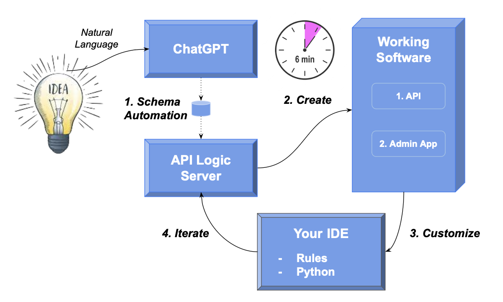

<style>
  .md-typeset h1,
  .md-content__button {
    display: none;
  }
</style>

# One Day Projects

Here's how to use AI and API Logic Server to create complete running systems in minutes:

1. Use **ChatGPT for Schema Automation:** create a database schema from natural language
2. Use **API Logic Server:** create working software *with 1 command*
    * **App Automation:** a multi-page, multi-table admin app
    * **API Automation:** a JSON:API - crud for each table, with filtering, sorting, optimistic locking and pagination
3. **Customize** the project with *your IDE*:
    * **Logic Automation using rules:** declare spreadsheet-like rules in Python for multi-table derivations and constraints - **40X more concise** than code
    * Use Python and standard libraries (Flask, SQLAlchemy), and debug in your IDE
4. **Iterate** your project:
    * Revise your database design and logic
    * **Integrate** with B2B partners and internal systems



This process **leverages your existing IT infrastructure:** your IDE, GitHub, the cloud, your database… open source.  Let's see how.

&nbsp;

---

## 1. AI: Schema Automation

You can use an existing database, or create a new one with ChapGPT or your database tools.

Use ChatGPT to generate SQL commands for database creation:

!!! pied-piper "Create database schemas from ChatGPT"

    Create a sqlite database for customers, orders, items and product
    
    Hints: use autonum keys, allow nulls, Decimal types, foreign keys, no check constraints.

    Include a notes field for orders.

    Create a few rows of only customer and product data.

    Enforce the Check Credit requirement:

    1. Customer.Balance <= CreditLimit
    2. Customer.Balance = Sum(Order.AmountTotal where date shipped is null)
    3. Order.AmountTotal = Sum(Items.Amount)
    4. Items.Amount = Quantity * UnitPrice
    5. Store the Items.UnitPrice as a copy from Product.UnitPrice
&nbsp;

This creates standard SQL, [like this](https://github.com/ApiLogicServer/ApiLogicServer-src/blob/main/api_logic_server_cli/prototypes/sample_ai/database/chatgpt/sample_ai.sql){:target="_blank" rel="noopener"}.  Copy the generated SQL commands into a file, say, `sample-ai.sql`:

Then, create the database:

```bash
sqlite3 sample_ai.sqlite < sample_ai.sql
```

> You may not have the sqlite cli; you can proceed to step 2 and the system will use a pre-installed database.

&nbsp;

## 2. API Logic Server: Create

Given a database, API Logic Server creates an executable, customizable project with the following single command:

```bash
$ ApiLogicServer create --project_name=sample_ai --db_url=sqlite:///sample_ai.sqlite
```

This creates a project you can open with your IDE, such as VSCode (see below).  The project is now ready to run - press F5.  It includes:

* a self-serve **API** ready for UI developers, and
* an **Admin app** ready for Business User Collaboration


&nbsp;

### a. App Automation

App Automation means that `ApiLogicServer create` creates a multi-page, multi-table Admin App -- automatically.  This React-Admin does *not* consist of hundreds of lines of complex html and javascript - it's a simple yaml file that's easy to customize.

> Ready for business user collaboration, back-office data maintenance - Day 1.


&nbsp;

### b. API Automation

App Automation means that `ApiLogicServer create` creates a JSON:API -- automatically.  Your API supports related data access, pagination, optimistic locking, filtering, and sorting.

> It would take days to months to create such an API using frameworks.

UI App Developers can create custom apps immediately, using swagger to design their API call, and copying the URI into their JavaScript code.  APIs are thus ***self-serve:*** no server coding is required.  

> Custom App Dev is unblocked - Day 1.


&nbsp;

## 3. Customize

So, we have working software, in minutes.  It's running, but we really can't *deploy* it until we have logic and security.  Which brings us to customization.

Projects are designed for customization, using standards: Python, frameworks (e.g., Flask, SQLAlchemy), and your IDE for code editing and debugging.  Not only Python *code*, but also ***Rules***.

To explore, let's customize this project.  To speed things up, instead of the normal procedure of declaring rules in your IDE, follow this procedure:

1. Stop the Server

2. Execute the following in your IDE terminal window:

```bash
ApiLogicServer sample-ai
```

This applies customized logic and security, which we examine below.

&nbsp;

### a. Logic Automation

Logic Automation means that you can ***declare spreadsheet-like rules*** using Python.  Such logic maintains database integrity with multi-table derivations and constraints, and security.  Rules are 40X more concise than traditional code, and can be extended with Python.

Rules are an executable design.  Use your IDE (code completion, etc), to replace 280 lines of code with the 5 spreadsheet-like rules below.  Note they map exactly to our natural language design:


&nbsp;

**1. Debugging**

The screenshot above shows our logic declarations, and how we debug them:

1. Execution is paused at a **breakpoint** in the debugger, where we can examine state, and execute step by step.

2. Note the **logging** for inserting an `Item`.  Each line represents a rule firing, and shows the complete state of the row.
<br><br>

**2. Chaining - Multi-Table Transaction Automation**

Note that it's a `Multi-Table Transaction`, as indicated by the log indentation.  This is because - like a spreadsheet - **rules automatically chain, *including across tables.***
<br><br>

**3. 40X More Concise**

The 5 spreadsheet-like rules represent the same logic as 200 lines of code, [shown here](https://github.com/valhuber/LogicBank/wiki/by-code){:target="_blank" rel="noopener"}.  That's a remarkable 40X decrease in the backend *half* of the system.
<br><br>

**4. Automatic Re-use**

The logic above, perhaps conceived for Place order, applies automatically to all transactions: deleting an order, changing items, moving an order to a new customer, etc.  This reduces code, and promotes quality (no missed corner cases).
<br><br>

**5. Automatic Optimizations**

SQL overhead is minimized by pruning, and by elimination of expensive aggregate queries.  These can result in orders of magnitude impact.  This is because the rule engine is not a Rete algorithm, but highly optimized for transaction processing, and integrated with the SQLAlchemy ORM (Object Relational Manager).
<br><br>

**6. Transparent**

Rules are an executable design.  Note they map exactly to our natural language design (shown in comments) - readable by business users.  

&nbsp;

### b. Security Automation

Security Automation means you activate security, and declare grants (using Python) to control row access for user roles.

Security requires login to use the Admin App and Swagger.  Security also provide **row-level authorization** - here, we ensure that less active accounts are hidden:

```python
Grant(  on_entity = models.Customer,
        to_role = Roles.sales,
        filter = lambda : models.Customer.CreditLimit > 3000,
        filter_debug = "CreditLimit > 3000")
```

&nbsp;

## 4. Iterate: Rules + Python

So we have completed our 1 day project.  We can deploy it, as [described here](Tutorial-Deployment.md){:target="_blank" rel="noopener"}, for *agile collaboration* with business users.

Which leads to *agile iterations.*  Automation helps here too: not only are spreadsheet-like rules 40X more concise, they meaningfully simplify iterations and maintenance.  Let’s explore this with two changes:

!!! pied-piper "Green Discounts"

    Give a 10% discount for carbon-neutral products for 10 items or more.
&nbsp;
And:

!!! pied-piper "Application Integration"

    Send new Orders to Shipping using a Kafka message.

    Enable B2B partners to place orders with a custom API.
&nbsp;

As above, we speed things up with the following procedure:

1. Stop the Server

2. Execute the following in your IDE terminal window:

```bash
ApiLogicServer sample-ai-iteration
ApiLogicServer rebuild-from-database --project_name=ai_customer_orders --db_url=sqlite:///ai_customer_orders/database/db.sqlite
```

This revises your database to add the new Product.CarbonNeutral column, and installs some new code we'll explore below.

&nbsp;

**Iterate Logic - Add Python**

Here is our revised logic to apply the discount, and send the Kafka message:


We can also **extend our API** for our new B2BOrder endpoint, using standard Python and Flask:


Note: Kafka is not activated in this example.  To explore a running Tutorial for application integration with running Kafka, [click here](Sample-Integration.md){:target="_blank" rel="noopener"}.


This illustrates some significant aspects of logic.

&nbsp;

#### a. Maintenance Automation

Along with perhaps documentation, one of the tasks programmers most loathe is maintenance.  That’s because it’s not about writing code, but archaeology - deciphering code someone else wrote, just so you can add 4 or 5 lines that’ll hopefully be called and function correctly.

Logic Automation changes that, with ***Maintenance Automation:***

* Rules *automatically order* their execution (and pruning) based on system-discovered dependencies
* Rules are "automatically reused* for all relevant transations

So, to alter logic, you just *“drop a new rule in the bucket”,* and the system will ensure it’s called in the proper order, and *re-used* over all the relevant Use Cases.

&nbsp;

#### b. Extensibility: With Python

In the first case, we needed to do some if/else testing, and it was more convenient to add a dash of Python.  While this is pretty simple *Python as a 4GL*, you have full power of object-oriented Python and its many libraries.

For example, our extended API leverages Flask and open source libraries for Kafka messages.

&nbsp;

#### c. Rebuild: Logic Preserved

Note we rebuilt the project from our altered database (`ApiLogicServer rebuild-from-database`), without losing customizations.

&nbsp;

## Summary


In minutes, you've used ChatGPT and API Logic Server to convert an idea into working software.  It required only 5 rules, and 20 lines of Python.  The process was simple:

* **Created the Schema** with `ChatGPT`

* **Created the Project** with `ApiLogicServer`
    * A **Self-Serve API** to unblock UI Developers -- Day 1
    * An **Admin App** for Business User Collaboration -- Day 1

* **Customized** the project
    * With Rules -- 40X more concise than code

* **Iterated** the project in your IDE to implement new requirements
    * Rules, *with Python* for complete flexibility
    * Prior customizations are preserved

It all works with standard tooling: Python, your IDE, and container-based deployment.
