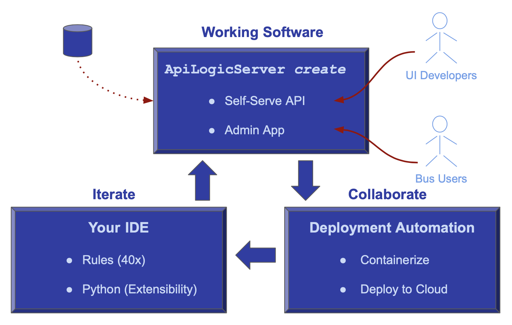
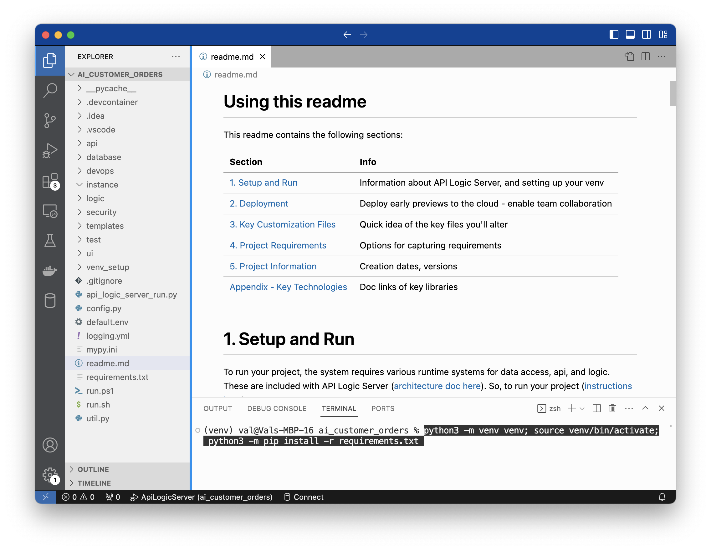
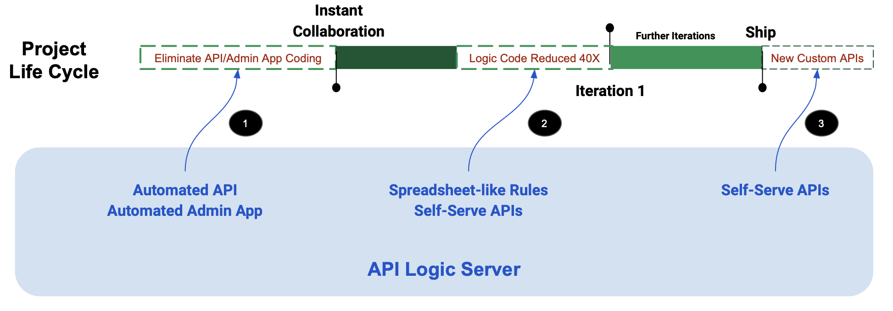
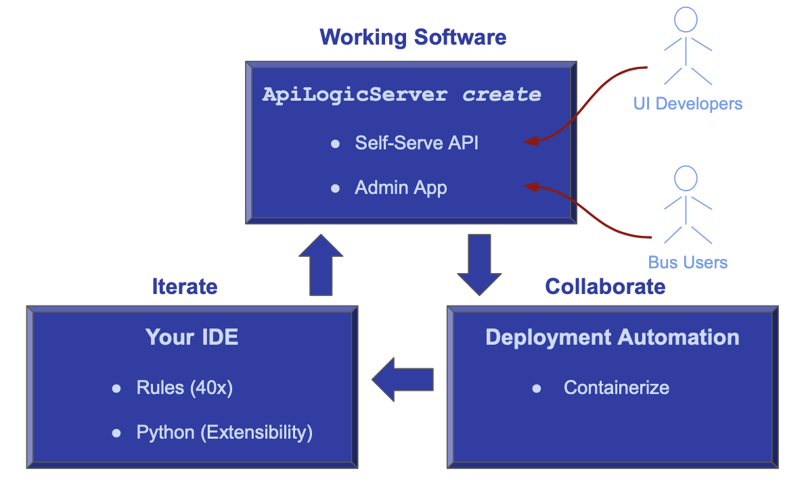

<style>
  .md-typeset h1,
  .md-content__button {
    display: none;
  }
</style>

*** Under Construction***

Intro...

Automation: Schema, App, API

Customization: Logic Automation, Python

Low Code: Transaction-oriented complements BI-oriented



1. **Use your existing database, or create a new one with ChatGPT or your database tools**
2. **Create Working Software *Now*:**  API Logic Server creates an ApiLogicProject, providing:
    * A ***Self-Serve* API** that UI developers can use, Day 1 - no waiting for server dev
    * An **Admin App** for Business Users to begin collaboration, Day 1
3. **Deploy for *Collaboration*:** e.g. to the Azure Cloud
4. **Iterate:** declare logic and security, with Python as required

This process **leverages your existing IT infrastructure:** your IDE, GitHub, the cloud, your database… open source

Let's see how.

&nbsp;

---

## 1. Acquire Database

&nbsp;

You can use an existing database, or create a new one with ChapGPT or your database tools.

For this Tutorial, to get a simple customers/orders database, [click here](https://github.com/ApiLogicServer/ApiLogicServer-src/blob/main/tests/test_databases/ai-created/ai_customer_orders-begin
.sqlite){:target="_blank" rel="noopener"}.

&nbsp;

## 2. Create Working Software

Given a database, API Logic Server creates an executable, customizable project:

```bash
$ ApiLogicServer create \
--project_name=ai_customer_orders \
--db_url=sqlite:///ai_customer_orders_begin.sqlite
```

This creates a project you can open with VSCode.  Establish your `venv`, and run it via the first pre-built Run Configuration.  To establish your venv:

```bash
python -m venv venv; venv\Scripts\activate     # win
python3 -m venv venv; . venv/bin/activate      # mac/linux
pip install -r requirements.txt
```


The project is now ready to run.  It includes a self-serve API ready for UI developers, and an Admin app ready for Business User Collaboration.  We have eliminated the first project segment from our traditional project timeline, and can ***start collaboration on Day 1.***

Our timelines looks more like this:



Let's have a look.

&nbsp;

### a. Admin App

This React-Admin web app is created automatically - no JavaScript, no HTML.

It's the Working Software Business Users need to collaborate on Day 1: confirm the data model, and uncover logic requirements.


### b. Self-serve APIs

The system automatically creates JSON:APIs, supporting related data access, pagination, optimistic locking, filtering, and sorting.

UI Developers can use swagger to design their API call, and copy the URI into their JavaScript code.  APIs are thus ***self-serve*** no server coding is required.  UI development is unblocked, Day 1.


## 3. Deploy for Collaboration

OK, running on our desktop.  We need to deploy it for collaboration. 

API Logic Server also creates scripts for deployment.

&nbsp;

**a. Containerize**

We'll create a container and deploy to Azure.
In a terminal window for your project:

```bash
sh devops/docker-image/build_image.sh .  # creates container
```

&nbsp;

**b. Test your Image**

You can test the image in single container mode:

```bash
sh devops/docker-image/run_image.sh
```

&nbsp;

**c. Upload Image (optional)**

You would next upload the image to docker hub.  

> If you use the same names as here, skip that, and use our image: `apilogicserver/aicustomerorders`.

&nbsp;

**d. Push the project**

It's also a good time to push your project to git.  Again, if you've used the same names as here, you can [use our project](https://github.com/ApiLogicServer/ApiLogicServer-src).

&nbsp;

**e. Deploy to Azure Cloud**

Login to the azure portal, and:

```bash
git clone https://github.com/ApiLogicServer/ai_customer_orders.git
cd ai_customer_orders
sh devops/docker-compose-dev-azure/azure-deploy.sh
```

&nbsp;

## 4. Iterate: Declare Rules

Collaboration might uncover a requirement for **Check Credit**.  Let’s implement it…

### a. Declare Logic

Rules are an executable design.  Use your IDE (code completion, etc), to replace 280 lines of code with the 5 spreadsheet-like rules below.  Note they map exactly to our natural language design:

```python
    ''' Declarative multi-table derivations and constraints, extensible with Python. 

    Brief background: see readme_declare_logic.md
    
    Use code completion (Rule.) to declare rules here:


    1. Customer.Balance <= CreditLimit

    2. Customer.Balance = Sum(Order.AmountTotal where unshipped)

    3. Order.AmountTotal = Sum(Items.Amount)

    4. Items.Amount = Quantity * UnitPrice

    5. Items.UnitPrice = copy from Product
    '''

    Rule.constraint(validate=models.Customer,       # logic design translates directly into rules
        as_condition=lambda row: row.Balance <= row.CreditLimit,
        error_msg="balance ({round(row.Balance, 2)}) exceeds credit ({round(row.CreditLimit, 2)})")

    Rule.sum(derive=models.Customer.Balance,        # adjust iff AmountTotal or ShippedDate or CustomerID changes
        as_sum_of=models.Order.AmountTotal,
        where=lambda row: row.ShipDate is None)     # adjusts - *not* a sql select sum...

    Rule.sum(derive=models.Order.AmountTotal,       # adjust iff Amount or OrderID changes
        as_sum_of=models.Item.Amount)

    Rule.formula(derive=models.Item.Amount,    # compute price * qty
        as_expression=lambda row: row.UnitPrice * row.Quantity)

    Rule.copy(derive=models.Item.UnitPrice,    # get Product Price (e,g., on insert, or ProductId change)
        from_parent=models.Product.UnitPrice)
```

Observe rules are declared in Python.  Given IDE services for code completion, this is using Python as a DSL (Domain Specific Language).

&nbsp;

#### -> Re-use and Optimization

We can contrast this to the (not shown) ChatGPT attempt at logic.  With declarative logic, you get:

1. ***Automatic* Reuse:** the logic above, perhaps conceived for Place order, applies automatically to all transactions: deleting an order, changing items, moving an order to a new customer, etc.

2. ***Automatic* Optimizations:** sql overhead is minimized by pruning, and by elimination of expensive aggregate queries.  These can result in orders of magnitude impact.

ChatGPT created triggers that missed many Use Cases, and were inefficient.  They were also not transparent; Business Users can read the rules and spot issues (*"hey, where's the tax?"*), certainly not triggers.

&nbsp;

### b. Add Security

In a terminal window for your project:

```bash
ApiLogicServer add-auth --project_name=. --db_url=auth
```

Users will now need to sign in to use the Admin App.

&nbsp;

## 5. Next Iteration: Rules + Python

Not only are spreadsheet-like rules 40X more concise, they meaningfully simplify maintenance.  Let’s take an example.

!!! pied-piper "Green Discounts"
    Give a 10% discount for carbon-neutral products for 10 items or more.


Automation still applies; we execute the steps below.


&nbsp;

**a. Add a Database Column**

```bash
$ sqlite3 database/db.sqlite
>   alter table Products Add CarbonNeutral Boolean;
>   .exit
```

&nbsp;

**b. Rebuild the project, preserving customizations**

```bash
cd ..  project parent directory
ApiLogicServer rebuild-from-database --project_name=ai_customer_orders --db_url=sqlite:///ai_customer_orders/database/db.sqlite
```

&nbsp;

**c. Update your admin app**

Use your IDE to merge `/ui/admin/admin-merge.yml` -> `/ui/admin/admin.yml`.`

&nbsp;


**d. Declare logic**

```python
    def derive_amount(row: models.Item, old_row: models.Item, logic_row: LogicRow):
        amount = row.Quantity * row.UnitPrice
        if row.Product.CarbonNeutral and row.Quantity >= 10:
            amount = amount * Decimal(0.9)
        return amount


    Rule.formula(derive=models.Item.Amount, calling=derive_amount)
```

&nbsp;

This simple example illustrates some significant aspects of iteration.

&nbsp;

#### a. Maintenance: Logic Ordering

Along with perhaps documentation, one of the tasks programmers most loathe is maintenance.  That’s because it’s not about writing code, but it’s mainly archaeology - deciphering code someone else wrote, just so you can add 4 or 5 lines they’ll hopefully be called and function correctly.

Rules change that, since they self-order their execution (and pruning) based on system-discovered dependencies.  So, to alter logic, you just “drop a new rule in the bucket”, and the system will ensure it’s called in the proper order, and re-used over all the Use Cases to which it applies.

&nbsp;

#### b. Extensibility: Rules + Python

In this case, we needed to do some if/else testing, and it was more convenient to add a dash of Python.  While you have the full object-oriented power of Python, this is simpler, more like Python as a 4GL.  

What’s important is that once you are in such functions, you can utilize Python libraries, invoke shared code, make web service calls, send email or messages, etc.  You have all the power of rules, plus the unrestricted flexibility of Python.

&nbsp;

#### c. Debugging: IDE, Logging

The screen shot above illustrates that debugging logic is what you’d expect: use your IDE's debugger.

In addition, the Logic Log lists every rule that fires, with indents for multi-table chaining (not visible in this screenshot).  Each line shows the old/new values of every attribute, so the transaction state is transparent.

&nbsp;

#### d. Rebuild: Logic Preserved

Note we rebuilt the project from our altered database, without losing customizations.

&nbsp;

## Summary



In 6 minutes, you've used ChatGPT and API Logic Server to convert an idea into working software -- 5 rules, 4 lines of Python.  The process was simple:

* Used the `ApiLogicServer create` command to create an executable project
    * A **Self-Serve API** to unblock UI Developers -- Day 1
    * An **Admin App** for Business User Collaboration -- Day 1

* Enabled **Collaboration** with automated deployment services

* Iterated the project in your IDE to implement new requirements
    * With Rules -- 40X more concise than code
    * And Python -- for complete flexibility

It all works with standard tooling: Python, your IDE, and container-based deployment.
