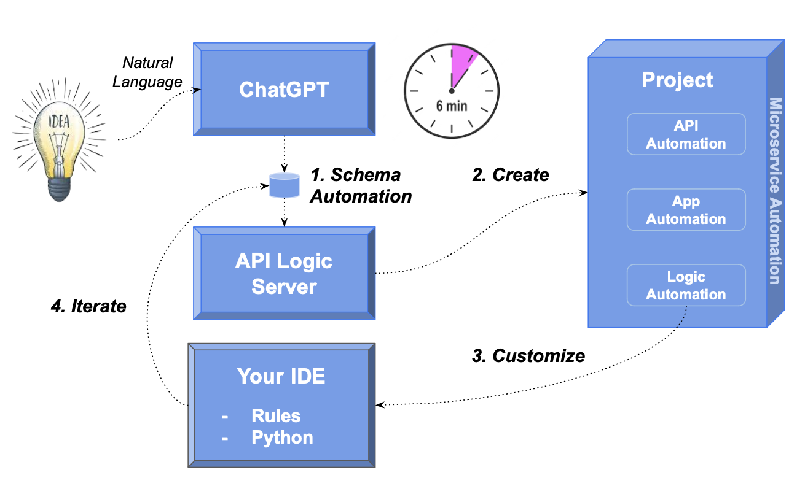
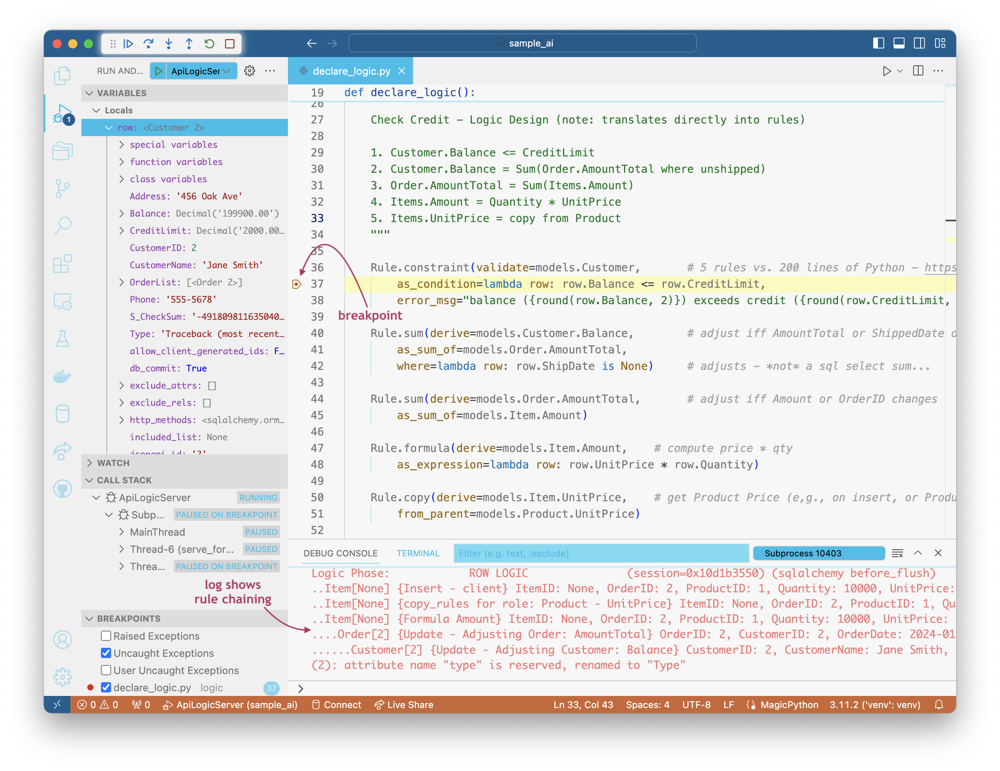
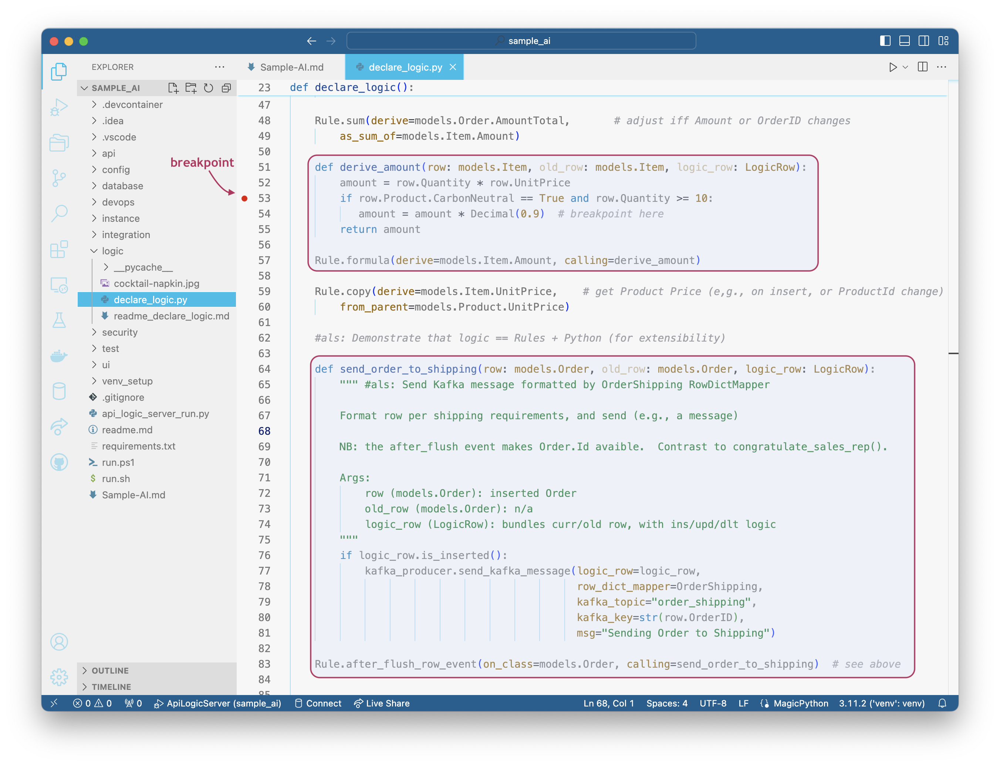

Here's how to use AI and API Logic Server to create complete running systems in minutes:

1. Use **ChatGPT for Schema Automation:** create a database schema from natural language
2. Use **API Logic Server:** create working software with 1 command
    * **App Automation:** a multi-page, multi-table admin app
    * **API Automation:** a JSON:API - crud for each table, with filtering, sorting, optimistic locking and pagination
3. Use **your IDE** to customize the project:
    * **Logic Automation using rules:** declare spreadsheet-like rules in Python for multi-table derivations and constraints - **40X more concise** than code
    * Use Python and standard libraries (Flask, SQLAlchemy), and debug in your IDE
4. **Iterate** your project:
    * Revise your database design and logic
    * **Integrate** with B2B partners and internal systems



This process **leverages your existing IT infrastructure:** your IDE, GitHub, the cloud, your database… open source.  Let's see how.

&nbsp;

---

## 1. AI: Schema Automation

You can use an existing database, or create a new one with ChapGPT or your database tools.

Use ChapGPT to generate SQL commands for database creation:

!!! pied-piper ":bulb: Create database definitions from ChatGPT"

    Create a sqlite database for customers, orders, items and product
    
    Hints: use autonum keys, allow nulls, Decimal types, foreign keys, no check constraints.

    Include a notes field for orders.

    Create a few rows of only customer and product data.

    Enforce the Check Credit requirement:

    1. Customer.Balance <= CreditLimit
    2. Customer.Balance = Sum(Order.AmountTotal where date shipped is null)
    3. Order.AmountTotal = Sum(Items.Amount)
    4. Items.Amount = Quantity * UnitPrice
    5. Store the Items.UnitPrice as a copy from Product.UnitPrice


This creates standard SQL, [like this](https://github.com/ApiLogicServer/ApiLogicServer-src/blob/main/api_logic_server_cli/prototypes/sample_ai/database/chatgpt/sample_ai.sql){:target="_blank" rel="noopener"}.  Copy the generated SQL commands into a file, say, `sample-ai.sql`:

To create the database:

```bash
sqlite3 sample_ai.sqlite < sample_ai.sql
```

> You may not have the sqlite cli; you can proceed to step 2 and the system will use a pre-installed database.

&nbsp;

## 2. API Logic Server: create

Given a database, API Logic Server creates an executable, customizable project:

```bash
$ ApiLogicServer create --project_name=sample_ai --db_url=sqlite:///sample_ai.sqlite
```

This creates a project you can open with VSCode, shown below.  The project is now ready to run - press F5.  It includes:

* a self-serve **API** ready for UI developers, and
* an **Admin app** ready for Business User Collaboration


&nbsp;

### a. App Automation

App Automation means that `ApiLogicServer create` creates a multi-page, multi-table Admin App -- automatically.  This React-Admin does *not* consist of hundreds of lines of complex html and javascript - it's a simple json file that's easy to customize.

> Ready for business user collaboration, back-office data maintenance - Day 1.


&nbsp;

### b. API Automation

App Automation means that `ApiLogicServer create` creates a JSON:API -- automatically.  Your API supports related data access, pagination, optimistic locking, filtering, and sorting.

> It would take days to months to create such an API using frameworks.

UI Developers can  to create custom apps immediately, using swagger to design their API call, and copying the URI into their JavaScript code.  APIs are thus ***self-serve*** no server coding is required.  

> UI development is unblocked - Day 1.


&nbsp;

## 3. Customize

Logic Automation means that you can declare spreadsheet-like rules using Python.  Such logic maintains database integrity with multi-table derivations and constraints, and security.  Rules are 40X more concise than traditional code, and can be extended with Python.

&nbsp;

### a. Logic Automation

Rules are an executable design.  Use your IDE (code completion, etc), to replace 280 lines of code with the 5 spreadsheet-like rules below.  Note they map exactly to our natural language design:



Observe rules are declared in Python.  Given IDE services for code completion, this is using Python as a DSL (Domain Specific Language).

&nbsp;

#### -> Re-use and Optimization

We can contrast this to the (not shown) ChatGPT attempt at logic.  With declarative logic, you get:

1. ***Automatic* Reuse:** the logic above, perhaps conceived for Place order, applies automatically to all transactions: deleting an order, changing items, moving an order to a new customer, etc.

2. ***Automatic* Optimizations:** sql overhead is minimized by pruning, and by elimination of expensive aggregate queries.  These can result in orders of magnitude impact.

ChatGPT created triggers that missed many Use Cases, and were inefficient.  They were also not transparent; Business Users can read the rules and spot issues (*"hey, where's the tax?"*), certainly not triggers.

&nbsp;

### b. Declare Security

In a terminal window for your project:

```bash
ApiLogicServer add-auth --project_name=. --db_url=auth
```

Users will now need to sign in to use the Admin App.  Security also provide row-level authoriation - here, we ensure that inactive accounts are hidden:

```python
Grant(  on_entity = models.Customer,
        to_role = Roles.sales,
        filter = lambda : models.Customer.CreditLimit > 300,
        filter_debug = "CreditLimit > 0")
```

&nbsp;

## 4. Iterate: Rules + Python

Not only are spreadsheet-like rules 40X more concise, they meaningfully simplify maintenance.  Let’s take an example.

!!! pied-piper ":bulb: Green Discounts"
    Give a 10% discount for carbon-neutral products for 10 items or more.


Automation still applies; we execute the steps below.

&nbsp;

**a. Add a Database Column and rebuild the data model**

You can use database tools to add the Product.CarbonNeutral column, and then rebuild your data model; customizations are preserved.

```bash
cd ..  project parent directory
ApiLogicServer rebuild-from-database --project_name=ai_customer_orders --db_url=sqlite:///ai_customer_orders/database/db.sqlite
```

We can also provide application integration services, for example:

!!! pied-piper ":bulb: Application Integration"
    Send new Orders to Shipping with a Kafka message.

    Enable B2B partners to place orders with a custom API.

&nbsp;


**b. Declare logic**

We revise our logic:



And use Python and Flask to create a new endpoint:


&nbsp;

This illustrates some significant aspects of logic.

&nbsp;

#### a. Maintenance: Logic Ordering

Along with perhaps documentation, one of the tasks programmers most loathe is maintenance.  That’s because it’s not about writing code, but it’s mainly archaeology - deciphering code someone else wrote, just so you can add 4 or 5 lines they’ll hopefully be called and function correctly.

Rules change that, since they self-order their execution (and pruning) based on system-discovered dependencies.  So, to alter logic, you just “drop a new rule in the bucket”, and the system will ensure it’s called in the proper order, and re-used over all the Use Cases to which it applies.

&nbsp;

#### b. Extensibility: Rules + Python

In this case, we needed to do some if/else testing, and it was more convenient to add a dash of Python.  While you have the full object-oriented power of Python, this is simpler, more like Python as a 4GL.  

What’s important is that once you are in such functions, you can utilize Python libraries, invoke shared code, make web service calls, send email or messages, etc.  You have all the power of rules, plus the unrestricted flexibility of Python.

&nbsp;

#### c. Debugging: IDE, Logging

The screen shot above illustrates that debugging logic is what you’d expect: use your IDE's debugger.

In addition, the Logic Log lists every rule that fires, with indents for multi-table chaining (not visible in this screenshot).  Each line shows the old/new values of every attribute, so the transaction state is transparent.

&nbsp;

#### d. Rebuild: Logic Preserved

Note we rebuilt the project from our altered database, without losing customizations.

&nbsp;

## Summary


In minutes, you've used ChatGPT and API Logic Server to convert an idea into working software -- 5 rules, 4 lines of Python.  The process was simple:

* Used the `ApiLogicServer create` command to create an executable project
    * A **Self-Serve API** to unblock UI Developers -- Day 1
    * An **Admin App** for Business User Collaboration -- Day 1

* Enabled **Collaboration** with automated deployment services

* Iterated the project in your IDE to implement new requirements
    * With Rules -- 40X more concise than code
    * And Python -- for complete flexibility

It all works with standard tooling: Python, your IDE, and container-based deployment.
