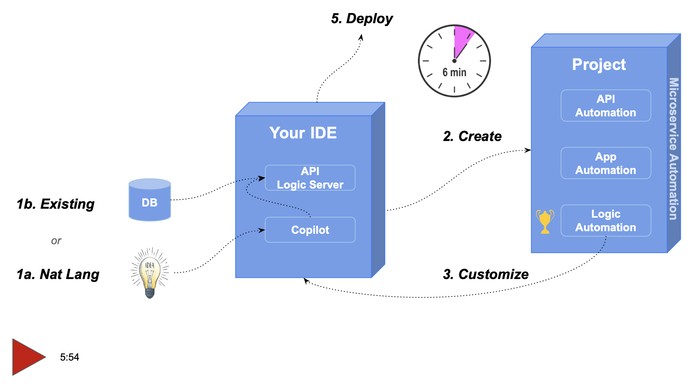

!!! pied-piper ":bulb: Instant API Services with Copilot and API Logic Server"

    Creating an API and an admin app using a framework takes too long, and is far too complex. AI and automation can create systems in minutes rather than weeks or months, dramatically simpler, and fully customizable with tools and approaches you already know.

    In this demo, we'll show how to create a complete system using VS Code, Copilot, and API Logic Server. We'll then add business logic with rules, and use Python to add a custom endpoint and Kafka integration.

# Overview

As shown below, you can submit a Natural Language description of a database to Copilot. This creates a Python data model (SQLAlchemy classes).  

You then use API Logic Server CLI to create an executable project from the model. Alternatively, you can create a project by identifying an existing database (pre-installed).

* The project is ***executable,*** providing an API and an admin app, enabling agile collaboration and unblocking custom app dev.

* The project is ***customizable,*** using rules and Python, in your existing IT infrastructure - your IDE, GitHub, the cloud, your database, etc.  

Let's see how.

[](https://youtu.be/laENat77nXw?si=XDvUMpFIsdI1guPA "Microservice Automation"){:target="_blank" rel="noopener"}

&nbsp;

**Setup**

To begin, install Python and VSCode. 

> Optionally, install Copilot: it's moderately priced and you can execute this demo without it. But, it provides the Natural Language services shown here - it's quite a lot of fun to explore, so you might just want to splurge and acquire it.

Then, install the API Logic Server and start it:

```bash title="Install and start API Logic Server"
python3 -m venv venv                 # windows: python -m venv venv 
source venv/bin/activate             # windows: venv\Scripts\activate 
python -m pip install ApiLogicServer

ApiLogicServer start
```

This will launch the API Logic Server in VSCode. We've moved the Copilot chat pane to the right.


---

## 1. Create DB Model with Copilot

If you are **using Copilot..**

The Sample-AI page includes the Natural Language Text to supply to Copilot; paste it, and press enter. It's shown in the diagram below in dark gray ("Use SQLAlchemy to...").


!!! pied-piper "Create database schemas from ChatGPT -- provide this prompt"

    Use SQLAlchemy to create a sqlite database named sample_ai.sqlite, with customers, orders, items and product

    Hints: use autonum keys, allow nulls, Decimal types, foreign keys, no check constraints.

    Include a notes field for orders.

    Create a few rows of only customer and product data.

    Enforce the Check Credit requirement (do not generate check constraints):

    1. Customer.Balance <= CreditLimit
    2. Customer.Balance = Sum(Order.AmountTotal where date shipped is null)
    3. Order.AmountTotal = Sum(Items.Amount)
    4. Items.Amount = Quantity * UnitPrice
    5. Store the Items.UnitPrice as a copy from Product.UnitPrice&nbsp;

Copilot creates the SQLAlchemy model code.

Paste the generated code into a new model file called `sample_ai.py` (step 2 in the screenshot below):


## 2. API Logic Server: Create

If you are **using Copilot...**

Create your project (step 3 in the screenshot above) by entering the following into the bottom terminal pane (als is a synonym for ApiLogicServer):

```bash title="Create Project with Copilot"
$  als create --project-name=sample_ai --from-model=sample_ai.py --db-url=sqlite
```

&nbsp;

**Or,** if you are **not using Copilot...**,

Use the pre-installed database to create your project in the terminal window:

```bash title="Create Project from Existing Database"
$  als create --project-name=sample_ai --db-url=sqlite:///sample_ai.sqlite
```

&nbsp;

In either case, this creates a project and opens it in your IDE, such as VSCode (see below).  The project is now ready to run - press F5.  It provides *Microservice Automation:*

&nbsp;&nbsp;&nbsp;&nbsp;**a. App Automation:** an Admin App, ready for Business User Collaboration, and

&nbsp;&nbsp;&nbsp;&nbsp;**b. Api Automation:** a self-serve JSON:API, ready for UI developers


&nbsp;

### a. App Automation

App Automation means that `ApiLogicServer create` creates a multi-page, multi-table Admin App -- automatically.  This React-Admin app does *not* consist of hundreds of lines of complex html and javascript - it's a simple yaml file that's easy to customize.

> Ready for business user collaboration, back-office data maintenance - Day 1.


&nbsp;

### b. API Automation

API Automation means that `ApiLogicServer create` creates a JSON:API -- automatically.  Your API supports related data access, pagination, optimistic locking, filtering, and sorting.

> It would take days to months to create such an API using frameworks.

UI App Developers can create custom apps immediately, using swagger to design their API call, and copying the URI into their JavaScript code.  APIs are thus ***self-serve:*** no server coding is required.  

> Custom App Dev is unblocked - Day 1.


!!! pied-piper ":bulb: Key Take Away -- Microservice Automation"

    Microservice Automation means that With 1 command, we have a running API and Admin App.

    * With a **framework**, you are ready to **code**
    * With **automation**, you are ready to **run**

        * UI Developers unblocked
        * Ad Hoc Integration

&nbsp;

## 3. Customize

So, we have working software, in minutes.  It's running, but we really can't *deploy* it until we have logic and security.  Which brings us to customization.

API Logic Server contains a rule engine. You can declare rules in Python, using IDE code completion services.  

It provides signficant value: spreadsheet-like rules reduce logic code (half the app) by 40X.

But, we can have much more fun.  As shown below, we can ask Copilot to create these rules for us, and paste them into a pre-created file:


&nbsp;

**Apply Remaining Customizations**

Projects are designed for customization, using standards: Python, frameworks (e.g., Flask, SQLAlchemy), and your IDE for code editing and debugging.  Not only Python *code*, but also ***Rules***.

To explore, let's customize this project.  To speed things up, instead of the normal procedure of declaring rules and entering Python code in your IDE, follow this procedure:

1. Stop the Server

2. Execute the following in your IDE terminal window:

```bash
ApiLogicServer sample-ai
ApiLogicServer add-auth --db_url=auth
```

This applies customized logic and security, which we examine below.

&nbsp;

### a. Logic Automation

Logic Automation means that you can ***declare spreadsheet-like rules*** using Python.  Such logic maintains database integrity with multi-table derivations and constraints, and security.  Rules are 40X more concise than traditional code, and can be extended with Python.

Below we implement the **Check Credit** requirement - see the comments at top.  Their implementation follows: 5 rules, instead of 200 lines of Python.  It's ready to test:

1. Restart the Server (F5)
2. Use the Admin App to add an Item for 1000 Widgets, observe how the constraint prevents the transaction

Rules are an executable design.  Note they map exactly to our natural language design:


&nbsp;

**1. Debugging**

The screenshot above shows our logic declarations, and how we debug them:

1. Execution is paused at a **breakpoint** in the debugger, where we can examine state, and execute step by step.

2. Note the **logging** for inserting an `Item`.  Each line represents a rule firing, and shows the complete state of the row.
<br><br>

**2. Chaining - Multi-Table Transaction Automation**

Note that it's a `Multi-Table Transaction`, as indicated by the log indentation.  This is because - like a spreadsheet - **rules automatically chain, *including across tables.***
<br><br>

**3. 40X More Concise**

The 5 spreadsheet-like rules represent the same logic as 200 lines of code, [shown here](https://github.com/valhuber/LogicBank/wiki/by-code){:target="_blank" rel="noopener"}.  That's a remarkable 40X decrease in the backend *half* of the system.
<br><br>

**4. Automatic Re-use**

The logic above, perhaps conceived for Place order, applies automatically to all transactions: deleting an order, changing items, moving an order to a new customer, etc.  This reduces code, and promotes quality (no missed corner cases).
<br><br>

**5. Automatic Optimizations**

SQL overhead is minimized by pruning, and by elimination of expensive aggregate queries.  These can result in orders of magnitude impact.  This is because the rule engine is not a Rete algorithm, but highly optimized for transaction processing, and integrated with the SQLAlchemy ORM (Object Relational Manager).
<br><br>

**6. Transparent**

Rules are an executable design.  Note they map exactly to our natural language design (shown in comments) - readable by business users.  

&nbsp;

### b. Security Automation

Security Automation means you activate security, and declare grants (using Python) to control row access for user roles.

Security requires login to use the Admin App and Swagger.  Security also provide **row-level authorization** - here, we ensure that less active accounts are hidden if we login as user s1.p:

```python
Grant(  on_entity = models.Customer,
        to_role = Roles.sales,
        filter = lambda : models.Customer.CreditLimit > 3000,
        filter_debug = "CreditLimit > 3000")
```

&nbsp;

## 4. Iterate: Rules + Python

So we have completed our 1 day project.  We can deploy it, as [described here](Tutorial-Deployment.md){:target="_blank" rel="noopener"}, for *agile collaboration* with business users.

Which leads to *agile iterations.*  Automation helps here too: not only are spreadsheet-like rules 40X more concise, they meaningfully simplify iterations and maintenance.  Let’s explore this with two changes:

!!! pied-piper "Green Discounts"

    Give a 10% discount for carbon-neutral products for 10 items or more.
&nbsp;
And:

!!! pied-piper "Application Integration"

    1. Provide read access for internal applications.

    2. Enable B2B partners to place orders with a custom API.

    3. Send new Orders to Shipping using a Kafka message.
&nbsp;

As above, we speed things up with the following procedure:

1. Stop the Server

2. Execute the following in your IDE terminal window:

```bash
ApiLogicServer sample-ai-iteration
ApiLogicServer rebuild-from-database --project_name=. --db_url=sqlite:///database/db.sqlite
```

This revises your database to add the new Product.CarbonNeutral column, and installs some new code we'll explore below.

&nbsp;

**Iterate Logic - Add Python**

Here is our revised logic to apply the discount, and send the Kafka message:


We can also **extend our API** for our new B2BOrder endpoint, using standard Python and Flask as shown below.  The code includes the swagger example, so we can now test our endpoint:

1. Use Swagger (**ServicesEndPoint > POST /ServicesEndPoint/OrderB2B)**


Note: Kafka is not activated in this example.  To explore a running Tutorial for application integration with running Kafka, [click here](Sample-Integration.md){:target="_blank" rel="noopener"}.


This illustrates some significant aspects of logic.

&nbsp;

#### a. Maintenance Automation

Along with perhaps documentation, one of the tasks programmers most loathe is maintenance.  That’s because it’s not about writing code, but archaeology - deciphering code someone else wrote, just so you can add 4 or 5 lines that’ll hopefully be called and function correctly.

Logic Automation changes that, with ***Maintenance Automation,*** which means:

* Rules *automatically order* their execution (and pruning) based on system-discovered dependencies
* Rules are *automatically reused* for all relevant transactions

So, to alter logic, you just *“drop a new rule in the bucket”,* and the system will ensure it’s called in the proper order, and *re-used* over all the relevant Use Cases.

&nbsp;

#### b. Extensibility: With Python

In the first case, we needed to do some if/else testing, and it was more convenient to add a dash of Python.  While this is pretty simple *Python as a 4GL*, you have full power of object-oriented Python and its many libraries.

For example, our extended API leverages Flask and open source libraries for Kafka messages.

&nbsp;

#### c. Rebuild: Logic Preserved

Note we rebuilt the project from our altered database (`ApiLogicServer rebuild-from-database`), without losing customizations.

&nbsp;

## 5. Deploy

Value is not realized until the system is deployed, whether for final production, or early collaboration with stakeholders. API Logic Server creates scripts to containerize your project, and deploy to Azure with Docker Compose:


&nbsp;

## Summary


In minutes, you've used Copilot and API Logic Server to convert an idea into working software.  It required only 5 rules, and 20 lines of Python.  The process was simple:

* **Created the Schema** with `Copilot`

* **Created the Project** with `ApiLogicServer`
    * A **Self-Serve API** to unblock UI Developers -- Day 1
    * An **Admin App** for Business User Collaboration -- Day 1

* **Customized** the project
    * With Rules -- 40X more concise than code, declared with Copilot or IDE code completion

* **Iterated** the project in your IDE to implement new requirements
    * Rules, *with Python* for complete flexibility
    * Prior customizations are preserved

It all works with standard tooling: Python, your IDE, and container-based deployment.
