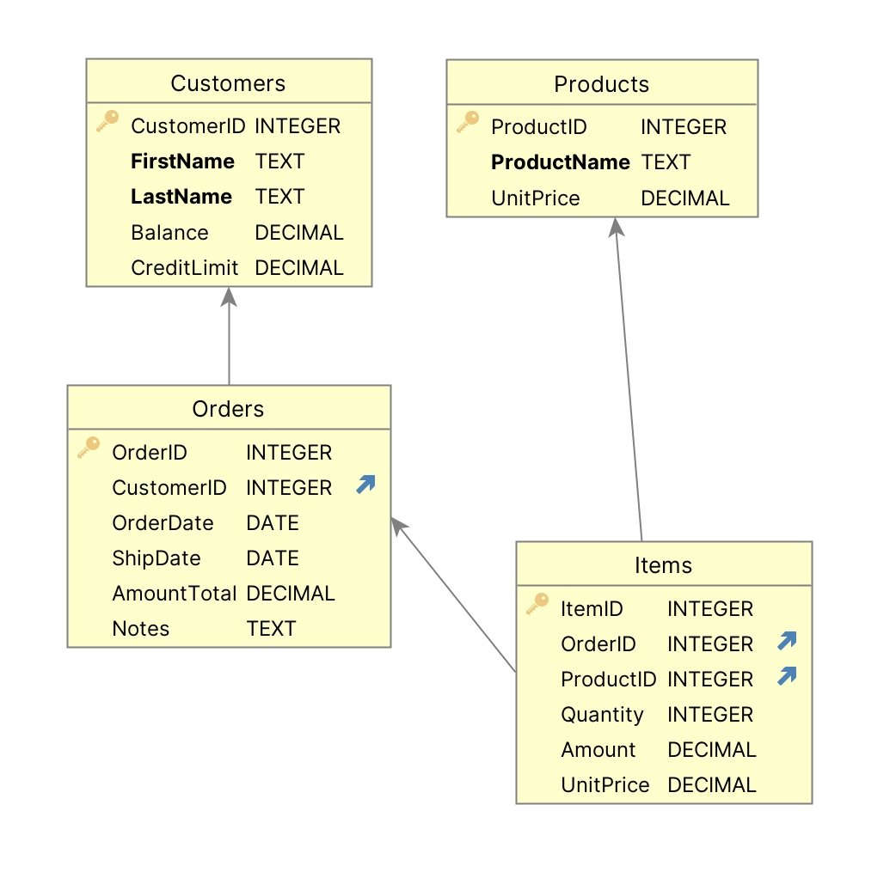
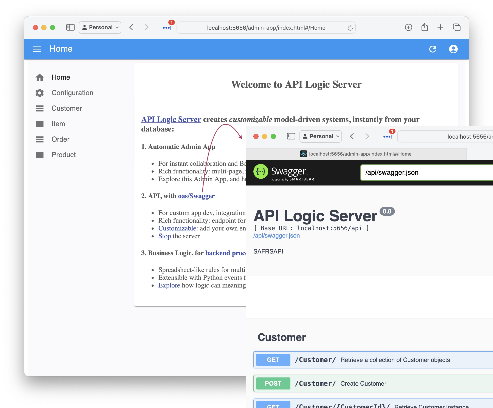
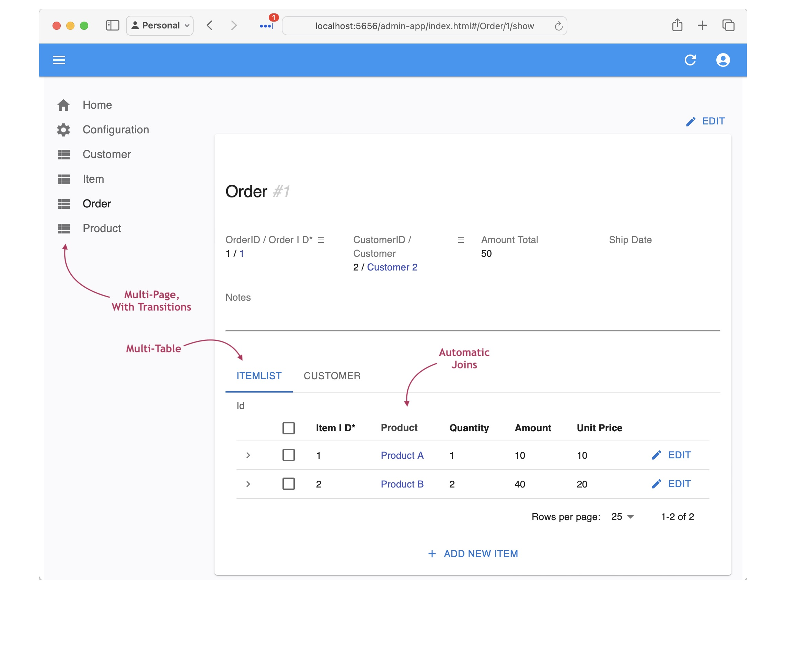
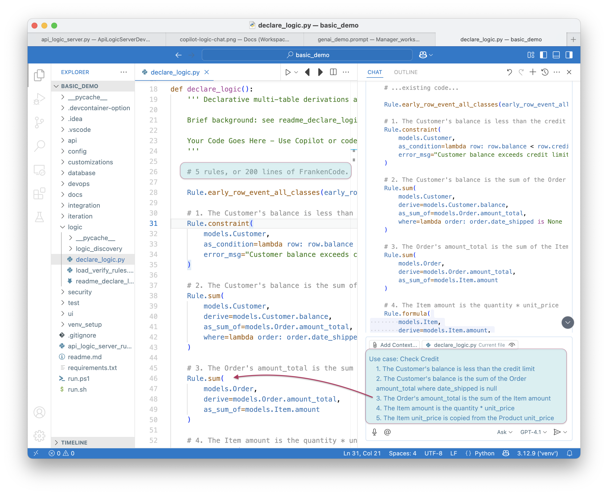
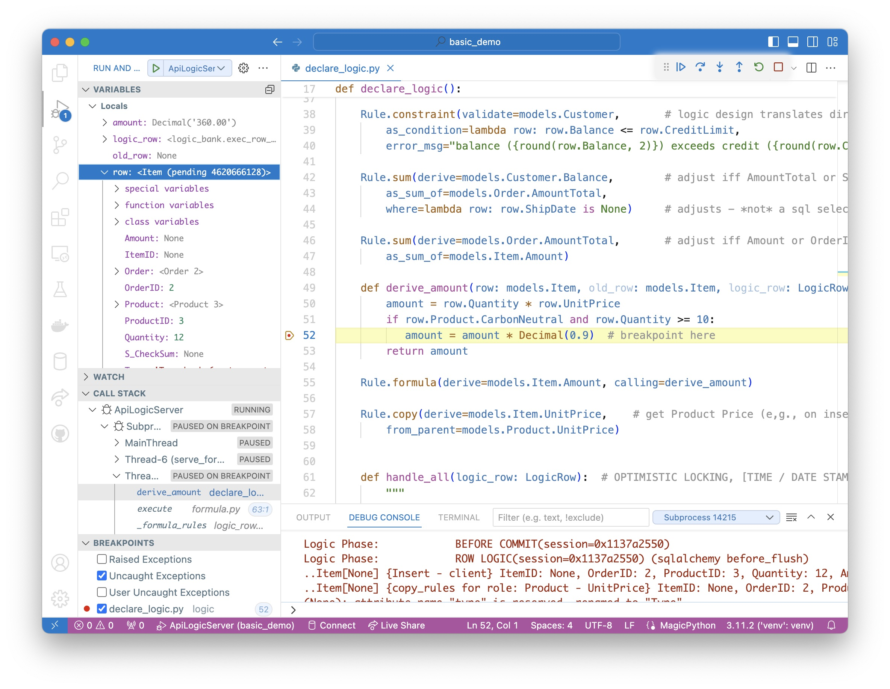
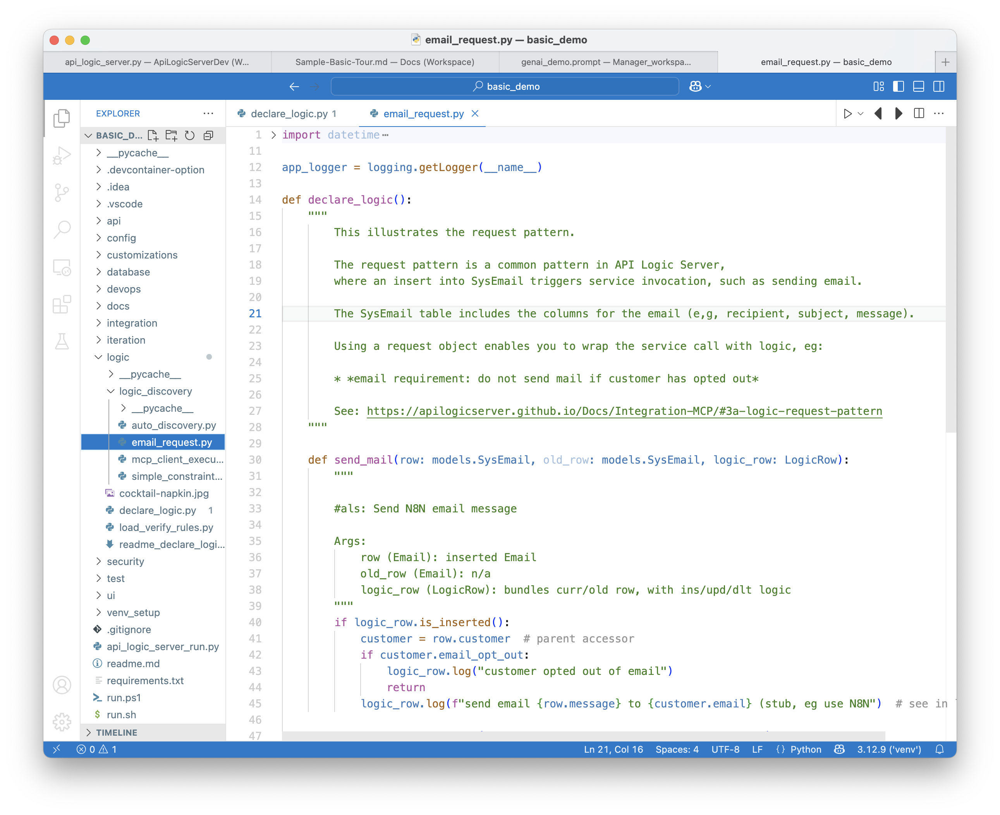
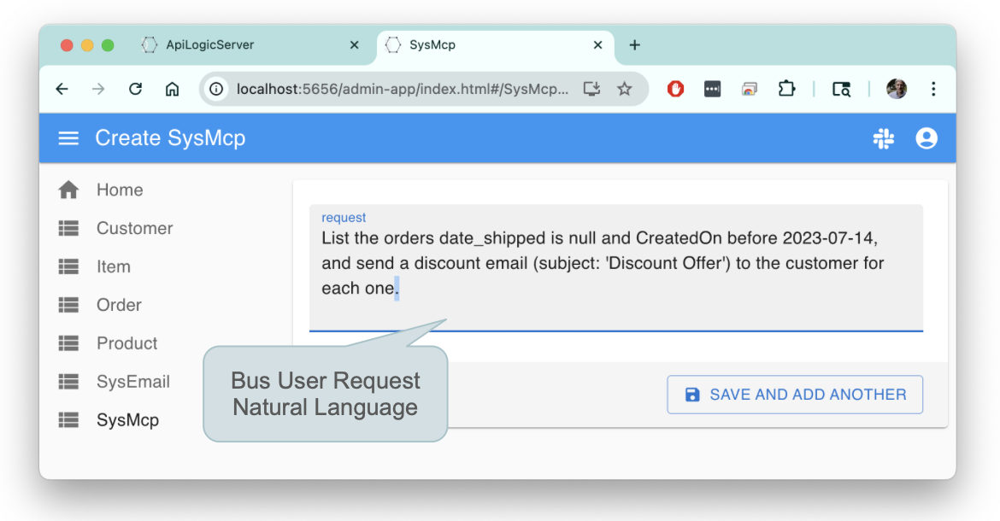
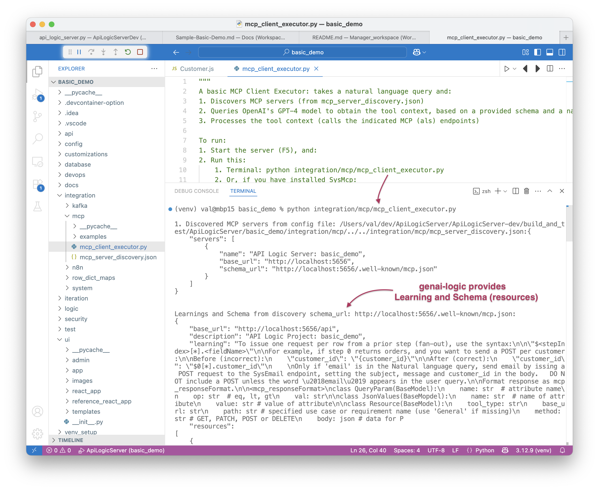

<style>
  .md-typeset h1,
  .md-content__button {
    display: none;
  }
</style>

!!! pied-piper ":bulb: Create an MCP Microservice using Natural Language (NL)"

    This demo illustrates automation to create an *governed* MCP system using Natural Language.  
    
    We'll create the system from an existing database, test the automatic MCP, and add governing logic.

    We'll also illustrate a client interface; you could also use your own.

&nbsp;

## Demo Overview

In this demo, we will use Natural Language to:

1. **Create From Existing DB:** creates a MCP-enabled API and an Admin App
2. **Verify MCP:** use your AI Assistant
3. **Declare Business Logic:** no-bypass governance using natural language logic and rules
4. **Create an email service:** add logic to create an audited email service
5. **MCP: Logic, User Interface**: enable business users to invoke services (such as email) with natural language, here via the automatically created Admin App:


``` bash title='🤖 Bootstrap your AI Assistant — paste into chat (Agent mode, e.g. Claude Sonnet 4.6)'
Please load `.github/.copilot-instructions.md`
```

> **Important:** be sure CoPilot is in "Agent" Mode.  "Ask" will not work.  Also, we get consistently good results with `Claude Sonnet 4.6`.

<br>

<details markdown>

<summary>How to Use This Demo </summary>

<br>This demo teaches AI-assisted development patterns. Each step is a **natural language prompt** you copy/paste into Copilot chat. The prompts are self-documenting - they explain what they do.

You may prefer to view this guide in the browser; [click here](https://apilogicserver.github.io/Docs/Sample-Basic-Demo-MCP-Send-Email){:target="_blank" rel="noopener"}.

**Vibe Philosophy:** AI makes errors. That's expected. When something fails, tell Copilot: *"Error X occurred, fix it"*. Copilot is exceptionally good at finding and correcting its own mistakes.

**Recommended Path:** If you're new to GenAI-Logic, start with the [Standard Demo](Sample-Basic-Demo.md) (creates `basic_demo` with guided tutor) to learn platform fundamentals. Then return here to explore AI-assisted development with `basic_demo_vibe`.
</details markdown>

<br>

## 1. Create From Existing DB

<br>

<details markdown>

<summary> Create the Customer, Orders, and Product Project [typically already done using Manager]</summary>

<br>


```bash title="In the Manager: Create a project from an existing database (probably already done)"
Create a database project named basic_demo_vibe from samples/dbs/basic_demo.sqlite
```

<br>

<details markdown>

<summary> Your project includes a data model diagram</summary>

<br>



</details markdown>

&nbsp;

**1a. Project Opens: Run**

The project should automatically open a new window in VSCode. <br>

``` bash title='🤖 Again, bootstrap Copilot by pasting the following into the chat'
Please load `.github/.copilot-instructions.md`.
```

Run it as follows:

1. **Start the Server:** F5 
2. **Start the Admin App:** browse to [http://localhost:5656/](http://localhost:5656/).  The Admin App screen shown below should appear in your Browser.
3. **Verify as shown below**

<details markdown>

<summary>API: filtering, sorting, pagination, optimistic locking,related data access... see Swagger </summary>

Your API is MCP enabled, and ready for custom app dev.  For more information, [click here](API-Self-Serve.md){:target="_blank" rel="noopener"}.


</details>

<br>

<details markdown>

<summary>Admin App: multi-page, multi-table, automatic joins, lookups, cascade add - collaboration-ready</summary>

For more information, [click here](Admin-Tour.md){:target="_blank" rel="noopener"}.

The Admin App is ready for **[business user agile collaboration](https://apilogicserver.github.io/Docs/Tech-AI/),** and back office data maintenance.  This complements custom UIs created with the API.

Explore the app - click Customer Alice, and see their Orders, and Items.  


</details>

</details>

<br><br>

## 2. Verify MCP

Project creation builds an MDA-enabled API.  To test it, paste into your AI Assistant:

``` bash title="Verify MCP Operation"
Using mcp discovery, list the customers with a positive balance.
```

you should see:

| ID | Name    | Balance  | Credit Limit |
|----|---------|----------|-------------|
| 3  | Charlie | $220.00  | $2,000.00   |
| 5  | Silent  | $220.00  | $1,000.00   |
| 1  | Alice   | $90.00   | $5,000.00   |

&nbsp;

## 3. Declare Business Logic

Since MCP Access include update operations, is is critical to provide governance: business logic that cannot be by-passed.

> Such logic (multi-table derivations and constraints) is a significant portion of a system, typically nearly half.  GenAI-Logic provides **spreadsheet-like rules** that dramatically simplify and accelerate logic development.

You can declare such logic in 2 ways:

1. Use Natural Language, as shown in the code sample below.  The screenshot shows the 5 rules for **Check Credit Logic.**
2. Or, declare rules directly in Python, simplified with IDE code completion.  

&nbsp;

**To declare logic:**

**1. Stop the Server** (Red Stop button, or Shift-F5 -- see Appendix)

**2. Add Business Logic:** paste the following into your AI Assistant:

```bash title="Check Credit Logic (instead of 220 lines of code)"
on Placing Orders, Check Credit    
    1. The Customer's balance is less than the credit limit
    2. The Customer's balance is the sum of the Order amount_total where date_shipped is null
    3. The Order's amount_total is the sum of the Item amount
    4. The Item amount is the quantity * unit_price
    5. The Item unit_price is copied from the Product unit_price

Use case: App Integration
    1. Send the Order to Kafka topic 'order_shipping' if the date_shipped is not None.
```

In either case, the result is the same:



To test the logic:

**1. Use the Admin App to access the first order for `Customer Alice`**

**2. Edit its first item to a very high quantity**

The update is properly rejected because it exceeds the credit limit.  Observe the rules firing in the console log - see Logic In Action, below.

<br>

<details markdown>

<summary>Logic is critical - half the effort; Declarative is 40X More Concise, Maintainable </summary>

<br>Logic is critical to your system - it represents nearly *half the effort.*  Instead of procedural code, [***declare logic***](Logic.md#declaring-rules){:target="_blank" rel="noopener"} with WebGenAI, or in your IDE using code completion or Natural Language as shown above.


**a. 40X More Concise**

The 5 spreadsheet-like rules represent the same logic as 200 lines of code, [shown here](Logic-Why.md){:target="_blank" rel="noopener"}.  That's a remarkable 40X decrease in the backend half of the system.

> 💡 No FrankenCode<br>Note the rules look like syntactically correct requirements.  They are not turned into piles of unmanageable "frankencode" - see [models not frankencode](https://www.genai-logic.com/faqs#h.3fe4qv21qtbs){:target="_blank" rel="noopener"}.

**b. Maintainable: Debugging, Logging**

The screenshot below shows our logic declarations, and the logging for inserting an `Item`.  Each line represents a rule firing, and shows the complete state of the row.

Note that it's a `Multi-Table Transaction`, as indicated by the indentation.  This is because - like a spreadsheet - **rules automatically chain, *including across tables.***




</details>

<br>

## 4. Create the email Service

The server is automatically mcp-enabled, but we also require a user-interface to enable business users to send email, subject to business logic for customer email opt-outs.  Build it with Natural Language as follows:<br><br>

**1. Stop the Server:**  click the red stop icon 🟥 or press <kbd>Shift</kbd>+<kbd>F5</kbd>.

&nbsp;

We use the **Request Pattern** to send emails, via Copilot (in conjunction with substantial Context Engineering in your project at `.github/.copilot-instructions.md` and `docs/training`):

<br>

``` bash title="1. Add a Table to Track Sent Emails"
Create a table SysEmail in `database/db.sqlite` as a child of customer, 
with columns id, message, subject, customer_id and CreatedOn.
```

Follow the suggestions to update the admin app. 

> Ask it to do so if it fails to offer the suggestion.

> Request objects are a common rule pattern - for more information, [click here](Integration-MCP.md#3b-logic-request-pattern){:target="_blank" rel="noopener"}.

<br>

``` bash title="2. Create the email service using SysEmail as a Request Table"
Add an after_flush event on SysEmail to produce a log message "email sent",
unless the customer has opted out.
```

Inserts into SysEmail will now send mails (stubbed here with a log message).

<br>

## 5. Activate MCP Client Executor

Your project is pre-created with `integration/mcp/mcp_client_executor.py`, which processes MCP requests.  

> MCP Clients accept MCP Requests, invoke the LLM to obtain a series of API calls to run, and runs them.  For more on MCP, [click here](Integration-MCP.md){:target="_blank" rel="noopener"}.

To activate the MCP Client Executor:

``` bash title="Activate MCP Client Executor"
Create the mcp client executor
```

Context Engineering has trained Copilot to use (again) the **Request Pattern:**

1. Creates the `SysMcp` request object (new table, also added to Admin App)
2. Creates **Request Implementation:**

    * `logic/logic_discovery/send_email.py`, which provides an `after_flush_row_event` on `SysMcp` to invoke `integration/mcp/mcp_client_executor.py`.

<br>


<details markdown>

<summary>Creates logic like this </summary>

<br>When sending email, we require ***business rules*** to ensure it respects the opt-out policy:



</details>

<br>

## 6. Test in the Admin App

<br>

**1. Restart the Server and Start the Admin App**

<br>

```text title="2. Click SysMCP >> Create New, and enter:"
List the orders date_shipped is null and CreatedOn before 2023-07-14, 
and send a discount email (subject: 'Discount Offer') 
to the customer for each one.
```

<br>




<details markdown>

<summary>More on MCP; Observe the log </summary>

<br>For more on MCP, [click here](Integration-MCP.md){:target="_blank" rel="noopener"}.



</details>

<br>

## 7. Iterate: Rules and Python

This is addressed in the related CLI-based demo - to continue, [click here](Sample-Basic-Demo.md#5-iterate-with-rules-and-python){:target="_blank" rel="noopener"}.