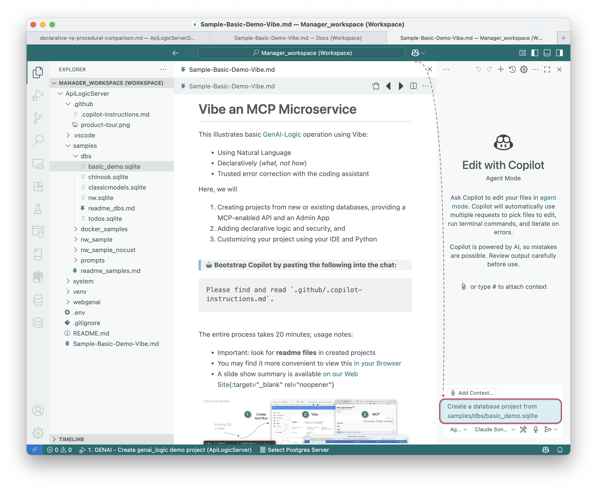
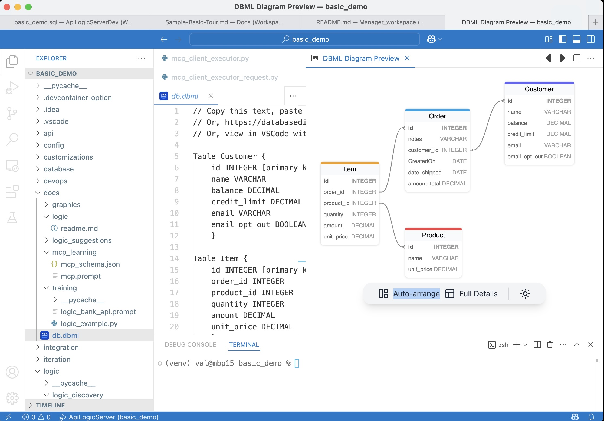
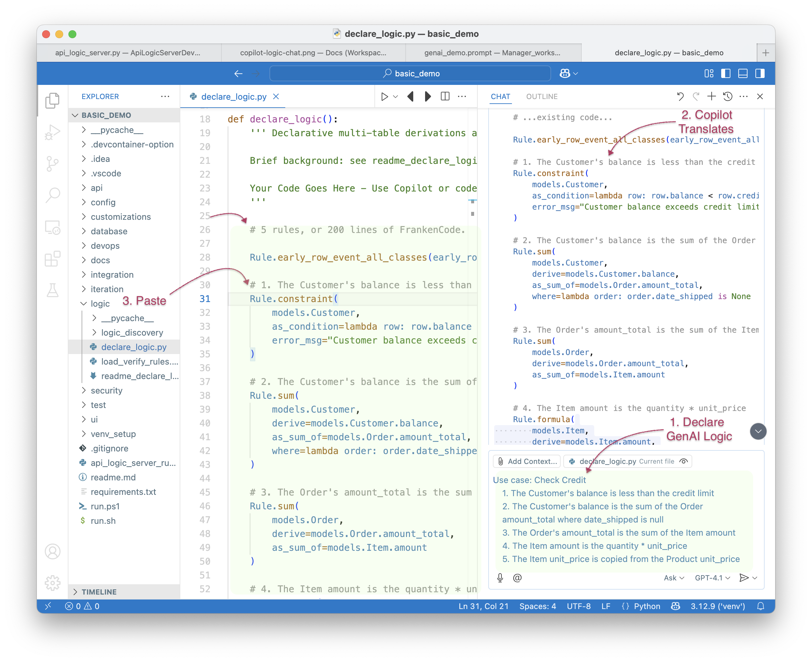

<style>
  .md-typeset h1,
  .md-content__button {
    display: none;
  }
</style>

<< Running - testing phase >>

# Vibe an MCP Microservice

This illustrates [GenAI-Logic](https://www.genai-logic.com/product/key-features) automation to create an MCP system using **Vibe:** 
> **1) Natural Language**, **2) Declarative** (*what not now*), **3) Trusted error correction** with the coding assistant

<br>

``` bash title='🤖 Bootstrap Copilot by pasting the following into the chat'
Please find and read `.github/.copilot-instructions.md`.
```

<br>

<details markdown>

<summary>Demo Overview: Vibe an MCP API, Custom Client and Business Logic; pre-reqs </summary>

<br>Here we will use Vibe to:

1. Create a project from an existing database, providing a MCP-enabled API and an Admin App
2. Create a custom (React) client
3. Create an MCP Client, and
4. Add declarative logic and security<br><br>

Pre-reqs:

1. Install
2. OpenAI API Key is useful but not required; [click here](WebGenAI-CLI.md#configuration){:target="_blank" rel="noopener"}.

  * The React App has pre-built apps (`ui/my-react-app`) you can use; they require `npm install; npm start`
  * The `integration/mcp/mcp_client_executor.py` has `create_tool_context_from_llm` set to bypass LLM calls and use saved context; alter as required.

The entire process takes 20 minutes; usage notes:

* Most find it **more convenient** to view this in your Browser; [click here](Sample-Basic-Tour.md)
* A slide show summary is available [on our Web Site](https://www.genai-logic.com/product/tour){:target="_blank" rel="noopener"}
* Important: look for **readme files** in created projects


</details>

<br>

## 1. Create From Existing DB

```bash title="Create a project from an existing database (open the disclure box for details)"
Create a database project from samples/dbs/basic_demo.sqlite
```

<details markdown>

<summary> The database is Customer, Orders, Items and Product; you can also create the dataase</summary>



**Or, create a *new* database** with this prompt:
```bash
Create a system with customers, orders, items and products.

Include a notes field for orders.

Use case: Check Credit    
    1. The Customer's balance is less than the credit limit
    2. The Customer's balance is the sum of the Order amount_total where date_shipped is null
    3. The Order's amount_total is the sum of the Item amount
    4. The Item amount is the quantity * unit_price
    5. The Item unit_price is copied from the Product unit_price

Use case: App Integration
    1. Send the Order to Kafka topic 'order_shipping' if the date_shipped is not None.
```

<br>

In either case, the database model is customer, orders and items:



</details>

&nbsp;

### 1a. Project Opens: Run

The project should automatically open a new window in VSCode. <br>

``` bash title='🤖 Again, bootstrap Copilot by pasting the following into the chat'
Please find and read `.github/.copilot-instructions.md`.
```

Run it as follows:

1. **Start the Server:** F5 
2. **Start the Admin App:** browse to [http://localhost:5656/](http://localhost:5656/).  The Admin App screen shown below should appear in your Browser.
3. **Verify as shown below**

<details markdown>

<summary>API: filtering, sorting, pagination, optimistic locking and related data access - see the Swagger </summary>

Your API is MCP enabled, and ready for custom app dev.  For more information, [click here](https://apilogicserver.github.io/Docs/API-Self-Serve/){:target="_blank" rel="noopener"}.


</details>

<br>

<details markdown>

<summary>Admin App: multi-page, multi-table, automatic joins, lookups, cascade add - collaboration-ready</summary>

For more information, [click here](Admin-Tour.md){:target="_blank" rel="noopener"}.

The Admin App is ready for **[business user agile collaboration](https://apilogicserver.github.io/Docs/Tech-AI/),** and back office data maintenance.  This complements custom UIs created with the API.

Explore the app - click Customer Alice, and see their Orders, and Items.  


</details>

<br>

## 2. Custom UI: GenAI, Vibe

The app above is suitable for collaborative iteration to nail down the requirements, and back office data maintenance.  It's also easy to make simple customizations, using the yaml file.  For more custom apps, use Vibe:

```bash title="Create a custom react app - customize in your IDE directly or with Vibe"
Create a react app.
```

<details markdown>

<summary>Vibe Automation provides a running start (and can make errors)</summary>

* Instead of creating data mockups, you have a **running API server with real data**
* Instead of starting from scratch, you have a **running multi-page app** 
* And, you'll have projects that are **architecturally correct:** shared logic, enforced in the server, available for both User Interfaces and services.
* Then, use you favorite Vibe tools with your running API:

> Note: AI makes errors.  Part of Vibe is to accept that, and insist that AI find and fix them.  CoPilot is generally exceptionally good at this.

</details>

<br>

```txt title='Customize using Natural Language'
In the ui/react app, update the Product list to provide users an option to see results in a list,
or in cards.
```
<br>

> Below is an example from Northwind: [click here](Admin-Vibe-Sample.md){:target="_blank" rel="noopener"}


<br>

## 3. MCP: Logic, User Interface

The server is automatically mcp-enabled, but we also require a user-interface to enable business users to send email, subject to business logic for customer email opt-outs.  Build it as follows:<br><br>


**1. Stop the Server:**  click the red stop icon 🟥 or press <kbd>Shift</kbd>+<kbd>F5</kbd>.

**2. Create the SysEmail Table to Track Sent Emails**

``` bash title="Add a Table to Track Sent Emails"
Create a table SysEmail in `database/db.sqlite` as a child of customer, 
with columns id, message, subject, customer_id and CreatedOn.
```
Follow the suggestions to update the admin app.

<br>

**3. Create an MCP Client Executor to process MCP Requests:**

``` bash title="Create an MCP Client Executor (don't run yet)"
Create the mcp client executor
```

MCP Clients accept MCP Requests, invoke the LLM to obtain a series of API calls to run, and runs them.  For more on MCP, [click here](Integration-MCP.md){:target="_blank" rel="noopener"}.

<br>

**4. Create the email service using a Request Table**

``` bash title="Create the email service using SysEmail as a Request Table"
Add an after_flush event on SysEmail to produce a log message "email sent",
unless the customer has opted out.
```

Inserts into SysEmail will now send mails (stubbed here with a log message).  Request objects are a common rule pattern - for more information, [click here](Integration-MCP.md#3b-logic-request-pattern){:target="_blank" rel="noopener"}.

<br>

<details markdown>

<summary>Creates logic like this </summary>

<br>When sending email, we require ***business rules*** to ensure it respects the opt-out policy:


</details>

<br>

**5. Restart the Server** - F5

<br>

**6. Start the Admin App**

<br>

**7. Click SysMCP >> Create New, and enter:**

```text title="Test the MCP using the Admin App"
List the orders date_shipped is null and CreatedOn before 2023-07-14, 
and send a discount email (subject: 'Discount Offer') 
to the customer for each one.
```

<br>


<details markdown>

<summary>More on MCP; Observe the log </summary>

<br>For more on MCP, [click here](Integration-MCP.md){:target="_blank" rel="noopener"}.


</details>

<br>

## 4. Declare Business Logic

Logic (multi-table derivations and constraints) is a significant portion of a system, typically nearly half.  GenAI-Logic provides **spreadsheet-like rules** that dramatically simplify and accelerate logic development.

Rules are declared in Python, simplified with IDE code completion.  The screen below shows the 5 rules for **Check Credit Logic.**

**1. Stop the Server** (Red Stop button, or Shift-F5 -- see Appendix)

**2. Add Business Logic**

```bash title="Check Credit Logic (instead of 220 lines of code)"
Use case: Check Credit    
    1. The Customer's balance is less than the credit limit
    2. The Customer's balance is the sum of the Order amount_total where date_shipped is null
    3. The Order's amount_total is the sum of the Item amount
    4. The Item amount is the quantity * unit_price
    5. The Item unit_price is copied from the Product unit_price

Use case: App Integration
    1. Send the Order to Kafka topic 'order_shipping' if the date_shipped is not None.
```

To test the logic:

**1. Use the Admin App to access the first order for `Customer Alice`**

**2. Edit its first item to a very high quantity**

The update is properly rejected because it exceeds the credit limit.  Observe the rules firing in the console log - see Logic In Action, below.

<br>

<details markdown>

<summary>See Logic In Action </summary>

<br>[Declare logic](Logic.md#declaring-rules){:target="_blank" rel="noopener"} with WebGenAI, or in your IDE using code completion or Natural Language:



**a. Chaining**

The screenshot below shows our logic declarations, and the logging for inserting an `Item`.  Each line represents a rule firing, and shows the complete state of the row.

Note that it's a `Multi-Table Transaction`, as indicated by the indentation.  This is because - like a spreadsheet - **rules automatically chain, *including across tables.***


**b. 40X More Concise**

The 5 spreadsheet-like rules represent the same logic as 200 lines of code, [shown here](https://github.com/valhuber/LogicBank/wiki/by-code).  That's a remarkable 40X decrease in the backend half of the system.

> 💡 No FrankenCode<br>Note the rules look like syntactically correct requirements.  They are not turned into piles of unmanageable "frankencode" - see [models not frankencode](https://www.genai-logic.com/faqs#h.3fe4qv21qtbs){:target="_blank" rel="noopener"}.

<br><br>

**c. Automatic Re-use**

The logic above, perhaps conceived for Place order, applies automatically to all transactions: deleting an order, changing items, moving an order to a new customer, etc.  This reduces code, and promotes quality (no missed corner cases).
<br><br>

**d. Automatic Optimizations**

SQL overhead is minimized by pruning, and by elimination of expensive aggregate queries.  These can result in orders of magnitude impact.
<br><br>

**e. Transparent**

Rules are an executable design.  Note they map exactly to our natural language design (shown in comments) - readable by business users.  

Optionally, you can use the Behave TDD approach to define tests, and the Rules Report will show the rules that execute for each test.  For more information, [click here](https://apilogicserver.github.io/Docs/Behave-Logic-Report/).

> 💡 Logic: Multi-table Derivations and Constraint Declarative Rules.<br>&emsp;&emsp;Declarative Rules are 40X More Concise than procedural code.<br>&emsp;&emsp;For more information, [click here](Logic-Why.md){:target="_blank" rel="noopener"}.

</details>

<br>

## 5. Iterate with Rules and Python

This is addressed in the related CLI-based demo - to continue, [click here](Sample-Basic-Demo.md#5-iterate-with-rules-and-python){:target="_blank" rel="noopener"}.