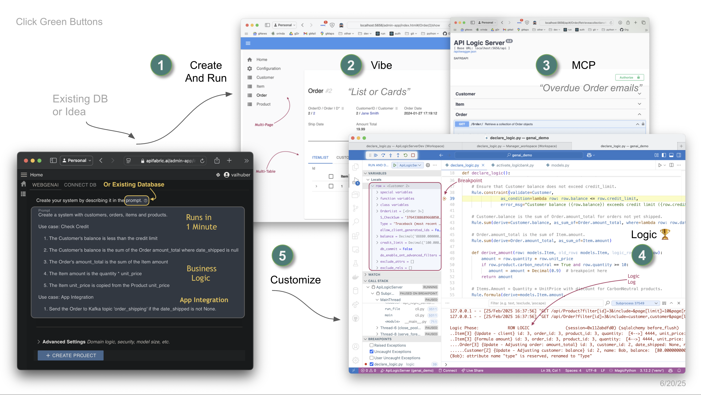
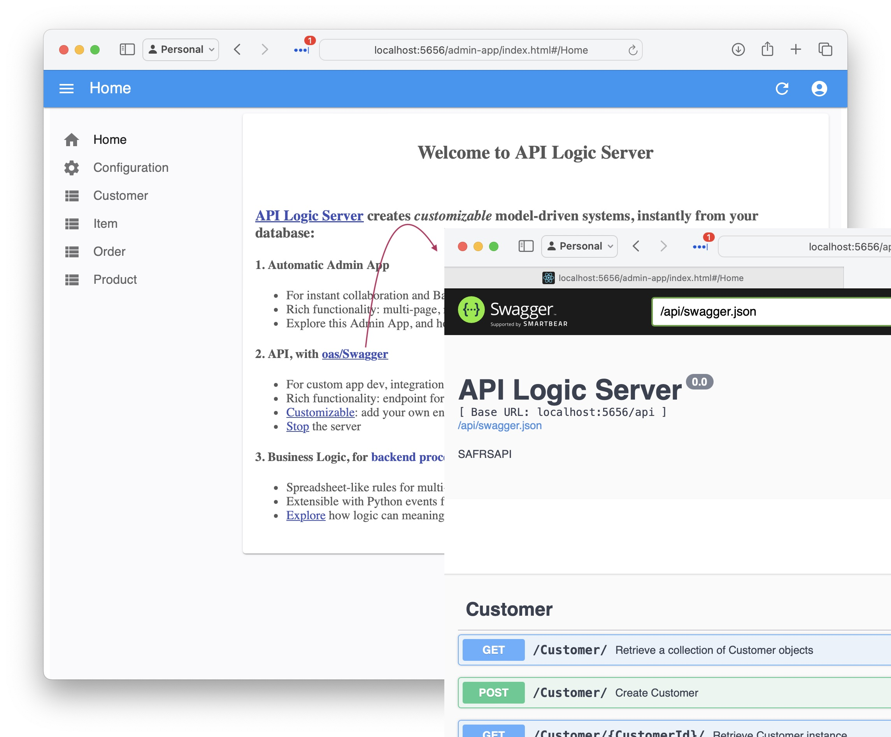
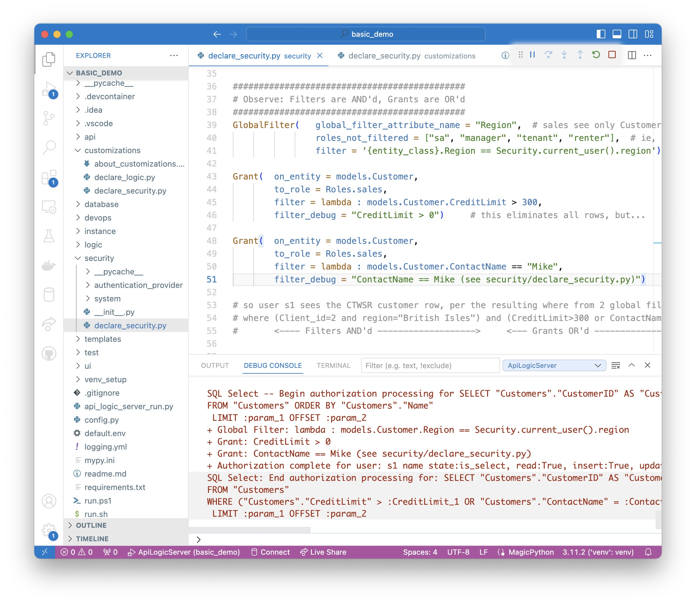
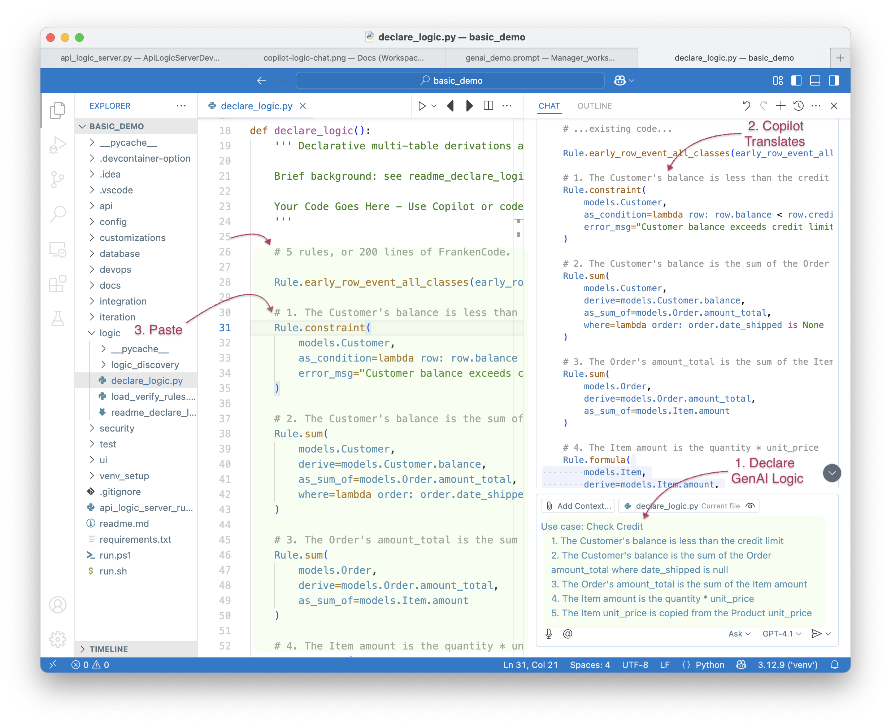
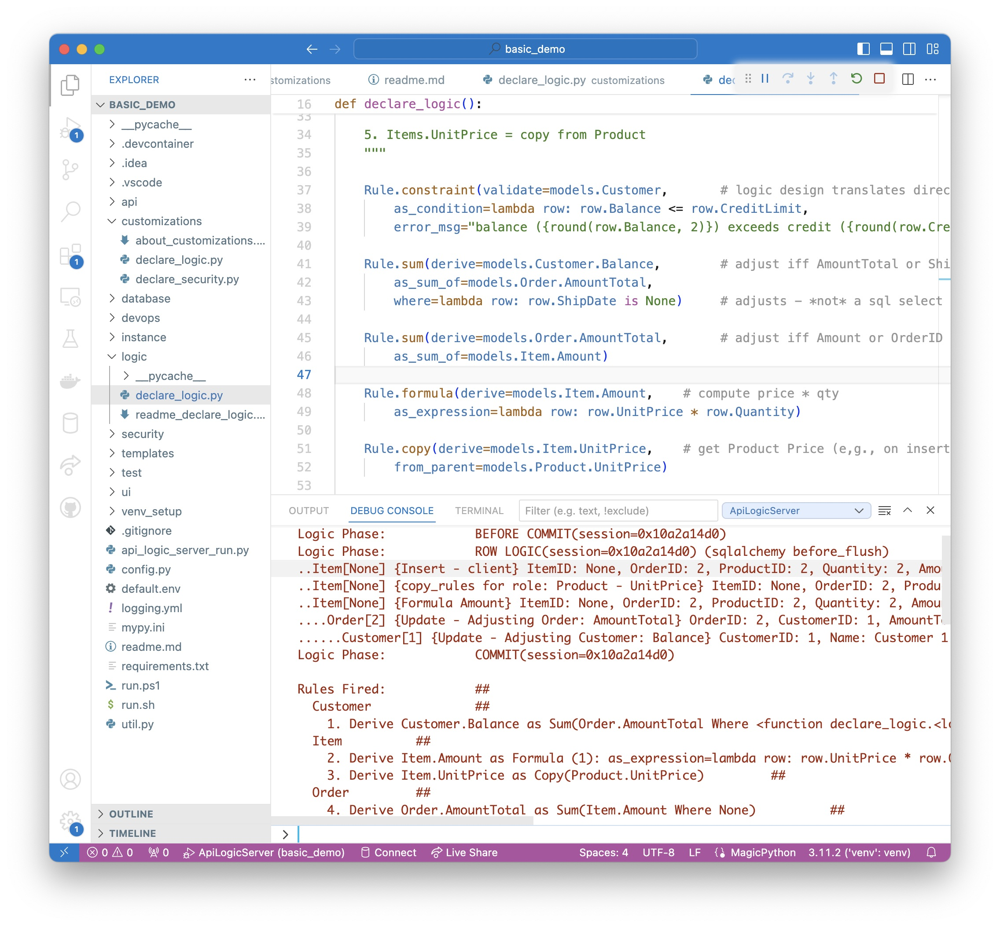
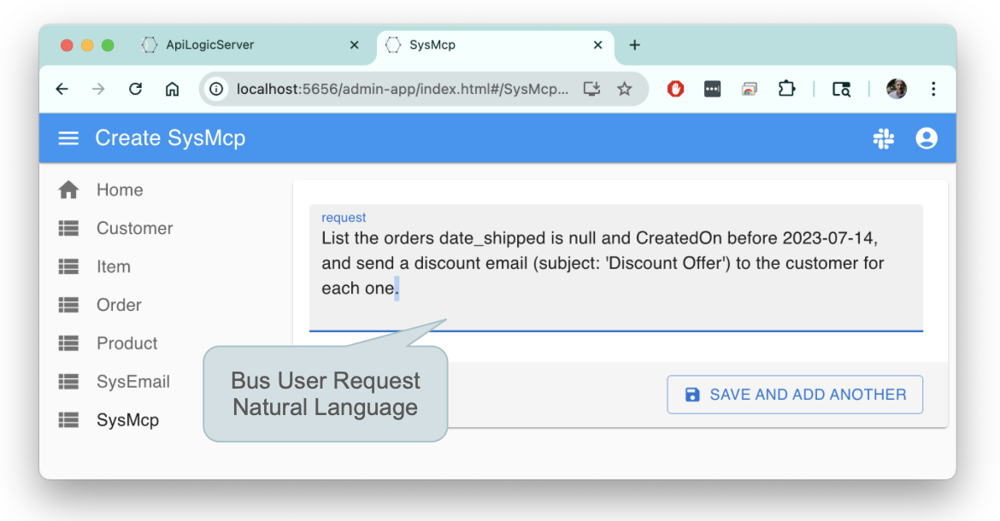
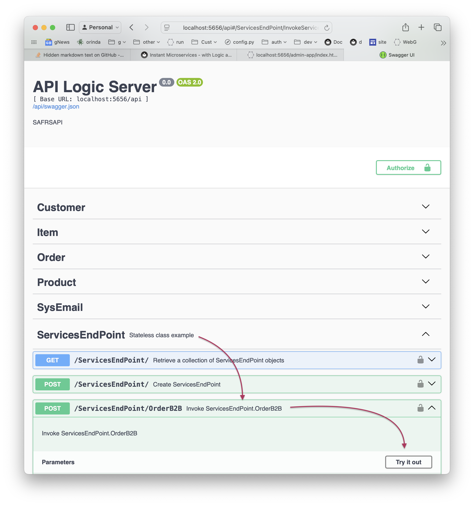

<style>
  .md-typeset h1,
  .md-content__button {
    display: none;
  }
</style>

# Product Tour (Start Here)

This illustrates basic [GenAI-Logic](https://www.genai-logic.com/product/key-features){:target="_blank" rel="noopener"} operation: 

1. Creating projects from new or existing databases, providing a MCP-enabled API and an Admin App
2. Adding declarative logic and security, and 
3. Customizing your project using your IDE and Python<br><br>

> 🤖 **Bootstrap Copilot by pasting the following into the chat:**
```
Please find and read `.github/.copilot-instructions.md`.
```

<br>

The entire process takes 20 minutes; usage notes:

* Important: look for **readme files** in created projects
* You may find it more convenient to view this [in your Browser](Sample-Basic-Tour.md)
* A slide show summary is available [on our Web Site](https://www.genai-logic.com/product/tour){:target="_blank" rel="noopener"}




&nbsp;

## 1. Create and Run

API Logic Server can create projects from existing databases, or use GenAI to create projects with new databases.  Let's see how.

&nbsp;
### From Existing Database

Create the project - use the CLI (**Terminal > New Terminal**), :

```bash
$ genai-logic create --project_name=basic_demo --db_url=basic_demo
```

> Note: the `db_url` value is [an abbreviation](https://apilogicserver.github.io/Docs/Data-Model-Examples/){:target="_blank" rel="noopener"} for a test database provided as part of the installation.  You would normally supply a SQLAlchemy URI to your existing database, e.g. <br>`genai-logic create  --project_name=basic_demo --db_url=sqlite:///samples/dbs/basic_demo.sqlite`.


<details markdown>

<summary> The database is Customer, Orders, Items and Product</summary>


</details>
<br>
&nbsp;

### GenAI: New Database

You can create a project *and a new database* from a prompt using GenAI, either by:

* [WebGenAI - in the Browser, via pubic website](WebGenAI.md){:target="_blank" rel="noopener"}, or
* [GenAI -         in the Browser, via docker](WebGenAI-install.md){:target="_blank" rel="noopener"}, or 
* [GenAI CLI](WebGenAI-CLI.md){:target="_blank" rel="noopener"} 

Here we use the GenAI CLI:

1. If you have signed up (see *Get an OpenAI Key*, below), this will create and open a project called `genai_demo` from `genai_demo.prompt` (available in left Explorer pane):

```bash
genai-logic genai --using=system/genai/examples/genai_demo/genai_demo.prompt --project-name=genai_demo
```

2. ***Or,*** you can simulate the process (no signup) using:

```bash
genai-logic genai --repaired-response=system/genai/examples/genai_demo/genai_demo.response_example --project-name=genai_demo
```

For background on how it works, [click here](Sample-Genai.md#how-does-it-work){:target="_blank" rel="noopener"}.

&nbsp;


### Open in your IDE and Run

You can open with VSCode, and run it as follows:

1. **Start the Server:** F5 (also described in the Appendix).

    * Your virtual environment is automatically configured in most cases; see the Appendix (Procedures / Detail Procedures) if that's not working.

2. **Start the Admin App:** either use the links provided in the IDE console, or click [http://localhost:5656/](http://localhost:5656/).  The Admin App screen shown below should appear in your Browser.

The sections below explore the system that has been created (which would be similar for your own database).
<br><br>

### API with Swagger

The system creates an API with end points for each table, with filtering, sorting, pagination, optimistic locking and related data access -- **[self-serve](https://apilogicserver.github.io/Docs/API-Self-Serve/), ready for custom app dev.**

<details markdown>

<summary>See the Swagger </summary>


</details>
<br>

### Admin App

It also creates an Admin App: multi-page, multi-table -- ready for **[business user agile collaboration](https://apilogicserver.github.io/Docs/Tech-AI/),** and back office data maintenance.  This complements custom UIs created with the API.

You can click Customer Alice, and see their Orders, and Items.

<details markdown>

<summary>See the Admin App </summary>

</details>

<br>

## 2. Custom UI: GenAI, Vibe

The app above is suitable for collaborative iteration to nail down the requirements, and back office data maintenance.  It's also easy to make simple customizations, using the yaml file.

For more custom apps, you get complete control by generating app source code, which you can then customize in your IDE, e.g. using Vibe Natural Language:

```bash
# create react source (requires OpenAI key)
genai-logic genai-add-app --vibe
cd react-app
npm install
npm start
```

And you are ready to Vibe:

* Instead of creating data mockups, you have a **running API server with real data**
* Instead of starting from scratch, you have a **running multi-page app** 
* And, you'll have projects that are **architecturally correct:** shared logic, enforced in the server, available for both User Interfaces and services.
* Then, use you favorite Vibe tools with your running API

    * Below is an example from Northwind: [click here](Admin-Vibe-Sample.md){:target="_blank" rel="noopener"}


```txt title='Customize using Natural Language'
Update the Employee list to provide users an option to see results in a list, or in cards.
Include the image in the card.
```
<br>


<br>

## 3. MCP-Ready APIs

Your project is MCP-ready - this will run a simple query *List customers with credit_limit > 1000* (we'll explore more interesting examples below, including provisions for user input):

```bash
python integration/mcp/mcp_client_executor.py
```


<br>

## 4. Declare Logic And Security

While API/MCP/UI automation is a great start, it's **critical to enforce logic and security.**  You do this in your IDE.  Here's how.

The following `add_customizations` process simulates:

* Adding security to your project, and
* Using your IDE to declare logic and security in `logic/declare_logic.sh` and `security/declare_security.py`.

> Declared security and logic are shown in the screenshots below.<br>It's quite short - 5 rules, 7 security settings.

To add customizations, in a terminal window for your project:

**1. Stop the Server** (Red Stop button, or Shift-F5 -- see Appendix)

**2. Add Customizations**

```bash
genai-logic add-cust
genai-logic add-auth --db_url=auth
```
&nbsp;

### Security: Role Based Access

The `add_customizations` process above has simulated using your IDE to declare security in `logic/declare_logic.sh`.

To see security in action:

**1. Start the Server**  F5

**2. Start the Admin App:** [http://localhost:5656/](http://localhost:5656/)

**3. Login** as `s1`, password `p`

**4. Click Customers**

<br>
Observe:

**1. Login now required**

**2. Role-Based Filtering**

Observe you now see fewer customers, since user `s1` has role `sales`.  This role has a declared filter, as shown in the screenshot below.

**3. Transparent Logging**

<details markdown>

<summary>See Security Declarations </summary>

<br>The screenshot below illustrates security declaration and operation:

* The declarative Grants in the upper code panel, and

*  The logging in the lower panel, to assist in debugging by showing which Grants (`+ Grant:`) are applied:



</details>

&nbsp;

### Logic: Derivations, Constraints

Logic (multi-table derivations and constraints) is a significant portion of a system, typically nearly half.  API Logic Server provides **spreadsheet-like rules** that dramatically simplify and accelerate logic development.

Rules are declared in Python, simplified with IDE code completion.  The screen below shows the 5 rules for **Check Credit Logic.**

The `add_customizations` process above has simulated the process of using your IDE to declare logic in `logic/declare_logic.sh`.

To see logic in action:

**1. In the admin app, Logout (upper right), and login as admin, p**

**2. Use the Admin App to add an Order and Item for `Customer Alice`** (see Appendix)

Observe the rules firing in the console log - see Logic In Action, below.

<br>
> 💡 Logic: Multi-table Derivations and Constraint Declarative Rules.<br>&emsp;&emsp;Declarative Rules are 40X More Concise than procedural code.<br>&emsp;&emsp;For more information, [click here](Logic-Why.md){:target="_blank" rel="noopener"}.

<br>

<details markdown>

<summary>See Logic In Action </summary>

<br>[Declare logic](Logic.md#declaring-rules){:target="_blank" rel="noopener"} with WebGenAI, or in your IDE using code completion or Natural Language:



**a. Chaining**

The screenshot below shows our logic declarations, and the logging for inserting an `Item`.  Each line represents a rule firing, and shows the complete state of the row.

Note that it's a `Multi-Table Transaction`, as indicated by the indentation.  This is because - like a spreadsheet - **rules automatically chain, *including across tables.***



**b. 40X More Concise**

The 5 spreadsheet-like rules represent the same logic as 200 lines of code, [shown here](https://github.com/valhuber/LogicBank/wiki/by-code).  That's a remarkable 40X decrease in the backend half of the system.

> 💡 No FrankenCode<br>Note the rules look like syntactically correct requirements.  They are not turned into piles of unmanageable "frankencode" - see [models not frankencode](https://www.genai-logic.com/faqs#h.3fe4qv21qtbs){:target="_blank" rel="noopener"}.

<br><br>

**c. Automatic Re-use**

The logic above, perhaps conceived for Place order, applies automatically to all transactions: deleting an order, changing items, moving an order to a new customer, etc.  This reduces code, and promotes quality (no missed corner cases).
<br><br>

**d. Automatic Optimizations**

SQL overhead is minimized by pruning, and by elimination of expensive aggregate queries.  These can result in orders of magnitude impact.
<br><br>

**e. Transparent**

Rules are an executable design.  Note they map exactly to our natural language design (shown in comments) - readable by business users.  

Optionally, you can use the Behave TDD approach to define tests, and the Rules Report will show the rules that execute for each test.  For more information, [click here](https://apilogicserver.github.io/Docs/Behave-Logic-Report/).

</details>

&nbsp;

### MCP: Logic, User Interface

Logic is automatically executed in your MCP-enabled API.  For example, consider the following MCP orchestration:




When sending email, we require ***business rules*** to ensure it respects the opt-out policy:


The server is automatically mcp-enabled, but we might also want an mcp user-interface client:

**1. Stop the Server**

**2. Create an MCP Client Executor like this:**

```
genai-logic genai-add-mcp-client
```

**3. Restart the Server**

<br>

With the server running, test it like this:

1. **Test MCP**

You can do this in the command line, or via the admin app.

```bash title='MCP from the command line'
python integration/mcp/mcp_client_executor.py mcp
```

Or, use the **Admin App:** (shown above), and follow step 4 on the Home page to see a Business-User-friendly example.

<br>

For more on MCP, [click here](Integration-MCP.md){:target="_blank" rel="noopener"}.

<br>

## 5. Iterate with Rules and Python

Not only are spreadsheet-like rules 40X more concise, they meaningfully simplify maintenance.  Let's take an example:

>> Give a 10% discount for carbon-neutral products for 10 items or more.
<br>

The following `add-cust` process simulates an iteration:

* acquires a new database with `Product.CarbonNeutral`

* issues the `genai-logic rebuild-from-database` command that rebuilds your project (the database models, the api), while preserving the customizations we made above.

* acquires a revised `ui/admin/admin.yaml` that shows this new column in the admin app

* acquires this revised logic - in `logic/declare_logic.py`, we replaced the 2 lines for the `models.Item.Amount` formula with this (next screenshot shows revised logic executing with breakpoint):

```python
    def derive_amount(row: models.Item, old_row: models.Item, logic_row: LogicRow):
        amount = row.Quantity * row.UnitPrice
        if row.Product.CarbonNeutral and row.Quantity >= 10:
           amount = amount * Decimal(0.9)  # breakpoint here
        return amount

    Rule.formula(derive=models.Item.Amount, calling=derive_amount)
```

&nbsp;

To add this iteration, repeat the process above - in a terminal window for your project:

**1. Stop the Server** (Red Stop button, or Shift-F5 -- see Appendix)

**2. Add Iteration**

```bash
genai-logic add-cust
genai-logic rebuild-from-database --db_url=sqlite:///database/db.sqlite
```

* You can ignore the warning regarding *'mcp-SysMcp' - not present*

**3. Set the breakpoint as shown in the screenshot below**

**4. Test: Start the Server, login as Admin**

**5. Use the Admin App to update your Order by adding 12 `Green` Items**

At the breakpoint, observe you can use standard debugger services to debug your logic (examine `Item` attributes, step, etc).


&nbsp;

This simple example illustrates some significant aspects of iteration, described in the sub-sections below.

<br>
> 💡 Iteration: Automatic Invocation/Ordering, Extensible, Rebuild Preserves Customizations

<br>

**a. Dependency Automation**

Along with perhaps documentation, one of the tasks programmers most loathe is maintenance.  That's because it's not about writing code, but it's mainly archaeology - deciphering code someone else wrote, just so you can add 4 or 5 lines that will hopefully be called and function correctly.

Rules change that, since they **self-order their execution** (and pruning) based on system-discovered dependencies.  So, to alter logic, you just "drop a new rule in the bucket", and the system will ensure it's called in the proper order, and re-used over all the Use Cases to which it applies.  Maintenance is **faster, and higher quality.**
<br><br>

**b. Extensibile with Python**

In this case, we needed to do some if/else testing, and it was convenient to add a pinch of Python. Using "Python as a 4GL" is remarkably simple, even if you are new to Python.

Of course, you have the full object-oriented power of Python and its many libraries, so there are *no automation penalty* restrictions.  
<br>

**c. Debugging: IDE, Logging**

The screenshot above illustrates that debugging logic is what you'd expect: use your IDE's debugger.  This "standard-based" approach applies to other development activities, such as source code management, and container-based deployment.
<br><br>

**d. Customizations Retained**

Note we rebuilt the project from our altered database, illustrating we can **iterate, while *preserving customizations.***

&nbsp;

### API Customization: Standard

Of course, we all know that all businesses the world over depend on the `hello world` app.  This is provided in `api/customize_api`.  Observe that it's:

* standard Python

* using Flask

* and, for database access, SQLAlchemy.  Note all updates from custom APIs also enforce your logic.

Explore the custom API in `api/api_discovery/order_b2b.py`, and test it using swagger:



&nbsp;

### Messaging With Kafka

Along with APIs, messaging is another technology commonly employed for application integration.  See the screenshot below; for more information, see [Sample Integration](Sample-Integration.md#produce-ordershipping-message){:target="_blank" rel="noopener"}.


&nbsp;

## 6. Deploy Containers: No Fees

API Logic Server also creates scripts for deployment.  While these are ***not required at this demo,*** this means you can enable collaboration with Business Users:

1. Create a container from your project -- see `devops/docker-image/build_image.sh`
2. Upload to Docker Hub, and
3. Deploy for agile collaboration.

&nbsp;