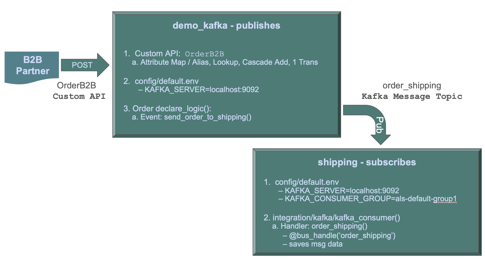

<style>
  .md-typeset h1,
  .md-content__button {
    display: none;
  }
</style>

!!! pied-piper ":bulb: TL;DR - Kafka Integration: Async Messaging"

    APIs are useful to application integration, but do not deal with the reality that the receiving system might be down.

    Message Brokers like Kafka address this with guaranteed ***async delivery*** of messages.  The Broker stores the message, delivering it (possibly later) when the the receiver is up.

    Message Brokers also support multi-cast: you ***publish*** a message to a "topic", and other systems ***subscribe***.  This is often casually described as "pub/sub".

    This sample presumes you are familiar with basic GenAI-Logic services, as illustrated in the Basic Demo tutorial.

    This guide will illustrate how to publish Kafka messages, and subscribe to and process them in another project.  This all runs on your machine, and includes instructions in installing Kafka as a Docker container.


# Purpose

**System Requirements**

This app illustrates using IntegrationServices for B2B push-style integrations with APIs, and internal integration with messages.  

&nbsp;



The **demo_kafka API Logic Server** provides APIs *and logic*:

1. **Order Logic:** enforcing database integrity and application Integration (alert shipping)

2. A **Custom API**, to match an agreed-upon format for B2B partners

3. **Standard APIs** for ad-hoc integration, user interfaces, etc

The **Shipping API Logic Server** listens on kafka, and processes the message.<br><br>

&nbsp;

**Self-serve APIs, Shared Logic**

This sample illustrates some key architectural considerations:

| Requirement | Poor Practice | Good Practice | Best Practice | Ideal
| :--- |:---|:---|:---|:---|
| **Ad Hoc Integration** | ETL | APIs | **Self-Serve APIs** |  **Automated** Self-Serve APIs |
| **Logic** | Logic in UI | | **Reusable Logic** | **Declarative Rules**<br>.. Extensible with Python |
| **Messages** | | | Kafka | **Kafka Logic Integration** |

We'll further expand of these topics as we build the system, but we note some Best Practices:

* **APIs should be self-serve:** not requiring continuing server development

    * APIs avoid the overhead of nightly Extract, Transfer and Load (ETL)

* **Logic should be re-used** over the UI and API transaction sources

    * Logic in UI controls is undesirable, since it cannot be shared with APIs and messages

This sample was developed with API Logic Server - [open source, available here](https://apilogicserver.github.io/Docs/).

<br>

```bash title='🤖 Bootstrap Copilot by pasting the following into the chat'
Please load `.github/.copilot-instructions.md`
```

> **Important:** be sure CoPilot is in "Agent" Mode.  "Ask" will not work.  Also, we get consistently good results with `Claude Sonnet 4.6`.

<br>

## 1. Create From Existing DB

<br>

<details markdown>

<summary> Create the Customer, Orders and Product Project [typically already done using Manager]</summary>

<br>


```bash title="In the Manager: Create a project from an existing database (probably already done)"
Create a database project named basic_demo_vibe from samples/dbs/basic_demo.sqlite
```

<br>

<details markdown>

<summary> Your project includes a data model diagram</summary>

<br>


</details markdown>

&nbsp;

### 1a. Project Opens: Run

The project should automatically open a new window in VSCode. <br>

``` bash title='🤖 Again, bootstrap Copilot by pasting the following into the chat'
Please load `.github/.copilot-instructions.md`.
```

Run it as follows:

1. **Start the Server:** F5 
2. **Start the Admin App:** browse to [http://localhost:5656/](http://localhost:5656/).  The Admin App screen shown below should appear in your Browser.
3. **Verify as shown below**

<details markdown>

<summary>API: filtering, sorting, pagination, optimistic locking,related data access... see Swagger </summary>

Your API is MCP enabled, and ready for custom app dev.  For more information, [click here](API-Self-Serve.md){:target="_blank" rel="noopener"}.


</details>

<br>

<details markdown>

<summary>Admin App: multi-page, multi-table, automatic joins, lookups, cascade add - collaboration-ready</summary>

For more information, [click here](Admin-Tour.md){:target="_blank" rel="noopener"}.

The Admin App is ready for **[business user agile collaboration](https://apilogicserver.github.io/Docs/Tech-AI/),** and back office data maintenance.  This complements custom UIs created with the API.

Explore the app - click Customer Alice, and see their Orders, and Items.  


</details>

</details>

<br><br>

## 2. Declare Business Logic

Logic (multi-table derivations and constraints) is a significant portion of a system, typically nearly half.  GenAI-Logic provides **spreadsheet-like rules** that dramatically simplify and accelerate logic development.

Rules are declared in Python, simplified with IDE code completion.  The screen below shows the 5 rules for **Check Credit Logic.**

**1. Stop the Server** (Red Stop button, or Shift-F5 -- see Appendix)

**2. Add Business Logic**

```bash title="Check Credit Logic (instead of 220 lines of code)"
on Placing Orders, Check Credit    
    1. The Customer's balance is less than the credit limit
    2. The Customer's balance is the sum of the Order amount_total where date_shipped is null
    3. The Order's amount_total is the sum of the Item amount
    4. The Item amount is the quantity * unit_price
    5. The Item unit_price is copied from the Product unit_price

Use case: App Integration
    1. Send the Order to Kafka topic 'order_shipping' if the date_shipped is not None.
```


To test the logic:

**1. Use the Admin App to access the first order for `Customer Alice`**

**2. Edit its first item to a very high quantity**

The update is properly rejected because it exceeds the credit limit.  Observe the rules firing in the console log - see Logic In Action, below.

<br>

<details markdown>

<summary>Logic is critical - half the effort; Declarative is 40X More Concise, Maintainable </summary>

<br>Logic is critical to your system - it represents nearly *half the effort.*  Instead of procedural code, [***declare logic***](Logic.md#declaring-rules){:target="_blank" rel="noopener"} with WebGenAI, or in your IDE using code completion or Natural Language as shown above.


**a. 40X More Concise**

The 5 spreadsheet-like rules represent the same logic as 200 lines of code, [shown here](Logic-Why.md){:target="_blank" rel="noopener"}.  That's a remarkable 40X decrease in the backend half of the system.

> 💡 No FrankenCode<br>Note the rules look like syntactically correct requirements.  They are not turned into piles of unmanageable "frankencode" - see [models not frankencode](https://www.genai-logic.com/faqs#h.3fe4qv21qtbs){:target="_blank" rel="noopener"}.

**b. Maintainable: Debugging, Logging**

The screenshot below shows our logic declarations, and the logging for inserting an `Item`.  Each line represents a rule firing, and shows the complete state of the row.

Note that it's a `Multi-Table Transaction`, as indicated by the indentation.  This is because - like a spreadsheet - **rules automatically chain, *including across tables.***


</details>

<br>

## 3. Custom API - B2B Orders

To fit our system into the Value Chain,
we need a **Custom API** to accept orders from B2B partners, and forward paid orders to shipping via Kafka.

``` bash title="Create the Custom B2B API Endpoint"
Create a B2B order API called 'OrderB2B' that accepts orders from external partners. 

The external format should map:
- 'Account' field to find customers by name
- 'Notes' field to order notes
- 'Items' array where each item maps 'Name' to find products and 'QuantityOrdered' to item quantity

The API should create complete orders with automatic lookups and inherit all business logic rules.
```

The Kafka logic was created earlier, so we are ready to test.

You can use Swagger (note the test data is provided), or use CLI:

``` bash title="Test the B2B Endpoint"
curl -X POST http://localhost:5656/OrderB2B -H "Content-Type: application/json" -d '{"Account":"Alice","Notes":"RUSH order for Q4 promotion","Items":[{"Name":"Widget","QuantityOrdered":5},{"Name":"Gadget","QuantityOrdered":3}]}'
```

Observe the logic execution in the VSCode debug window.

<br>

## 4. EAI Message

Alternatively, we might receive a message from sales using Kafka.  We can subscribe as follows:

```text title="Subscribe to sales message - Kafka Enterprise Application Integration"
Subscribe to Kafka topic `order_b2b` (JSON format).

The payload is a single order with items:
{
  "Account": "Alice",
  "Notes": "Kafka order from sales",
  "Items": [
    { "Name": "Widget",  "QuantityOrdered": 1 },
    { "Name": "Gadget", "QuantityOrdered": 2 }
  ]
}

Target tables: Order, Item (from models.py).

Field mappings:
- `Account` → look up Customer by Customer.name, set Order.customer_id
- `Notes` → Order.notes
- `Items` array → Item rows: `Name` → look up Product by Product.name, set Item.product_id; `QuantityOrdered` → Item.quantity
```

&nbsp;

<details markdown>

<summary>What Got Built?  The 2-Message Pattern</summary>

# EAI Consume: `order_b2b` Kafka Topic

Generated from `docs/training/eai_consume.md`.

**Two-Message Pattern**

A single-transaction consumer loses data if parsing fails mid-flush — the raw payload is gone. Instead:

```
topic: order_b2b
  → Consumer 1:  save raw JSON blob → OrderB2bMessage  (Tx 1 — always commits)
  → row_event:   blob insert → publish to order_b2b_processed
  → Consumer 2:  parse → Order + Items, resolve FKs, LogicBank rules  (Tx 2)
```

Parse failures leave `is_processed = False` on the blob row — queryable and retryable.

**Key Files**

See the module docstring in [integration/kafka/kafka_discovery/order_b2b.py](../integration/kafka/kafka_discovery/order_b2b.py) for design details, field mapping, and test instructions. Supporting files:

| File | Role |
|------|------|
| `logic/logic_discovery/place_order/order_b2b_consume.py` | `row_event` bridge — publishes blob to `order_b2b_processed` (no inline parse) |
| `integration/OrderB2bMapper.py` | JSON → Order + Items (3-tier mapping contract) |
| `api/api_discovery/order_b2b_kafka_consume_debug.py` | `/consume_debug/order_b2b` — test without Kafka |
| `docs/sample_data/sample_order_b2b.json` | Sample payload |
| `test/order_b2b_reset.sh` | Reset Kafka topics + log between runs |

**Quick Test (no Kafka needed)**

```bash
curl 'http://localhost:5656/consume_debug/order_b2b?file=docs/sample_data/sample_order_b2b.json'
```

</details>

<br>

## 5. Test

Observe that the API and message listener use the same underlying logic.

`integration/kafka/kafka_discovery/order_b2b.py` illustrates unit testing:

```bash title="Test stand-alone, and with Kafka"
Debug / test (no Kafka required):
  APILOGICPROJECT_CONSUME_DEBUG=true is set in config/default.env
  1. Start server: python api_logic_server_run.py
  2. curl 'http://localhost:5656/consume_debug/order_b2b?file=docs/sample_data/sample_order_b2b.json'
  3. Verify DB: sqlite3 database/db.sqlite "SELECT * FROM order_b2b_message; SELECT * FROM 'order'; SELECT * FROM item;"
  Sample data file: docs/sample_data/sample_order_b2b.json

Live Kafka:
  1. docker compose -f integration/kafka/dockercompose_start_kafka.yml up -d
  2. Enable KAFKA_CONSUMER + KAFKA_PRODUCER in config/default.env
  3. bash test/order_b2b_reset.sh       # recreates topics + clears log
  4. Start server; publish sample JSON to order_b2b topic
```
