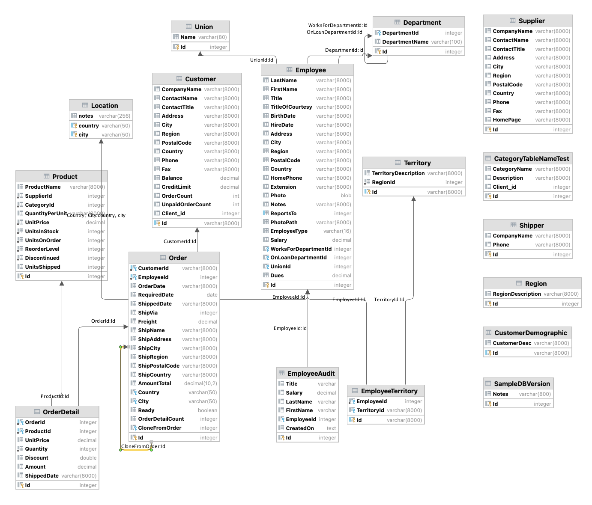
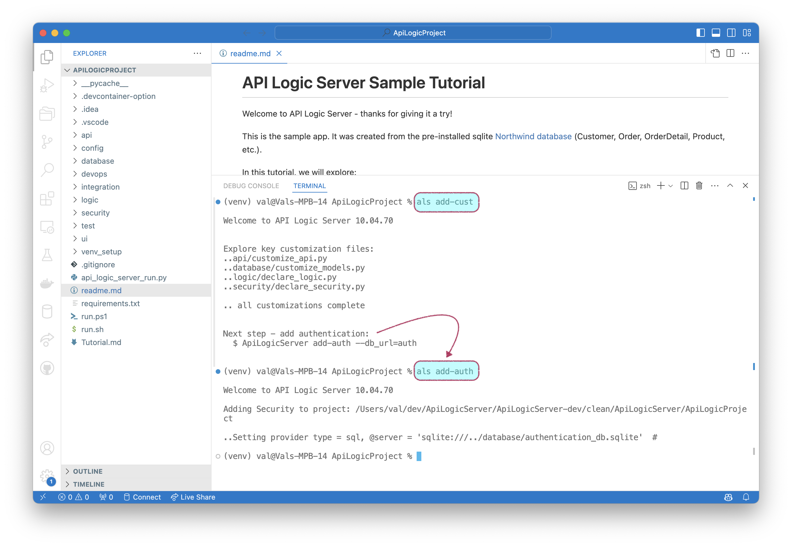

The sample application is created from the **pre-installed sample database** shown below [(tutorial here)](Tutorial.md).  It is an extension to Northwind that includes additional relationships:

* multiple relationships between Department / Employee
* multi-field relationships between Order / Location
* self-relationships in Department



You can create projects for it with or without logic, as described below.

&nbsp;

## Northwind without logic

To install _without pre-installed customizations_ for the API and Logic:

```bash
ApiLogicServer create --project_name=nw_sample_nocust --db_url=nw-
```
Open the project in your IDE, and open the `readme` for a walk-through:


&nbsp;

### Add Customizations

The tour begins with a review of the uncustomized project.  

> This illustrates the level of automation you can expect with your own projects.

The tutorial then shows how to add customizations:

```bash
ApiLogicServer add-cust
```



This installs:

1. **Logic:** The integrity of this database is enforced with [this logic](Logic-Why.md##declare-python){:target="_blank" rel="noopener"}
2. **Integration:** [this Kafka logic](Sample-Integration.md){:target="_blank" rel="noopener"}

### Add Security

Finally, as shown above, add security (defaulting to sqlite-based authorization):

```bash
ApiLogicServer add-auth
```

&nbsp;

## Northwind with Logic

You can also create the project with the logic pre-installed:

```bash
ApiLogicServer create --project_name=nw_sample --db_url=nw+
```
&nbsp;

## Sample-ai

The ChatGPT-based sample is structured as follows:

{: style="height:600px;";  }

&nbsp;

## Basic Demo

The ChatGPT-based sample is structured as follows:

{: style="height:600px;";  }


