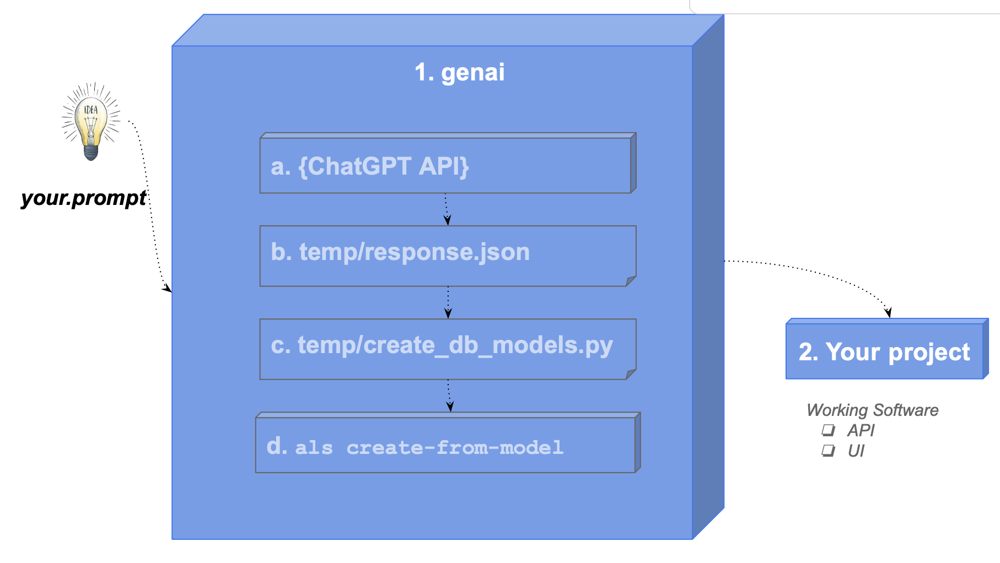

!!! pied-piper ":bulb: TL;DR - GENAI leverages AI for 'hands-free' project creation"

    API Logic Server use ChatGPT APIs, to submit prompts and obtain data model class responses.  
    
    API Logic Server can use these to create databases and projects, from single command.

&nbsp;

## Project Creation

You can explore genai using the [Manager](Manager.md){:target="_blank" rel="noopener"}.  Optionally, you can sign-up for ChatGPT API and Copilot, or simulate the process as described below.

1. If you have signed up for , this will create and open a project called `genai_demo` from `genai_demo.prompt`:

```bash
als genai --using=genai_demo.prompt
```


2. ***Or,*** you can simulate the process using a pre-installed response file:


```bash
als genai --using=genai_demo.prompt --gen-using-file=system/genai/temp/chatgpt_retry.txt
```

&nbsp;

### What Just Happened? &nbsp;&nbsp;&nbsp;Next Steps...

`genai` processing is shown below (internal steps denoted in grey):

1. You create your.prompt file, and invoke `als genai --using=your.prompt`.  genai then creates your database and project as follows:

    a. Submits your prompt to the `ChatGPT API`

    b. Writes the response to file, so you can correct and retry if anything goes wrong

    c. Extracts model.py from the response

    d. Invokes `als create-from-model`, which creates the database and your project

2. Your created project is opened in your IDE, ready to execute and customize

&nbsp;



&nbsp;

## Explore Customization

Rapid Creation of working software is interesting, but real value requires that you can customize the resultant project in standard ways: your IDE, standard languages, standard libraries, standard source control, etc.

You customize API Logic Project in two ways, both performed in your IDE:

* **Declare Rules:** spreadsheet like rules address multi-table derivations and constraints.  These constitute nearly half of a typical database-oriented system.   Declarative rules are 40X more concise than procedural code.

* **Standard Python:** as noted above

Explore these as described below.

&nbsp;

### Explore Spreadsheet-like Rules

To explore rules:

1. Open `logic/declare_logic.py`

2. Copy the comments to your Copilot window, starting with the line with **GenAI:**

3. Paste them into the Copilot Chat windows

4. Paste the generated code back into `logic/declare_logic.py`.  You will need to make a few small repairs:

    * change *import models* to *import database.models*, and 
    * change *as_formula* to *as_expression*


&nbsp;

### Explore Using Standard Code

To save time, issue the follow command to simulate changes you might make in your IDE, e.g., to send Kafka messages.

```bash title="Mimic IDE Customization"
als genai-cust
```

&nbsp;

## Explore Deployment, for Collaboration

One of the best ways to de-risk projects is to verify the sponsors are in sync with what is happening.  This is best addressed with *working software*, which often occurs project.  Issues here can result in considerable rework... and frustrations.

GenAI Automation produces *working software, **now***, so you can find misunderstanding before investing serious effort ("fail fast").  To expose the working software, it's often desirable to deploy to the cloud.

API Logic Server creates the `devops` directory, which scripts to containerize your project, and deploy it to Azure.  For more information, see [DevOps Automation](DevOps-Automation.md).

## Appendices

&nbsp;

### GenAI Restart Procedures

AI results are not consistent, so the created model file may need corrections.  You can find it at `system/genai/temp/model.py`.  You can correct the model file, and then run:

```bash
als create --project-name=genai_demo --from-model=system/genai/temp/model.py --db-url=sqlite
```

Or, correct the chatgpt response, and

```bash
als genai --using=genai_demo.prompt --gen-using-file=system/genai/temp/chatgpt_retry.txt
```

We have seen failures such as:

* duplicate definition of `DECIMAL`
* unclosed parentheses
* data type errors in test data creation
* wrong engine import: from logic_bank import Engine, constraint
* bad test data creation: with Engine() as engine...
* Bad load code (no session)

&nbsp;

### GenAI Using Postgresql

The above examples use *s1lite* since it requires no install.  The GenAI process works for other database, such as Postgresql.

You can test this as follows:

1. Use [our docker image](Database-Docker.md){:target="_blank" rel="noopener"}
2. And:

```bash
als create --project-name=genai_demo_pg.prompt --db-url=postgresql://postgres:p@localhost/genai_demo
```

Provisos:

* You have to create the database first

