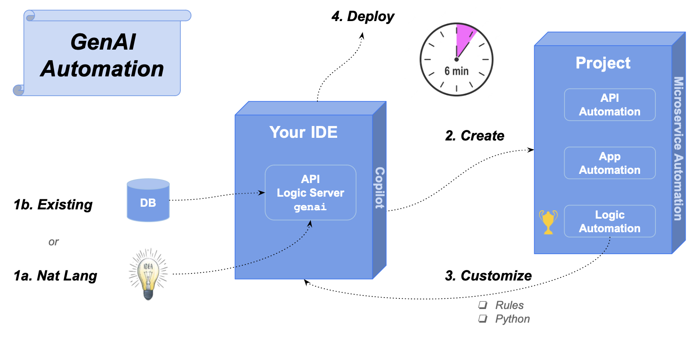
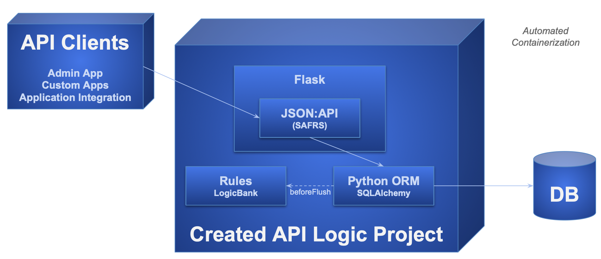
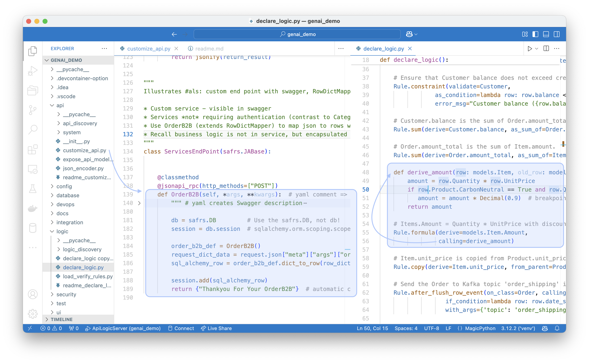

!!! pied-piper ":bulb: TL;DR - GENAI leverages AI for 'hands-free' project creation"

    API Logic Server uses ChatGPT APIs, to submit prompts and obtain data model class responses.  
    
    API Logic Server uses these to create databases and projects, from single command.

    This document illustrates how to create, run and customize the genai_demo project.

    > Note: if you have already created the project, proceed to "What Just Happened?".

&nbsp;



&nbsp;

## 1. Description (or Database)

To create a microservice, identify an existing database, or provide a natural language "prompt" description.  For example, here is the `genai_demo.prompt` file:

!!! pied-piper ":bulb: TL;DR - GenAI Prompt"

    Use SQLAlchemy to create a sqlite database named sample_ai.sqlite, with customers, orders, items and product

    Hints: use autonum keys, allow nulls, Decimal types, foreign keys, no check constraints.

    Include a notes field for orders.

    Create a few rows of only customer and product data.

    Enforce the Check Credit requirement (do not generate check constraints):

    1. Customer.Balance <= CreditLimit
    2. Customer.Balance = Sum(Order.AmountTotal where date shipped is null)
    3. Order.AmountTotal = Sum(Items.Amount)
    4. Items.Amount = Quantity * UnitPrice
    5. Store the Items.UnitPrice as a copy from Product.UnitPrice

&nbsp;

## 2. GenAI Creation

You can explore genai_demo using the [Manager](https://apilogicserver.github.io/Docs/Manager/){:target="_blank" rel="noopener"}.  Optionally, you can sign-up for ChatGPT API and Copilot, or simulate the process as described below.

1. If you have signed up for ChatGPT API and Copilot, this command will create and open a project called `genai_demo` from `genai_demo.prompt`:

```bash
als genai --using=genai_demo.prompt
```


2. ***Or,*** if you have not signed up, you can simulate the process using a pre-installed response file:

```bash
als genai --using=genai_demo.prompt --gen-using-file=system/genai/temp/chatgpt_retry.txt
```

&nbsp;

### What Just Happened?

`genai` processing is shown below (internal steps denoted in grey):

1. You create your.prompt file, and invoke `als genai --using=your.prompt`.  genai then creates your database and project as follows:

    a. Submits your prompt to the `ChatGPT API`

    b. Writes the response to file, so you can correct and retry if anything goes wrong

    c. Extracts model.py from the response

    d. Invokes `als create-from-model`, which creates the database and your project

2. Your created project is opened in your IDE, ready to execute and customize

&nbsp;


&nbsp;

### API/App Automation

API/App Autmation means the created project is executable.  To run:

1. Press **F5** to run
2. Start your [Browser](http://localhost:5656/) to view:
    * App Automation: the Admin App, and
    * API Automation: JSON:API, with Swagger
3. Stop the server when you are done (red box on VSCode Debugger panel)


It's a modern, 3-tiered architecture, using standard Python libraries:



&nbsp;

## 3. Customize: Rules and Python

The development environment is also standard: your IDE, standard languages, standard libraries, standard source control, etc.  You customize API Logic Project in two ways, both performed in your IDE:

* **Logic Automation:** declare spreadsheet-like rules to address multi-table derivations and constraints.  These constitute nearly half of a typical database-oriented system.   Declarative rules are 40X more concise than procedural code.

* **Standard Python:** e.g, to create a new custom endpoint, and send a Kafka message

Explore these below.

&nbsp;

### Logic Automation

To explore rules:

1. Open `logic/declare_logic.py`

2. Copy the comments to your Copilot window, starting with the line with **GenAI:**

3. Paste them into the Copilot Chat windows

4. Paste the generated code back into `logic/declare_logic.py`.  You will need to make a few small repairs:

    * change *import models* to *import database.models*, and 
    * change *as_formula* to *as_expression*


&nbsp;

### Standard Python, Libraries

To save time, issue the follow command to simulate changes you might make in your IDE, e.g., to create a new custom endpoint, and send a Kafka message.

```bash title="Simulate IDE Customization"
als genai-cust
```



### Try it out

Set a breakpoint in the code above, and:

1. Start the Server (**F5**)
2. Use the Admin app to alter the first Customer, first Order, first Item, and change the quantity to 11111
    * Observe the error message, from the rules.
3. To test the new endpoint, use Swagger (**ServicesEndPoint > POST /ServicesEndPoint/OrderB2B)**.
    * Observe the swagger response - "Thankyou For Your OrderB2B".

Note: Kafka is not activated in this example.  To explore a running Tutorial for application integration with running Kafka, [click here](Sample-Integration.md){:target="_blank" rel="noopener"}.

&nbsp;

## 4. Deployment: Containers, Cloud

One of the best ways to de-risk projects is to verify the sponsors are in sync with what is happening.  This is best addressed with *working software*, which often occurs late in project development.  Surprises here can result in considerable rework... and frustrations.

GenAI Automation produces *working software, now*, so you can find misunderstandings before investing serious effort ("fail fast").  To expose the working software, it's often desirable to deploy to the cloud so business users can run it.

API Logic Server creates the `devops` directory, which scripts to containerize your project, and deploy it to Azure.  For more information, see [DevOps Automation](https://apilogicserver.github.io/Docs/DevOps-Automation/){:target="_blank" rel="noopener"}.

&nbsp;

## Appendices

&nbsp;

### GenAI Restart Procedures

AI results are not consistent, so the created model file may need corrections.  You can find it at `system/genai/temp/model.py`.  You can correct the model file, and then run:

```bash
als create --project-name=genai_demo --from-model=system/genai/temp/model.py --db-url=sqlite
```

Or, correct the chatgpt response, and

```bash
als genai --using=genai_demo.prompt --gen-using-file=system/genai/temp/chatgpt_retry.txt
```

We have seen failures such as:

* duplicate definition of `DECIMAL`
* unclosed parentheses
* data type errors in test data creation
* wrong engine import: from logic_bank import Engine, constraint
* bad test data creation: with Engine() as engine...
* Bad load code (no session)

&nbsp;

### GenAI Using Postgresql

The above examples use *sqlite,* since it requires no install.  The GenAI process works for other database, such as Postgresql.

You can test this as follows:

1. Use [our docker image](https://apilogicserver.github.io/Docs/Database-Docker/){:target="_blank" rel="noopener"}
2. And:

```bash
als create --project-name=genai_demo_pg.prompt --db-url=postgresql://postgres:p@localhost/genai_demo
```

Provisos:

* You have to create the database first

