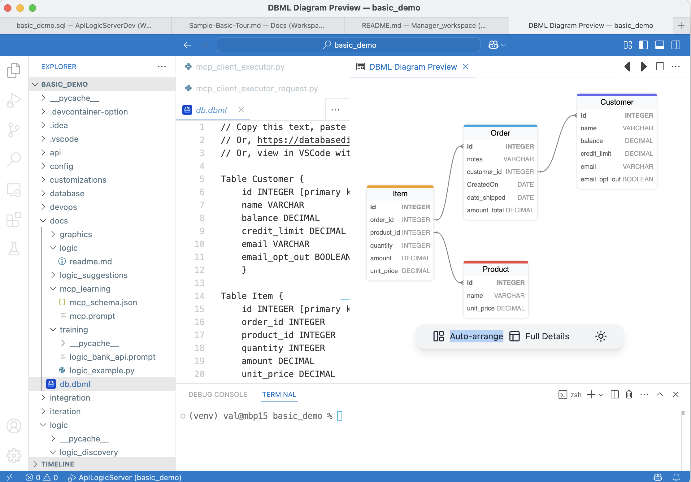

!!! pied-piper "TL;DR - Integrated Deterministic and AI Rules!"
    AI provides creativity and reasoning that businesses want... how do we provide that, *with determistic goverance?*.  
    
    For example - a business can continue to operate even if a tanker has blocked the Suez canal by choosing an alternate supplier, as declared in the prompt below:

## Declare and Test

If you have not already created the project, you can create it in Manager using Copilot:

&emsp;*Create a system named basic_demo from samples/dbs/basic_demo.sqlite*.  

Then:

!!! pied-piper "Paste this logic into Copilot (note: takes several minutes)"
    *On Placing Orders, Check Credit:* 

    *1. The Customer's balance is less than the credit limit* 
    *2. The Customer's balance is the sum of the Order amount_total where date_shipped is null* 
    *3. The Order's amount_total is the sum of the Item amount* 
    *4. The Item amount is the quantity * unit_price* 
    *5. The Product count suppliers is the sum of the Product Suppliers* 
    *6. __Use AI__ to Set Item field unit_price by finding the optimal Product Supplier based on cost, lead time, and world conditions*

    *Use case: App Integration*

    *1. Send the Order to Kafka topic 'order_shipping' if the date_shipped is not None.*

Developers review this DSL before execution, providing a natural human-in-the-loop checkpoint.

To test:

1. Start the Server
2. Order some Egyptian Cotton Sheets (use in the Admin App, or test MCP using Copilot - paste:  &emsp;*On Alice's first order, include 100 Egyptian Cotton Sheets*
3. Verify the AI call - use the Admin App to view the audit trail (top of this page)

&nbsp;

## Background Concepts

### Unified Deterministic / Probablilistic Logic

Agentic systems are evolving quickly, and a clearer architectural picture is forming:

> Not AI *vs* Rules — **AI and Rules together.**

Different kinds of logic naturally call for different tools, as in this unified example:

* **Deterministic Logic** — logic that must always be correct, consistent, and governed.  
*Example:* “Customer balance must not exceed credit limit.”

* **AI Logic** — logic that benefits from exploration, adaptation, and probabilistic reasoning.  
*Example:* “Which supplier can still deliver if shipping lanes are disrupted?”

    * **Creative reasoning needs boundaries. Deterministic rules supply the guardrails that keep outcomes correct, consistent, and governed.**

 

### Logic Architecture

**The Business Logic Agent** processes a *declarative NL requests:*

- At declaration time (e.g., in Copilot):

    * **D1:** Accepts a unified declarative NL request
    * **D2.** Uses GenAI to create
        * Rules (in Python DSL: Domain Specific Logic) for deterministic Logic
        * LLM calls for Probablistic

- At runtime, during commit

    * **R1:** DSL is executed by the Rules Engine (deterministic - no NL processing occurs)
    * **R2:** LLM calls are made to compute values (e.g., optimal supplier)
    * The rules engine ensures that R2 logic results are governed by R1 rules

**AI logic become far more compelling when probabilistic intent is paired with deterministic enforcement.**

This "governable intent" model aligns with enterprise expectations —  
adaptive where helpful, reliable where essential.

**GenAI-Logic unifies probabilistic intent with deterministic enforcement in a single model**

 

## AI Logic Pattern: Pick Optimal

In this example, we leverage AI by providing a list of suppliers and the selection criteria (*"finding the optimal Product Supplier based on cost, lead time, and world conditions"*).  

!!! abstract "AI Intelligent Selection From Options"

     Invoke AI providing a prompt (*find optimal <criteria>*) and a *list of candidates*.
     
     AI computes the selected object.

     Here we select an optimal supplier from a list of suppliers.  Other examples:

     1. Shipping Carrier/Route Selection
     2. Dynamic Pricing/Discount Strategy
     3. Task/Resource Assignment
     4. Inventory Sourcing/Replenishment

 

## Design

### Data Model

Observe:

1. Products can have multiple suppliers (selection candidates)
2. The Audit table `SysSupplierReq` - rows are created for each AI request

### AI Code Generation via Context Engineering

AI was not *born* understanding how to use rules to solve this.  We provide extensive context engineering to automate this pattern.

AI can not only create the implementation, it can explain it:

## AI Supplier Selection Logic Flow

**Trigger**: When an Item is inserted or its `product_id` changes

**Flow**:

1. **Early Event on OrderItem Fires** → `set_item_unit_price_from_supplier()` checks if suppliers exist for the product (fallback to Product.unit_price if no suppliers)

    - see `logic/logic_discovery/place_order/check_credit.py`

2. **Wrapper Function** → Calls `get_supplier_selection_from_ai(product_id, item_id, logic_row)`

   - Creates new `SysSupplierReq` row via Request Pattern
   - Sets parent context links (`product_id`, `item_id`)
   - Inserts the request row
   - See `logic/logic_discovery/place_order/ai_requests/supplier_selection.py`
   
3. **AI Event Triggers** → Insert automatically fires `select_supplier_via_ai()`

   - Loads world conditions from `config/ai_test_context.yaml` (e.g., "Suez Canal blocked")
   - Sends supplier data (cost, lead time, region) + world conditions to OpenAI
   - AI analyzes and selects optimal supplier
   - Populates result fields: `chosen_supplier_id`, `chosen_unit_price`, `reason`, `request`

4. **Wrapper Returns** → Returns populated `SysSupplierReq` row with AI results

   - Caller extracts: `supplier_req.chosen_unit_price`
   - Item's `unit_price` is set from this AI-chosen value

5. **Cascading**: Formula rules automatically recalculate `Item.amount` → `Order.amount_total` → `Customer.balance`, triggering credit limit constraint check

**Key Pattern**: 

1. The ***request pattern*** is commonly used to insert a row, where logic (such as `before_insert`) provides integration services (e.g, invoke AI, messaging, email, etc), with automatic request auditing 
2. The wrapper hides Request Pattern complexity - caller just gets back a populated row object with AI results (`chosen_supplier_id`, `chosen_unit_price`, `reason`) plus full audit trail.

 

