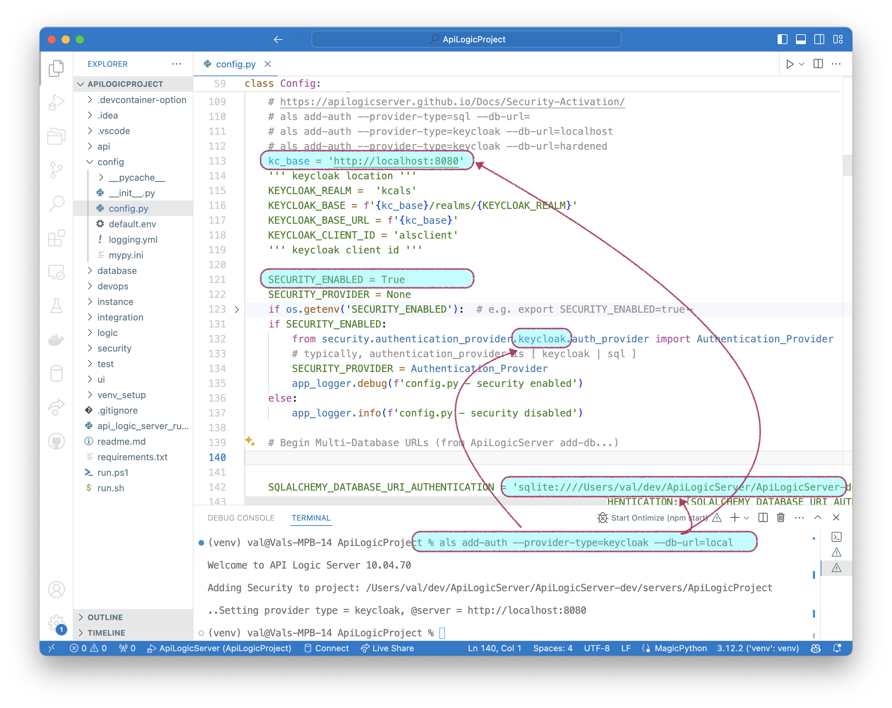

!!! pied-piper ":bulb: TL;DR - Use add-auth to activate security"

    You activate security by activating authentication using the `add-auth` CLI command to designate the `authentication-type` (sql or keycloak), and its database location (`db_url`).
    
&nbsp;

## add-auth

Use the `add-auth` command to activate security.  Specify:

1. `--provider-type`: sql, keycloak, or your custom auth provider
2. `--db-url`: the persistent store to identify valid users and their roles.  These can be stores such as LDAP or Microsoft AD, or a security sql database.

&nbsp;

## Examples

Use your IDE's terminal window positioned at your project root [^1]:

```bash title='Configure Security - Examples'
gail add-auth --provider-type=sql --db-url=
gail add-auth --provider-type=sql --db_url=postgresql://postgres:p@localhost/authdb

gail add-auth --provider-type=keycloak --db-url=localhost
gail add-auth --provider-type=keycloak --db-url=hardened

gail add-auth --provider-type=None # to disable
```

&nbsp;

## `add-auth` Internal Processing

### Updates `config.py`

Internally, this updates `conf/config.py`:



&nbsp;

### Creates auth models

See [this information for sql authentication](Security-sql.md#accessed-via-sqlalchemy){:target="_blank" rel="noopener"}.

&nbsp;

## Appendix: Internals

The Security Manager and sqlite Authentication-Provider are built into created projects from the [system's prototype project](https://github.com/ApiLogicServer/ApiLogicServer-src/tree/main/api_logic_server_cli/prototypes/nw){:target="_blank" rel="noopener"}.

[^1]:
    `gail` (or `genai-logic`) is the rebranded name for `als` (or `apilogicserver`).
    Older installations may require these latter CLI names.