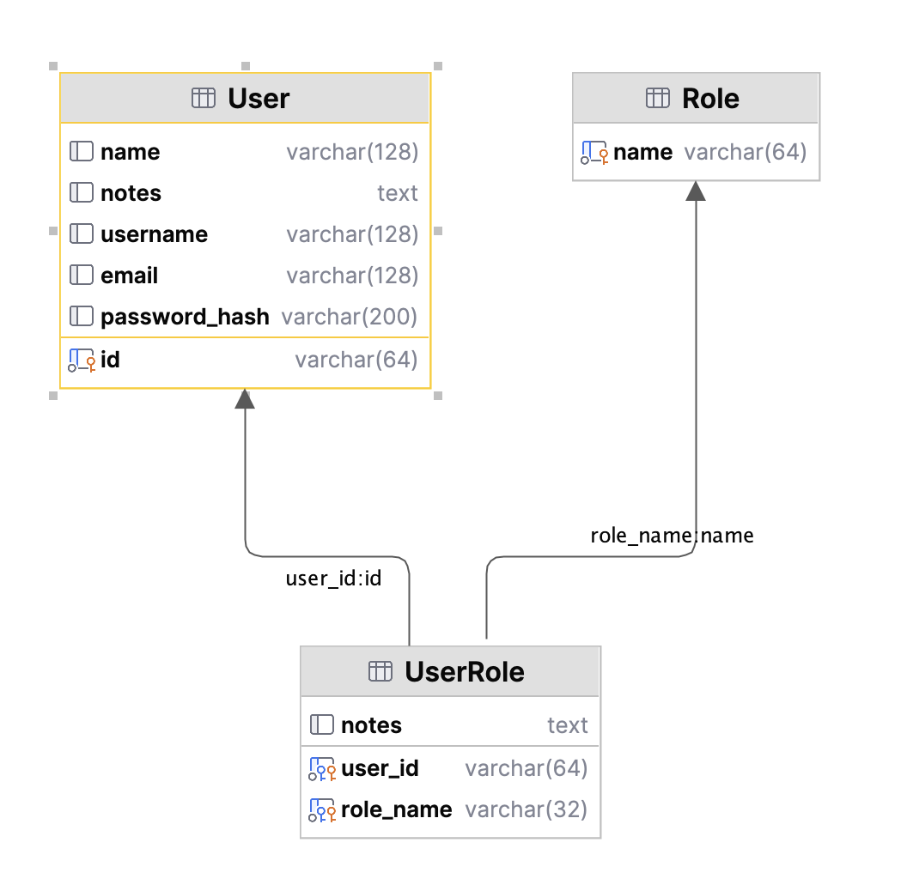

!!! pied-piper ":bulb: TL;DR - Row Level Security with Grant Permissions on User Roles"

    Security requires persistent store to identify valid users and their roles.  These can be stores such as LDAP or Microsoft AD, or a security sql database.

    Projects are initially created without security.  Use the command below to add security using your own database, which enables you to *Add `User` properties for `Grant` declarations*,

For example, use your IDE's terminal window positioned at your project root:

```bash
cd <project-root>  # typically done in your IDE
ApiLogicServer add-auth --db_url=mysql+pymysql://root:p@localhost:3306/authdb
```        

You can use the SQLite version:
```bash
cd <project-root>  # typically done in your IDE
ApiLogicServer add-auth --db_url=auth 
```

&nbsp;

## Security Database Structure

{:height="500px" width="500px"}

Except for the sample project, projects are created with security disabled.  So, a typical project creation sequence might be:

1. Create your project without security

    * Verify connectivity, API operation, Admin App operation, etc.

2. Activate Security

This page describes how to activate security.

&nbsp;

## Explore Security Samples

You might want to begin by exploring the samples below.

&nbsp;

### Nortwind Sample

Security is automatically enabled when building the sample app.  Explore / test it as described in [Authorization](Security-Authorization.md#sample).

Or, you can create the sample application _without customizations_, and then add security using the `add-auth` command; [click here](Sample-Database.md#activate-security){:target="_blank" rel="noopener"}:

```bash
ApiLogicServer add-auth --db_url=auth
```

The `add-auth` command will:

1. Add the sqlite database and models, using `ApiLogicServer add-db --db_url=auth --bind_key=authentication`
    * This uses [Multi-Database Support](Data-Model-Multi.md){:target="_blank" rel="noopener"} for the sqlite authentication data
2. Add `User.Login`` endpoint to the User model
3. Set `SECURITY_ENABLED` in `conf/config.py`
4. Configure your Authentication-Provider, using your own [Authentication-Provider](Security-Authentication-Provider.md){:target="_blank" rel="noopener"}
5. Add Sample authorizations to `security/declare_security.py`

&nbsp;

### Docker Databases

You can use the [docker databases](Database-Docker.md){:target="_blank" rel="noopener"} as shown below.  (If you haven't already done so, recall you must first `docker network create dev-network  # only required once`)

&nbsp;

**1. MySQL `classicmodels`**

```bash
docker run --name mysql-container --net dev-network -p 3306:3306 -d -e MYSQL_ROOT_PASSWORD=p apilogicserver/mysql8.0:latest

ApiLogicServer create --project_name=classicmodels  --db_url=classicmodels

cd classicmodels
ApiLogicServer add-auth --project_name=. --db_url=mysql+pymysql://root:p@localhost:3306/authdb
```
&nbsp;

**2. Postgres `northwind`**

```bash
docker run -d --name postgresql-container --net dev-network -p 5432:5432 -e PGDATA=/pgdata -e POSTGRES_PASSWORD=p apilogicserver/postgres:latest

ApiLogicServer create --project_name=postgres-nw --db_url=postgresql://postgres:p@localhost/postgres

cd postgres-nw
ApiLogicServer add-auth --project_name=. --db_url=postgresql://postgres:p@localhost/authdb
```


&nbsp;

## Using your own `authdb`

In most cases, you will create your own `authdb`:

1. To use the same kind of DBMS you are using for your data

2. To introduce additional properties for use in `Grants` -- see the first section below


### Add `User` properties for `Grants`

For example, the `nw` security example has the following mulit-tenant example:

```python
Grant(  on_entity = models.Category,    # illustrate multi-tenant - u1 shows only row 1
        to_role = Roles.tenant,
        filter = lambda : models.Category.Client_id == Security.current_user().client_id)  # User table attributes
```

Here, our custom `authdb` has added the `client_id` column to the `User` table, and we are using that to restrict _tenants_ to their own companies' data.


### Pre-created `authdb` scripts

For example, use [this Dockerfile](https://github.com/valhuber/ApiLogicServer/tree/main/api_logic_server_cli/project_prototype/devops/docker) to create a MySQL docker image for your project, including `authdb`.

> After release 08.00.05, those files are created in new projects.  For earlier versions, create these files in devops/docker.

&nbsp;

### Pre-created in Docker Samples

A sample security database is pre-created in the MySQL and Postgres [Sample Docker Databases](Database-Docker.md).

&nbsp;

## Appendix: Internals

The Security Manager and sqlite Authentication-Provider are built into created projects from the [system's prototype project](https://github.com/valhuber/ApiLogicServer/tree/main/api_logic_server_cli/project_prototype_nw).
