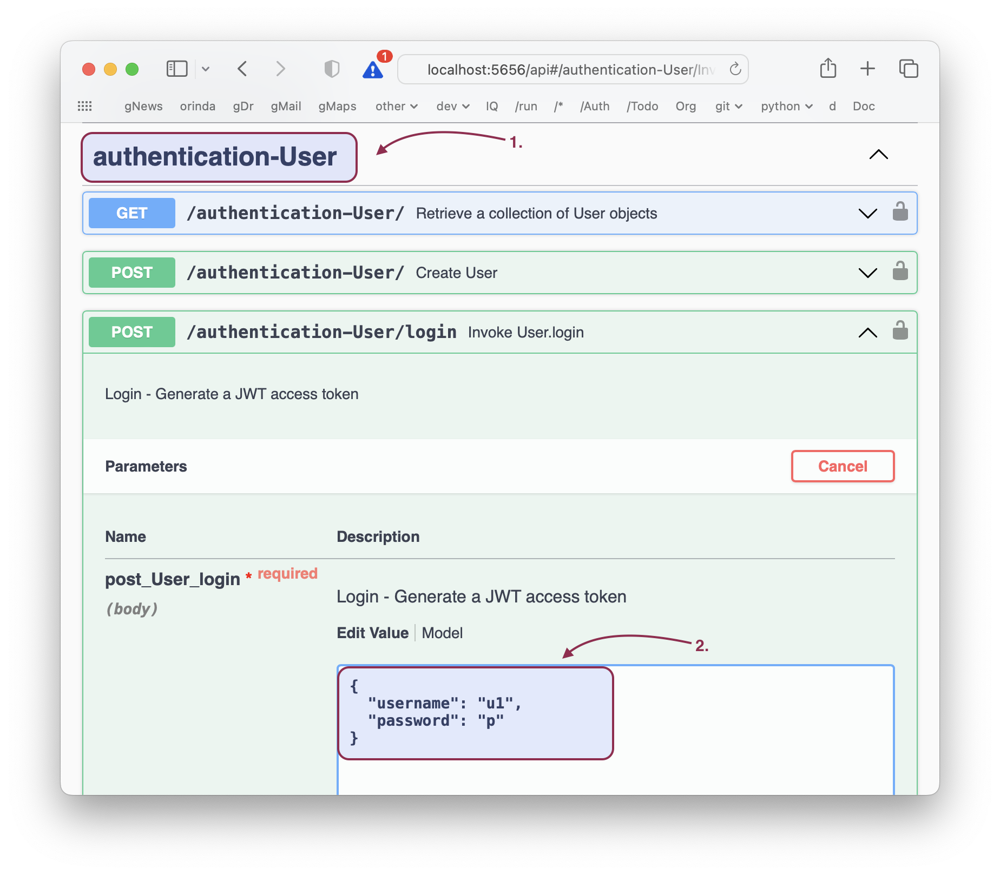
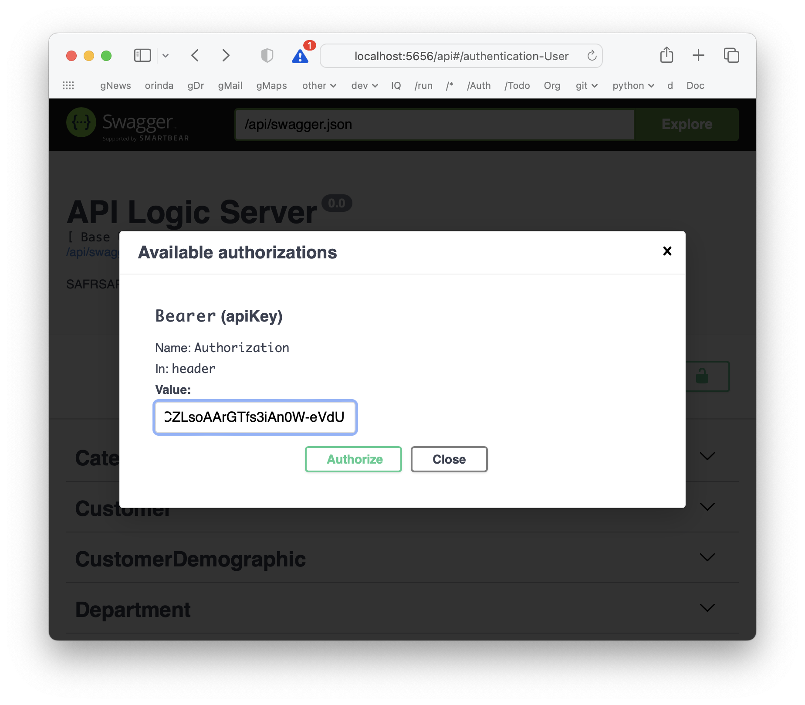

Once you have activated security, the system require you to login to obtain a token, and provide this token on subsequent APIs.  This page describes how to login and provide a token.

&nbsp;

## Obtain a token

The sample test apps obtain a token [as shown here (see login())](https://github.com/ApiLogicServer/ApiLogicServer-src/blob/main/api_logic_server_cli/prototypes/base/test/api_logic_server_behave/features/steps/test_utils.py){:target="_blank" rel="noopener"}.  This is also illustrated in the swagger section, below.

&nbsp;

### Swagger Authentication

Once you activate, tokens are required, including in Swagger.  You can obtain a token and authenticate as described below for the sqlite authentication-provider:

1. Access the User Login service
2. Use the __Try it now__ feature as shown below
3. Copy the token value for use in the next step



At the top of Swagger, locate the Authenticate button.  Copy the token, precede it with __Bearer__, and login like this:



&nbsp;

## Provide token in header

The sample test apps use this token on API calls [as shown here](https://github.com/valhuber/ApiLogicServer/blob/main/api_logic_server_cli/project_prototype_nw/test/api_logic_server_behave/features/steps/place_order.py){:target="_blank" rel="noopener"}.

## `public` role

For each user, you define their roles.  Depending on your authentication provider, this can be in a sql database, keycloak, or your own custom provider (e.g., LDAP, AD).

If you define no roles, authenticated users are automatically assigned with the `public` role.  You must still authorize this role, as illustrated in the [nw sample](https://github.com/ApiLogicServer/ApiLogicServer-src/blob/main/api_logic_server_cli/prototypes/nw/security/declare_security.py){:target="_blank" rel="noopener"}.

## Password Encryption with flask_bcrypt

It is generally not a good idea to store user passwords in plain text.  The Python package flask_bcrypt is included and can be used to generate encrypted passwords. Note: each time you run the encryption - you will get a different value but the check password hash will return true if the plain text matches.

```
from flask_bcrypt import generate_password_hash, check_password_hash

if __name__ == "__main__":
    pw = input("Enter a password to encrypt: ")
    pw_hash = generate_password_hash(password=pw)
    print(f'encrypted password = {pw_hash}')
    print(f'check_password_hash: {pw} = {check_password_hash(pw_hash=pw_hash, password=pw)}')

Enter a password to encrypt: p
encrypted password = b'$2b$12$7sBO8jrL7nlgd10/yZ6lqeCV9Jr/itMnu0Zx0bFAqzC3kYQbzB8j.'
check_password_hash: p = True
```

Once you have the encrypted password - update your 'User' table password_hash value. 
SQL for each user:
```
update user set password_hash = '$2b$12$7sBO8jrL7nlgd10/yZ6lqeCV9Jr/itMnu0Zx0bFAqzC3kYQbzB8j.' where user.id = 'admin'
```

Modify the file database/authentication.py to use the encrypted password_hash.
```
from flask_bcrypt import generate_password_hash, check_password_hash

    # authentication-provider extension - encrypted password check
    def check_password(self, plaintext=None):
        # print(password)
        return check_password_hash(self.password_hash, plaintext)
```