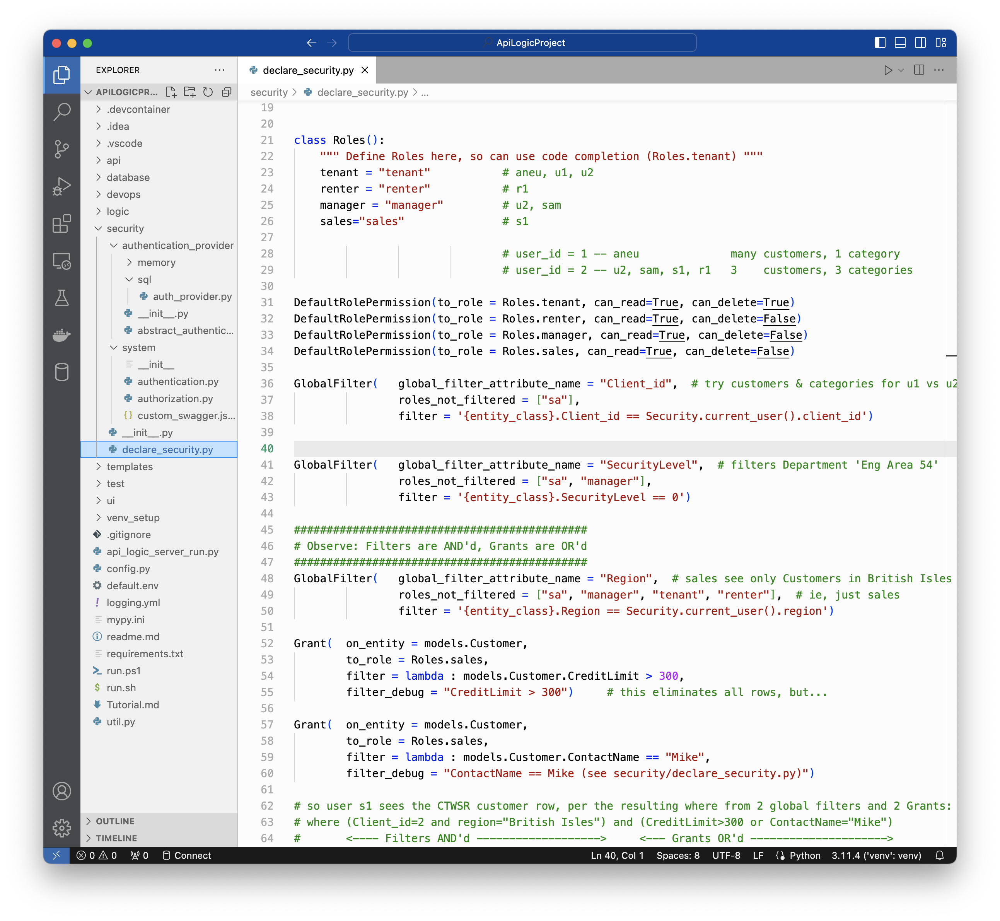

!!! pied-piper ":bulb: TL;DR - Role-based Grants and Permissions, Global Filters"

    Declarative security enables you to control which rows are visible to which users, and their read/update permissions:
        
    **1. Grants:** declare filters for a class/role

    **2. Global Filters:** declare filters global to all tables, used for:

       * Multi-Tenant

       * Common patterns such as hiding rows marked for deletion, rows outside a users' territory, etc

    **3. Permissions:** define whether specific rows are create, read, update or delete rows

    **Logging** is provided so you can see which filters are applied, and the resultant SQL.

## Declaring Security Logic

Analogous to logic declarations, Developers declare filters for users' roles (role-based access control).  As shown below, these are declared in `security/declare_security.py`.

A user can have multiple roles; a users' filters are **OR**ed together.

Roles are typically defined elsewhere (Keycloak, LDAP, AD, external SQL database), and accessed at runtime via the Authentication-Provider.  Roles simplify administration, since there are typically many fewer roles that users, and they are less subject to change.  

> You may elect to define the roles in your code for code completion, as shown below in the `Roles` class.  In any case, the "source of truth" is the Authentication-Provider.

{ align=left }

&nbsp;

### Grants

Each `Grant` designates a role, class and filter.  Since a user can have multiple roles, there can be multiple Grants.  These are OR'd together.

In the sales example shown above, the CreditLimit filter would hide all rows; rows, however, are visible becuase the ContactName filter is OR'd in.

&nbsp;

### Global Filters

Global filter specify an entity, a filter, and rows ***not*** subject to the filter.

In the example above:

* `Client_id` illustrates multi-tenant.  Observe the search criteria are from the `User` object.
* `Region` illustrates how to limit customer rows to sales reps in their region
* `Security` illustrates how to protect certain rows

&nbsp;

### Permissions

Permissions designate what operations can be performed for each role.  Since this can get wordy (imagine many tables and roles), defaults are provided.

&nbsp;
 
## Debugging

In the Sample App, login as **s1** and click Customers.  You will see the following log:

{ align=left }

## Sample

This is illustrated in the sample application `security/declare_security.py` - [click here](https://github.com/ApiLogicServer/demo/blob/main/security/declare_security.py){target="_blank" rel="noopener"}.

You can test it via the Admin App, or via Swagger.

&nbsp;

### Admin App

Click `Category` in the Admin App:

{ align=left }

&nbsp;

### Swagger

The same result is visible in Swagger:

{ align=left }