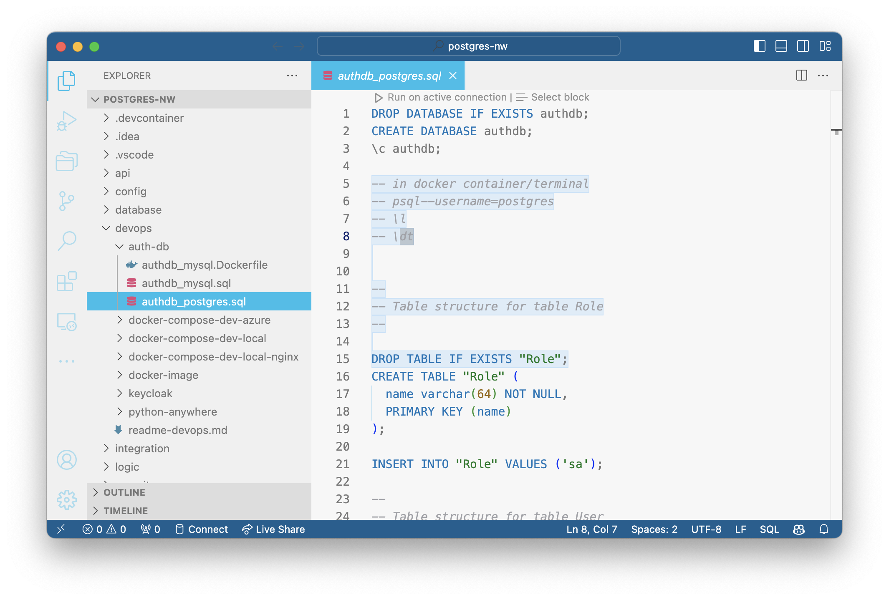

!!! pied-piper ":bulb: TL;DR - Explore Samples to Learn About Security"

    Security can be complicated.  
    
    We recommend exploring the security examples below.


## Northwind Sqlite Sample

Security is automatically enabled when building the [sample app, with customizations](Sample-Database.md##northwind-with-logic){:target="_blank" rel="noopener"}:

To explore the Grants in `security/declare_security.py` - [click here](https://github.com/ApiLogicServer/demo/blob/main/security/declare_security.py){target="_blank" rel="noopener"}.

You can test it via the Admin App, or via Swagger.

Or, to see the process from scratch:

1. Create the sample application _without customizations_: [click here](Sample-Database.md##northwind-without-logic){:target="_blank" rel="noopener"}
2. Then, as shown in that link, add customizations and security

The `add-auth` command will:

1. Add the sqlite database and models, using `ApiLogicServer add-db --db_url=auth --bind_key=authentication`
    * This uses [Multi-Database Support](Data-Model-Multi.md){:target="_blank" rel="noopener"} for the sqlite authentication data
2. Add `User.Login`` endpoint to the User model
3. Set `SECURITY_ENABLED` in `conf/config.py`
4. Configure your Authentication-Provider, using your own [Authentication-Provider](Security-Authentication-Provider.md){:target="_blank" rel="noopener"}
5. Add Sample authorizations to `security/declare_security.py`

&nbsp;

## Postgres Docker `northwind`

You can use the [docker databases](Database-Docker.md){:target="_blank" rel="noopener"} as shown below.  (If you haven't already done so, recall you must first `docker network create dev-network  # only required once`).

```bash
docker run -d --name postgresql-container --net dev-network -p 5432:5432 -e PGDATA=/pgdata -e POSTGRES_PASSWORD=p apilogicserver/postgres:latest

ApiLogicServer create --project_name=postgres-nw --db_url=postgresql://postgres:p@localhost/postgres

cd postgres-nw
ApiLogicServer add-auth --project_name=. --db_url=postgresql://postgres:p@localhost/authdb
```

Let's review how this database was created.

**1. Create the Postgres NW database**

You can find the creation information here:



After using the Postgres CLI to create the database, verify it exists:


&nbsp;

## MySQL docker `classicmodels`

As noted above, you can use the [docker databases](Database-Docker.md){:target="_blank" rel="noopener"} as shown below.

```bash
docker network create dev-network  # only required once

docker run --name mysql-container --net dev-network -p 3306:3306 -d -e MYSQL_ROOT_PASSWORD=p apilogicserver/mysql8.0:latest

ApiLogicServer create --project_name=classicmodels  --db_url=classicmodels

cd classicmodels
ApiLogicServer add-auth --db_url=mysql+pymysql://root:p@localhost:3306/authdb
```

&nbsp;

## Using your own `authdb`

In most cases, you will create your own `authdb`:

1. To use the same kind of DBMS you are using for your data

2. To introduce additional properties for use in `Grants` -- see the first section below


### Add `User` properties for `Grants`

For example, the `nw` security example has the following mulit-tenant example:

```python
Grant(  on_entity = models.Category,    # illustrate multi-tenant - u1 shows only row 1
        to_role = Roles.tenant,
        filter = lambda : models.Category.Client_id == Security.current_user().client_id)  # User table attributes
```

Here, our custom `authdb` has added the `client_id` column to the `User` table, and we are using that to restrict _tenants_ to their own companies' data.


### Pre-created `authdb` scripts

For example, use [this Dockerfile](https://github.com/valhuber/ApiLogicServer/tree/main/api_logic_server_cli/project_prototype/devops/docker) to create a MySQL docker image for your project, including `authdb`.

> After release 08.00.05, those files are created in new projects.  For earlier versions, create these files in devops/docker.

&nbsp;

### Pre-created in Docker Samples

A sample security database is pre-created in the MySQL and Postgres [Sample Docker Databases](Database-Docker.md).

&nbsp;


