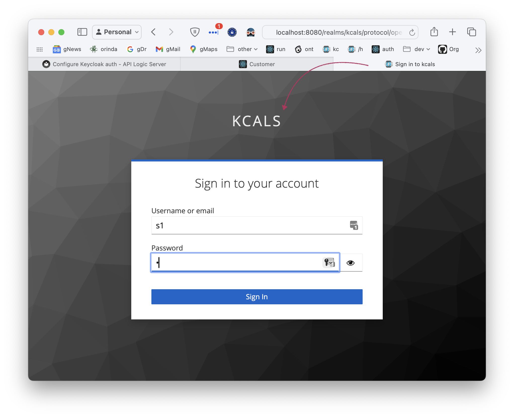

!!! pied-piper ":bulb: TL;DR - Explore Samples to Learn About Security"

    Security can be complicated.  
    
    We recommend exploring the security examples below.

&nbsp;

## Typical Process - Your Projects

We recommend starting with the pre-configured Northwind database, described in the next section.  Use this to explore grants, configuration, etc.

For your own projects, consider introducing security gradually:

1. Create your project without security

    * Verify connectivity, API operation, Admin App operation, etc.

2. Activate sqlite Security

    * Start with sqlite, and build your Grant declarations

3. Upgrade to sql or keycloak

    * With some basic examples working, introduce sql or keycloak authorization

&nbsp;

## Northwind Sqlite Sample

Security is automatically enabled when building the [sample app, *with customizations*](Sample-Database.md##northwind-with-logic){:target="_blank" rel="noopener"}:

```bash title='Create a sample project to Explore Security'
ApiLogicServer create --project_name=nw_sample --db_url=nw+
```

To explore the Grants in `security/declare_security.py` - [click here](https://github.com/ApiLogicServer/demo/blob/main/security/declare_security.py){target="_blank" rel="noopener"}.

You can test it via the Admin App, or via Swagger.  See the *Verify* section, below.

Or, to see the process from scratch:

1. Create the sample application _without customizations_: [click here](Sample-Database.md##northwind-without-logic){:target="_blank" rel="noopener"}
2. Then, as shown in that link, add customizations and security

In either case, you will have a project using the default [sqlite security](Security-sql.md#sqlite-authentication-db){:target="_blank" rel="noopener"}, including Grants and test data.

&nbsp;

### Verify

After configuring, you should now be able to run the admin app:

1. login as **s1/p** -- note the login screen indicates whether or not you are using keycloak (*kcals*):



2. Verify there is only 1 customer

3. Logout and login as **admin/p**, and there should be more customers

&nbsp;

### Experiment with auth dbs

Depending on your ultimate objectives, explore alternative auth databases:

| **AuthDB** | **Try**  | Test |
:-------|:-----------|:-----------|
| **sql (default sqlite)** | Pre-configured from creation, above | See *Verify*, above |
| **sql (Postgress example)** | [Postgres Northwind with Docker](#postgres-docker-northwind) | Basic retrieval |
| **Keycloak (preconfigured)** | [Keycloak - hardened](Security-Keycloak.md#keycloak-hardened) | See *Verify* |
| **Keycloak (local using Docker)** | [Keycloak - local using Docker](Security-Keycloak.md##keycloak-local)| See *Verify* |

&nbsp;

## Using your own `authdb`

In most cases, you will create your own `authdb`:

1. To use the same kind of DBMS you are using for your data

2. To introduce additional properties for use in `Grants` -- see the first section below

&nbsp;

### sql authdb Resources

The following resources are available to help you create sql authdb.

#### Pre-created `authdb` scripts

Your project contains some example sql to create the auth db:


> Prior release 08.00.05, those files were not created in new projects.  For earlier versions, create these files in devops/docker with [this Dockerfile](https://github.com/valhuber/ApiLogicServer/tree/main/api_logic_server_cli/project_prototype/devops/docker){:target="_blank" rel="noopener"}.

&nbsp;

#### Pre-created in Docker DBs

A sample security database is pre-created in the MySQL and Postgres [Sample Docker Databases](Database-Docker.md){:target="_blank" rel="noopener"}.

&nbsp;

### Examples

&nbsp;

#### Postgres Docker `northwind`

This example uses the Postgres docker database noted above:

```bash
docker network create dev-network  # only required once

docker run -d --name postgresql-container --net dev-network -p 5432:5432 -e PGDATA=/pgdata -e POSTGRES_PASSWORD=p apilogicserver/postgres:latest

ApiLogicServer create --project_name=postgres-nw --db_url=postgresql://postgres:p@localhost/postgres

cd postgres-nw
ApiLogicServer add-auth --db_url=postgresql://postgres:p@localhost/authdb
```

Let's review how this database was created.

**1. Create the Postgres NW database**

You can find the creation information here:


After using the Postgres CLI to create the database, verify it exists:


&nbsp;

#### MySQL docker `classicmodels`

As noted above, you can use the [docker databases](Database-Docker.md){:target="_blank" rel="noopener"} as shown below.

```bash
docker network create dev-network  # only required once

docker run --name mysql-container --net dev-network -p 3306:3306 -d -e MYSQL_ROOT_PASSWORD=p apilogicserver/mysql8.0:latest

ApiLogicServer create --project_name=classicmodels  --db_url=classicmodels

cd classicmodels
ApiLogicServer add-auth --db_url=mysql+pymysql://root:p@localhost:3306/authdb
```

&nbsp;